# Agentic Workflow Definitions (AWD)

**The NPM for AI-Native Development** - Natural language in Markdown is the new scripting language. Now you can build, package, share, and run Markdown agentic prompts and workflows across any LLM runtime. 

**Think npm + Node.js, but for Natural Language (Markdown).**

| Traditional Web Dev | AI-Native Development | Role |
|---------------------|----------------------|------|
| **npm** | **AWD Package Manager** | Dependency resolution, distribution |
| **TypeScript Compiler** | **AWD Prompt Compiler** | Transform .prompt.md → runtime-ready format |
| **Node.js** | **LLM Runtimes (codex/llm)** | Execute compiled artifacts |
| **JavaScript** | **Natural Language** | What runtimes actually understand |

## Quick Start (30 seconds)

> [!NOTE] 
> **📋 Prerequisites**: Get a GitHub fine-grained Personal Access Token with **read-only Models permissions** at [github.com/settings/personal-access-tokens/new](https://github.com/settings/personal-access-tokens/new)

```bash
# 1. Install AWD CLI (zero dependencies)
curl -sSL https://raw.githubusercontent.com/danielmeppiel/awd-cli/main/install.sh | sh

# 2. Setup AI runtime with GitHub Models (OpenAI Codex here)
awd runtime setup codex
export GITHUB_TOKEN=your_token_here

# 3. Initialize your first AWD project (like npm init)
awd init my-hello-world

# 4. Install and run (like npm install && npm start)
cd my-hello-world
awd install
awd run start --param name="Developer"
```

**That's it!** You're now running AI prompt applications against an LLM runtime.

## Supported Runtimes

AWD manages LLM runtime installation and configuration automatically:

- **⚡ OpenAI Codex CLI** (recommended) - OpenAI's [`codex`](https://github.com/openai/codex) with advanced code understanding and native MCP support
- **🔧 LLM Library** - Simon Willison's [`llm`](https://llm.datasette.io/en/stable/index.html) with 100+ models from GitHub, OpenAI, Anthropic, local Ollama, and more

```bash
# AWD manages runtime installation
awd runtime setup codex        # Install Codex with GitHub Models
awd runtime setup llm          # Install LLM library  
awd runtime list              # Show installed runtimes
```

## How It Works

**Initialize like npm:**

```bash
# Create new AWD project (like npm init)
awd init my-app

# Install MCP dependencies (like npm install)
cd my-app && awd install
```

**Write prompts with MCP integration:**

```markdown
---
description: Analyzes application logs for errors
mcp:
  - ghcr.io/github/github-mcp-server
input: [service_name, time_window]
---

# Analyze Application Logs

Analyze logs for ${input:service_name} over the last ${input:time_window}.

## Instructions

1. Use the **get_me** tool to identify the user
2. Retrieve logs for the specified service and timeframe
3. Identify ERROR and FATAL messages  
4. Look for patterns and provide recommendations
```

**Run anywhere:**

```bash
# Run start script
awd run start --param service_name=api --param time_window=1h

# Run with different runtimes and models
awd run start                                    # Uses codex (default) 
awd run llm --param service_name=api            # Uses LLM 
awd run debug --param service_name=api          # Uses codex with debug mode
```

**Manage like npm packages:**

```yaml
# Project configuration (awd.yml)
name: my-logging-app
version: 1.0.0
scripts:
  start: "codex analyze-logs.prompt.md"
  llm: "llm analyze-logs.prompt.md -m github/gpt-4o-mini"
  debug: "DEBUG=true codex analyze-logs.prompt.md"
dependencies:
  mcp:
    - ghcr.io/github/github-mcp-server

## Beyond Simple Prompts: Composable Workflows

> [!WARNING]
> Workflow composition and prompt chaining are part of the vision but not yet implemented. This is planned for Phase 3. Currently, AWD executes individual prompts only.

**Prompts can reference other prompts** to create powerful agentic workflows:

```markdown
---
name: incident-response
description: Complete incident response procedure
input: [severity, affected_service]
---

# Incident Response

## Step 1: Initial Analysis
Analyze logs using [analyze-logs](./analyze-logs.prompt.md) with ${service_name:${input:affected_service}} and ${time_window:1h}

## Step 2: Determine Response
Based on the log analysis results:
- If severity is **CRITICAL**: escalate immediately and proceed to emergency response
- If severity is **HIGH**: notify team using [alert-team](./alert-team.prompt.md) with ${service:${input:affected_service}} and ${severity:${input:severity}}
- Otherwise: create standard incident ticket

## Step 3: Emergency Response (Critical Only)
**Ask for approval**: "Critical incident detected for ${input:affected_service}. Execute emergency procedures? (yes/no)"

If approved:
- Scale service using [scale-service](./scale-service.prompt.md) with ${service:${input:affected_service}} and ${action:scale-up}
```

Run it as any other prompt:
```bash
# Run complex agentic workflows  
awd run start --param severity=HIGH --param affected_service=api-gateway

# Preview compiled prompts for debugging
awd preview start --param severity=HIGH --param affected_service=api-gateway
```

## Philosophy: The AWD Manifesto

AWD follows our **[AWD Manifesto](MANIFESTO.md)** - core principles for AI-native development:

- 🌐 **Portability over Vendor Lock-in** - Write once, run anywhere
- 📝 **Natural Language over Code Complexity** - English beats any programming language  
- ♻️ **Reusability over Reinvention** - Share prompts like code packages
- 🔍 **Reliability over Magic** - Predictable, transparent execution
- 🛠️ **Developer Experience over AI Sophistication** - Simple tools, powerful results

## Why AWD?

**Think NPM + Node.js, but for AI-Native Development**

Just as npm revolutionized JavaScript development by creating a package ecosystem, AWD creates the missing infrastructure for AI-native applications written in Markdown.

**The Problem**: We have the new programming language (natural language in markdown) but lack the essential tooling infrastructure. Every team reinvents their prompts, cannot share them, cannot distribute them, can't run them at scale. It's like having JavaScript syntax but no npm, Node.js, or package ecosystem.

**The AWD Solution**: Complete the tooling stack for AI-native development

**Key Benefits**:
- 🏗️ **Infrastructure Layer** - AWD is the package manager, runtimes ([llm](https://github.com/simonw/llm), [codex](https://github.com/openai/codex)) are the execution engines
- ✅ **Portable** - Same prompt runs on any LLM runtime (just like npm packages run on any Node.js version)
- ✅ **Reusable** - Share prompts like code packages with versioning and dependencies
- ✅ **Composable** - Prompts can reference other prompts to create complex workflows
- ✅ **Tool-enabled** - Integrate with APIs via MCP servers, handled by your chosen runtime

Just as npm enabled JavaScript's explosive growth, AWD enables the prompt-based application ecosystem to flourish.

## Architecture

```mermaid
graph TD
    A["📝 Prompts<br/>.prompt.md<br/>Natural Language Programs"] --> B["🔧 AWD CLI"]
    
    B --> D["📦 AWD Package Manager<br/>Dependencies<br/>Templates"]
    B --> C["⚙️ AWD Prompt Compiler<br/>Script Resolution<br/>Prompt Compilation"]
    B --> E["🏗️ AWD Runtime Manager<br/>Install & Configure<br/>Codex, LLM, etc."]
    
    C --> F["⚡ LLM Runtimes<br/>Codex (Rust)<br/>LLM (Python)"]
    
    F --> G["🛠️ MCP Servers<br/>Tool Integration"]
    F --> H["🧠 LLM Models<br/>GitHub Models<br/>Ollama, etc."]
    
    style A fill:#e3f2fd,stroke:#1976d2,stroke-width:2px,color:#000
    style B fill:#f3e5f5,stroke:#7b1fa2,stroke-width:3px,color:#000
    style C fill:#f3e5f5,stroke:#7b1fa2,stroke-width:2px,color:#000
    style D fill:#f3e5f5,stroke:#7b1fa2,stroke-width:2px,color:#000
    style E fill:#f3e5f5,stroke:#7b1fa2,stroke-width:2px,color:#000
    style F fill:#fce4ec,stroke:#c2185b,stroke-width:2px,color:#000
    style G fill:#e8f5e8,stroke:#388e3c,stroke-width:1px,color:#000
    style H fill:#fff3e0,stroke:#ff9800,stroke-width:1px,color:#000
```




**Key Insight**: AWD CLI provides three core components: Package Manager (dependencies), Prompt Compiler (script processing), and Runtime Manager (install/configure runtimes). LLM runtimes handle execution and call MCP servers for tool integration. 

## Installation

### Quick Install (Recommended)
```bash
curl -sSL https://raw.githubusercontent.com/danielmeppiel/awd-cli/main/install.sh | sh
```

### Python Package
```bash
pip install awd-cli
```

### Manual Download
Download the binary for your platform from [GitHub Releases](https://github.com/danielmeppiel/awd-cli/releases/latest):

```bash
# Linux x86_64
curl -L https://github.com/danielmeppiel/awd-cli/releases/latest/download/awd-linux-x86_64 -o awd && chmod +x awd

# macOS Intel
curl -L https://github.com/danielmeppiel/awd-cli/releases/latest/download/awd-darwin-x86_64 -o awd && chmod +x awd

# macOS Apple Silicon  
curl -L https://github.com/danielmeppiel/awd-cli/releases/latest/download/awd-darwin-arm64 -o awd && chmod +x awd
```

### From Source (Developers)
```bash
git clone https://github.com/danielmeppiel/awd-cli.git
cd awd-cli && pip install -e .
```

## CLI Usage Reference

**Complete CLI Reference**: See [CLI Reference](docs/cli-reference.md) for detailed documentation.

```bash
# Quick start commands
awd runtime setup codex                           # Install Codex runtime
awd init my-project                               # Initialize new AWD project
awd install                                       # Install dependencies
awd run start --param key=value                   # Run start script
awd run llm --param key=value                     # Run llm script

# Runtime selection and options
awd run start                                     # Use default Codex runtime
awd run llm --llm=github/gpt-4o-mini            # Use LLM with GitHub Models
awd run debug --param key=value --verbose        # Debug with environment variables
```

## Community

- 📚 [Documentation](docs/index.md) - Guides and examples
- 🤝 [Contributing](CONTRIBUTING.md) - Help build the ecosystem  
- ⭐ Star this repo if you find it useful!

---

**AWD makes AI prompts as shareable and reusable as code packages.**
