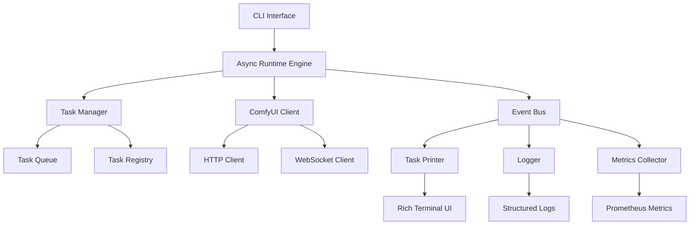

# ComfyReality Runtime Implementation Specification

## Executive Summary

This specification defines a production-ready async runtime system for ComfyReality that integrates ComfyUI workflows with modern Python practices. The system provides real-time task tracking, comprehensive logging, and a developer-friendly API following 2025 best practices.

## System Architecture



## Core Data Models

### 1. Base Models

```python
# src/comfy_reality/runtime/models/base.py
from pydantic import BaseModel, Field, ConfigDict, field_validator
from typing import Generic, TypeVar, Optional, Any
from datetime import datetime
import uuid

T = TypeVar('T')

class BaseRuntimeModel(BaseModel):
    """Base model with common configuration"""
    model_config = ConfigDict(
        str_strip_whitespace=True,
        json_encoders={
            datetime: lambda v: v.isoformat(),
            uuid.UUID: lambda v: str(v),
        },
        validate_assignment=True,
        arbitrary_types_allowed=True,
    )

class TimestampedModel(BaseRuntimeModel):
    """Model with automatic timestamps"""
    created_at: datetime = Field(default_factory=datetime.utcnow)
    updated_at: Optional[datetime] = None
    
    def touch(self) -> None:
        """Update the updated_at timestamp"""
        self.updated_at = datetime.utcnow()

class Result(BaseRuntimeModel, Generic[T]):
    """Generic result wrapper for operations"""
    success: bool
    data: Optional[T] = None
    error: Optional[str] = None
    metadata: dict[str, Any] = Field(default_factory=dict)
    
    @field_validator('error')
    def validate_error(cls, v, values):
        if v and values.get('success', True):
            raise ValueError("Cannot have error with success=True")
        return v
```

### 2. Task Models

```python
# src/comfy_reality/runtime/models/tasks.py
from enum import Enum
from typing import Literal, Optional, Any, Union
from pydantic import Field, field_validator, computed_field
import uuid

class TaskStatus(str, Enum):
    """Task execution states"""
    PENDING = "pending"
    QUEUED = "queued"
    RUNNING = "running"
    COMPLETED = "completed"
    FAILED = "failed"
    CANCELLED = "cancelled"
    RETRYING = "retrying"
    
    @property
    def is_terminal(self) -> bool:
        """Check if this is a terminal state"""
        return self in {self.COMPLETED, self.FAILED, self.CANCELLED}
    
    @property
    def is_active(self) -> bool:
        """Check if task is actively running"""
        return self in {self.RUNNING, self.RETRYING}

class TaskPriority(int, Enum):
    """Task priority levels"""
    LOW = 0
    NORMAL = 1
    HIGH = 2
    CRITICAL = 3

class TaskType(str, Enum):
    """Types of tasks in the system"""
    WORKFLOW = "workflow"
    NODE = "node"
    PREPROCESSING = "preprocessing"
    POSTPROCESSING = "postprocessing"
    SYSTEM = "system"
    CLEANUP = "cleanup"

class TaskMetrics(BaseRuntimeModel):
    """Performance metrics for a task"""
    start_time: Optional[datetime] = None
    end_time: Optional[datetime] = None
    cpu_time: Optional[float] = None
    memory_peak_mb: Optional[float] = None
    gpu_memory_mb: Optional[float] = None
    
    @computed_field
    @property
    def duration_seconds(self) -> Optional[float]:
        if self.start_time and self.end_time:
            return (self.end_time - self.start_time).total_seconds()
        return None

class TaskDependency(BaseRuntimeModel):
    """Dependency between tasks"""
    task_id: str
    dependency_type: Literal["requires", "blocks", "optional"]
    
class Task(TimestampedModel):
    """Core task model"""
    id: str = Field(default_factory=lambda: str(uuid.uuid4()))
    type: TaskType
    status: TaskStatus = TaskStatus.PENDING
    priority: TaskPriority = TaskPriority.NORMAL
    
    # Identity
    name: str
    description: Optional[str] = None
    tags: set[str] = Field(default_factory=set)
    
    # Relationships
    parent_id: Optional[str] = None
    dependencies: list[TaskDependency] = Field(default_factory=list)
    
    # Progress
    progress: float = Field(default=0.0, ge=0.0, le=1.0)
    progress_message: Optional[str] = None
    
    # Execution
    retry_count: int = Field(default=0)
    max_retries: int = Field(default=3)
    timeout_seconds: Optional[float] = None
    
    # Results
    result: Optional[Any] = None
    error: Optional[str] = None
    error_type: Optional[str] = None
    
    # Metrics
    metrics: TaskMetrics = Field(default_factory=TaskMetrics)
    
    # Metadata
    metadata: dict[str, Any] = Field(default_factory=dict)
    
    @field_validator('progress')
    def validate_progress(cls, v):
        return max(0.0, min(1.0, v))
    
    @computed_field
    @property
    def is_complete(self) -> bool:
        return self.status.is_terminal
    
    @computed_field
    @property
    def can_retry(self) -> bool:
        return (
            self.status == TaskStatus.FAILED 
            and self.retry_count < self.max_retries
        )

class TaskEvent(BaseRuntimeModel):
    """Event emitted during task lifecycle"""
    id: str = Field(default_factory=lambda: str(uuid.uuid4()))
    task_id: str
    event_type: Literal[
        "created", "queued", "started", "progress", 
        "completed", "failed", "cancelled", "retrying"
    ]
    timestamp: datetime = Field(default_factory=datetime.utcnow)
    
    # Event data
    message: Optional[str] = None
    data: dict[str, Any] = Field(default_factory=dict)
    
    # Source information
    source: Optional[str] = None
    correlation_id: Optional[str] = None
```

### 3. Workflow Models

```python
# src/comfy_reality/runtime/models/workflows.py
from typing import Optional, Any, Dict
from pydantic import Field, field_validator

class ComfyNode(BaseRuntimeModel):
    """ComfyUI node representation"""
    id: str
    type: str
    inputs: dict[str, Any]
    outputs: list[str] = Field(default_factory=list)
    metadata: dict[str, Any] = Field(default_factory=dict)

class WorkflowDefinition(BaseRuntimeModel):
    """ComfyUI workflow definition"""
    id: str = Field(default_factory=lambda: str(uuid.uuid4()))
    name: str
    description: Optional[str] = None
    version: str = "1.0.0"
    
    # Workflow structure
    nodes: dict[str, ComfyNode]
    edges: list[tuple[str, str]]  # (from_node, to_node)
    
    # Validation
    is_valid: bool = True
    validation_errors: list[str] = Field(default_factory=list)
    
    # Metadata
    tags: set[str] = Field(default_factory=set)
    author: Optional[str] = None
    created_at: datetime = Field(default_factory=datetime.utcnow)
    
    @field_validator('version')
    def validate_version(cls, v):
        # Simple semver validation
        parts = v.split('.')
        if len(parts) != 3 or not all(p.isdigit() for p in parts):
            raise ValueError("Version must be in semver format (x.y.z)")
        return v

class WorkflowExecution(TimestampedModel):
    """Workflow execution instance"""
    id: str = Field(default_factory=lambda: str(uuid.uuid4()))
    workflow_id: str
    client_id: str = Field(default_factory=lambda: str(uuid.uuid4()))
    
    # Status
    status: TaskStatus = TaskStatus.PENDING
    progress: float = Field(default=0.0, ge=0.0, le=1.0)
    
    # Tasks
    root_task_id: Optional[str] = None
    tasks: list[Task] = Field(default_factory=list)
    
    # Results
    outputs: dict[str, Any] = Field(default_factory=dict)
    artifacts: list[str] = Field(default_factory=list)  # File paths
    
    # Metrics
    total_duration_seconds: Optional[float] = None
    node_metrics: dict[str, TaskMetrics] = Field(default_factory=dict)
    
    # Configuration
    config: dict[str, Any] = Field(default_factory=dict)
    environment: dict[str, str] = Field(default_factory=dict)
    
    @computed_field
    @property
    def completed_tasks(self) -> int:
        return sum(1 for t in self.tasks if t.is_complete)
    
    @computed_field
    @property
    def failed_tasks(self) -> int:
        return sum(1 for t in self.tasks if t.status == TaskStatus.FAILED)
```

### 4. Event and Logging Models

```python
# src/comfy_reality/runtime/models/events.py
from typing import Literal, Optional, Any
from enum import Enum

class LogLevel(str, Enum):
    """Log severity levels"""
    DEBUG = "debug"
    INFO = "info"
    WARNING = "warning"
    ERROR = "error"
    CRITICAL = "critical"

class EventCategory(str, Enum):
    """Event categorization"""
    TASK = "task"
    WORKFLOW = "workflow"
    SYSTEM = "system"
    PERFORMANCE = "performance"
    ERROR = "error"
    AUDIT = "audit"

class RuntimeEvent(TimestampedModel):
    """Generic runtime event"""
    id: str = Field(default_factory=lambda: str(uuid.uuid4()))
    category: EventCategory
    level: LogLevel = LogLevel.INFO
    
    # Event details
    event_type: str
    message: str
    data: dict[str, Any] = Field(default_factory=dict)
    
    # Context
    task_id: Optional[str] = None
    workflow_id: Optional[str] = None
    user_id: Optional[str] = None
    session_id: Optional[str] = None
    
    # Source
    source_module: Optional[str] = None
    source_function: Optional[str] = None
    source_line: Optional[int] = None
    
    # Error information
    error_type: Optional[str] = None
    error_message: Optional[str] = None
    stack_trace: Optional[str] = None

class PerformanceMetric(BaseRuntimeModel):
    """Performance measurement"""
    name: str
    value: float
    unit: str
    timestamp: datetime = Field(default_factory=datetime.utcnow)
    
    # Context
    task_id: Optional[str] = None
    workflow_id: Optional[str] = None
    
    # Dimensions
    tags: dict[str, str] = Field(default_factory=dict)
```

### 5. Configuration Models

```python
# src/comfy_reality/runtime/models/config.py
from typing import Optional, Literal
from pydantic import Field, field_validator, HttpUrl

class ServerConfig(BaseRuntimeModel):
    """ComfyUI server configuration"""
    url: HttpUrl = Field(default="http://127.0.0.1:8188")
    timeout_seconds: float = Field(default=30.0, gt=0)
    max_retries: int = Field(default=3, ge=0)
    verify_ssl: bool = True
    
    # Authentication
    api_key: Optional[str] = None
    auth_header: Optional[str] = None

class RuntimeConfig(BaseRuntimeModel):
    """Runtime system configuration"""
    # Task management
    max_concurrent_tasks: int = Field(default=10, ge=1)
    task_timeout_seconds: float = Field(default=300.0, gt=0)
    task_retry_delay_seconds: float = Field(default=5.0, gt=0)
    
    # Queue settings
    queue_type: Literal["memory", "redis", "rabbitmq"] = "memory"
    queue_url: Optional[str] = None
    
    # Logging
    log_level: LogLevel = LogLevel.INFO
    log_format: Literal["json", "text"] = "json"
    log_file: Optional[str] = None
    
    # Monitoring
    enable_metrics: bool = True
    metrics_port: int = Field(default=9090, ge=1, le=65535)
    
    # UI
    enable_ui: bool = True
    ui_update_interval_seconds: float = Field(default=0.5, gt=0)
    
    @field_validator('queue_url')
    def validate_queue_url(cls, v, values):
        if values.get('queue_type') != 'memory' and not v:
            raise ValueError(f"queue_url required for queue_type {values['queue_type']}")
        return v

class TaskExecutorConfig(BaseRuntimeModel):
    """Task executor configuration"""
    # Resource limits
    max_memory_mb: Optional[int] = Field(None, ge=100)
    max_cpu_percent: Optional[float] = Field(None, ge=0, le=100)
    gpu_memory_fraction: float = Field(default=0.9, ge=0.1, le=1.0)
    
    # Execution
    enable_gpu: bool = True
    prefer_gpu_types: list[str] = Field(default=["cuda", "mps", "directml"])
    
    # Optimization
    enable_optimization: bool = True
    optimization_level: Literal["O0", "O1", "O2", "O3"] = "O2"
    
    # Caching
    enable_cache: bool = True
    cache_size_mb: int = Field(default=1000, ge=0)
    cache_ttl_seconds: int = Field(default=3600, ge=0)
```

### 6. API Response Models

```python
# src/comfy_reality/runtime/models/api.py
from typing import Generic, TypeVar, Optional, Any
from pydantic import Field

T = TypeVar('T')

class APIResponse(BaseRuntimeModel, Generic[T]):
    """Standard API response wrapper"""
    success: bool
    data: Optional[T] = None
    error: Optional[APIError] = None
    metadata: ResponseMetadata = Field(default_factory=ResponseMetadata)
    
class APIError(BaseRuntimeModel):
    """API error details"""
    code: str
    message: str
    details: Optional[dict[str, Any]] = None
    timestamp: datetime = Field(default_factory=datetime.utcnow)
    
class ResponseMetadata(BaseRuntimeModel):
    """Response metadata"""
    request_id: str = Field(default_factory=lambda: str(uuid.uuid4()))
    timestamp: datetime = Field(default_factory=datetime.utcnow)
    duration_ms: Optional[float] = None
    version: str = "1.0.0"

class TaskCreateRequest(BaseRuntimeModel):
    """Request to create a new task"""
    name: str
    type: TaskType = TaskType.NODE
    priority: TaskPriority = TaskPriority.NORMAL
    dependencies: list[str] = Field(default_factory=list)
    metadata: dict[str, Any] = Field(default_factory=dict)
    
class WorkflowExecuteRequest(BaseRuntimeModel):
    """Request to execute a workflow"""
    workflow: Union[str, dict[str, Any]]  # ID or definition
    config: dict[str, Any] = Field(default_factory=dict)
    priority: TaskPriority = TaskPriority.NORMAL
    tags: set[str] = Field(default_factory=set)
```

## Implementation Guidelines

### 1. Error Handling

```python
# src/comfy_reality/runtime/exceptions.py
from typing import Optional, Any

class RuntimeError(Exception):
    """Base runtime exception"""
    def __init__(
        self, 
        message: str, 
        code: Optional[str] = None,
        details: Optional[dict[str, Any]] = None
    ):
        super().__init__(message)
        self.code = code or self.__class__.__name__
        self.details = details or {}

class TaskError(RuntimeError):
    """Task execution error"""
    pass

class WorkflowError(RuntimeError):
    """Workflow execution error"""
    pass

class ValidationError(RuntimeError):
    """Validation error"""
    pass

class ConfigurationError(RuntimeError):
    """Configuration error"""
    pass
```

### 2. Dependency Injection

```python
# src/comfy_reality/runtime/dependencies.py
from typing import Annotated
from fastapi import Depends

async def get_runtime_config() -> RuntimeConfig:
    """Load runtime configuration"""
    # Load from environment, file, or defaults
    return RuntimeConfig()

async def get_task_manager(
    config: Annotated[RuntimeConfig, Depends(get_runtime_config)]
) -> AsyncTaskManager:
    """Get configured task manager instance"""
    return AsyncTaskManager(config)

async def get_comfy_client(
    config: Annotated[RuntimeConfig, Depends(get_runtime_config)]
) -> ComfyUIClient:
    """Get ComfyUI client instance"""
    return ComfyUIClient(config.server)
```

### 3. Async Context Management

```python
# src/comfy_reality/runtime/context.py
from contextvars import ContextVar
from typing import Optional

# Context variables
current_task: ContextVar[Optional[Task]] = ContextVar('current_task', default=None)
current_workflow: ContextVar[Optional[WorkflowExecution]] = ContextVar('current_workflow', default=None)
request_id: ContextVar[Optional[str]] = ContextVar('request_id', default=None)

@asynccontextmanager
async def task_context(task: Task):
    """Set current task context"""
    token = current_task.set(task)
    try:
        yield task
    finally:
        current_task.reset(token)

@asynccontextmanager
async def workflow_context(workflow: WorkflowExecution):
    """Set current workflow context"""
    token = current_workflow.set(workflow)
    try:
        yield workflow
    finally:
        current_workflow.reset(token)
```

## Testing Requirements

All models must have comprehensive tests covering:

1. **Validation**: Invalid inputs raise appropriate errors
2. **Serialization**: Models serialize/deserialize correctly
3. **Computed Fields**: Dynamic properties calculate correctly
4. **Constraints**: Field constraints are enforced
5. **Defaults**: Default values are applied correctly

Example test:

```python
import pytest
from comfy_reality.runtime.models import Task, TaskStatus

def test_task_validation():
    # Valid task
    task = Task(name="Test Task", type=TaskType.NODE)
    assert task.status == TaskStatus.PENDING
    assert 0.0 <= task.progress <= 1.0
    
    # Invalid progress
    with pytest.raises(ValidationError):
        task.progress = 1.5
    
    # Test computed fields
    assert not task.is_complete
    task.status = TaskStatus.COMPLETED
    assert task.is_complete
```

## Performance Considerations

1. **Model Reuse**: Use model instances efficiently, avoid recreating
2. **Lazy Loading**: Load related data only when needed
3. **Batch Operations**: Process multiple models together
4. **Caching**: Cache computed fields when expensive
5. **Serialization**: Use optimized serializers for high-volume data

## Security Considerations

1. **Input Validation**: All external input must be validated
2. **Secrets Management**: Never log or serialize sensitive data
3. **Access Control**: Implement proper authorization checks
4. **Rate Limiting**: Protect against resource exhaustion
5. **Audit Logging**: Track all significant operations