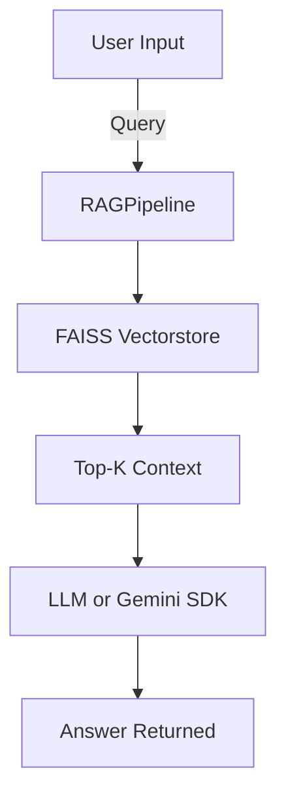

# 🧠 customrag

**customrag** is a customizable **Retrieval-Augmented Generation (RAG)** pipeline that supports **multiple LLMs and embedding models** via a simple YAML config. It’s built for developers who want a plug-and-play RAG setup that works across:

* ✅ OpenAI (ChatGPT, Embeddings)
* ✅ Gemini (Cloud Console SDK or Gemini Studio via LangChain)
* ✅ HuggingFace Hub
* ✅ xAI
* ✅ Local models via Sentence Transformers

---

## 🚀 Features

* 📆 Easy pip install (`pip install customrag`)
* ⚙️ YAML-based config — switch providers anytime
* 🔗 Supports **multiple file formats** (`.txt`, `.pdf`, `.csv`, `.json`, `.docx`, `.md`)
* 📁 Saves vectorstore using FAISS
* 🧐 Built-in SDK support for Gemini Cloud Console (not supported by LangChain)
* 🛠️ LangChain-native support for OpenAI, xAI, Gemini Studio, and HuggingFace

---

## 👅 Installation

```bash
pip install customrag
```

---

## 🛠️ One-Time Setup

Create a default config file in your project directory:

```bash
customrag-setup
```

This generates a `config.yaml` file with placeholders for your API keys and model settings.

---

## 📁 Example `config.yaml`

```yaml
embedding:
  provider: gemini            # Options: gemini, openai, huggingface, sentence-transformers, xai, gemini_studio
  model: models/embedding-001 # Model for embeddings

llm:
  provider: gemini            # Options: gemini, gemini_studio, openai, huggingface, xai
  model: gemini-1.5-pro       # Chat model

api_keys:
  gemini: your_gemini_api_key_here
  gemini_studio: your_gemini_studio_api_key_here
  openai: your_openai_api_key_here
  huggingface: your_huggingface_token_here
  xai: your_xai_api_key_here
```

---

## 🔧 Usage

### 1⃣ Initialize the Pipeline

```python
from customrag import RAGPipeline

pipeline = RAGPipeline(config_path="config.yaml")
```

---

### 2⃣ Build a Vectorstore from Documents

```python
pipeline.build_vectorstore("resume.pdf")  # Accepts .pdf, .txt, .docx, .md, .json, .csv
```

This will:

* Load and chunk your document
* Embed it using the configured embedding model
* Save the FAISS vectorstore locally

---

### 3⃣ Ask a Question

```python
answer = pipeline.query("What are my key skills?")
```

Depending on your config, it will:

* Retrieve top matching chunks using FAISS
* Generate an answer using either LangChain or Gemini SDK

---

## 🤖 Supported Providers

| Provider                          | Embeddings ✅               | Chat (LLM) ✅           | Chat SDK Support |
| --------------------------------- | -------------------------- | ---------------------- | ---------------- |
| **OpenAI**                        | ✅ `text-embedding-ada-002` | ✅ `gpt-3.5 / gpt-4`    | ❌                |
| **Gemini**                        | ✅ `models/embedding-001`   | ❌ *(SDK only)*         | ✅                |
| **Gemini Studio**                 | ✅                          | ✅ `gemini-pro`         | ❌                |
| **HuggingFace**                   | ✅                          | ✅ via `HuggingFaceHub` | ❌                |
| **xAI**                           | ✅                          | ✅ `Grok (xAI)`         | ❌                |
| **Local (sentence-transformers)** | ✅                          | ❌                      | ❌                |

---

## 📆 Example Project Structure

```
your-project/
├── config.yaml
├── resume.pdf
├── script.py
└── faiss_index/
```

---

## 👨‍💼 CLI Tool

Run this once in your project root:

```bash
customrag-setup
```

It will create a `config.yaml` you can edit with your API keys and model names.

---

## 💃 Supported Document Formats

You can ingest files of type:

* 📄 `.txt`, `.pdf`, `.docx`, `.md`
* 📈 `.csv`
* 🧾 `.json` (array of objects)

---

## 🧠 How It Works



---

## 👨‍💻 Author

Made by [Anuj Goel](https://github.com/goelanuj371)

---

## 📬 Contribute

Issues and PRs are welcome. Add support for more LLMs or improve CLI! 🚀

---

## 📄 License

MIT License – free for personal and commercial use.
