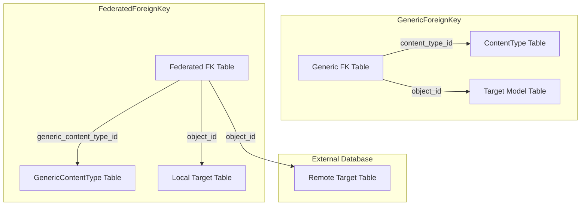

# django-federated-foreign-key
A GenericForeignKey drop-in with ability to point to items in another server

Install from source using `pip`:

```bash
pip install -e .
```

## GenericForeignKey

A generic foreign key allows pointing to objects of any type.
To do this, it uses 2 existing fields on the model:
 - A reference to a `ContentType` entry and
 - An id of the related object

https://docs.djangoproject.com/en/5.2/ref/contrib/contenttypes/#django.contrib.contenttypes.fields.GenericForeignKey

## Difference for Federated Foreign Key

The limitation that we are addressing here is that `ContentType` is only designed to
reference models that exist within the local system.
It is also taken as obvious that the `object_id` (the related object id) is the id
of the object, in the related table, in the same database.

The intent of a federated foreign key is to provide the same interface,
but expand this to allow referencing objects in different databases.

## Usage

Add `federated_foreign_key` to `INSTALLED_APPS` and define `FEDERATION_PROJECT_NAME` in your Django settings:

```python
FEDERATION_PROJECT_NAME = 'project_a'
INSTALLED_APPS = [
    'django.contrib.contenttypes',
    'federated_foreign_key',
    # your apps...
]
```

Use `FederatedForeignKey` in place of `GenericForeignKey` together with `GenericContentType`.

### Example

```python
from federated_foreign_key.fields import FederatedForeignKey
from federated_foreign_key.models import GenericContentType

class Reference(models.Model):
    content_type = models.ForeignKey(GenericContentType, on_delete=models.CASCADE)
    object_id = models.PositiveIntegerField()
    content_object = FederatedForeignKey("content_type", "object_id")
```

### Development

Install development requirements and run linting and tests:

```bash
pip install -r requirements-dev.txt
pip install -e .
pip install -e example_project
ruff check .
flake8
pytest -q
# Run Django's contenttypes tests as shipped in `dj_tests/`
# Use --parallel=1 to avoid multiprocessing issues
python dj_tests/runtests.py contenttypes_tests --parallel=1
```

## Demo

Run the included `run_demo.sh` script to start two demo servers.
The main `example_project` exposes `/books/` which lists local books and
books fetched from the `remote_project` server. SQLite database files are
created in each project directory when the script sets the `DATABASE_NAME`
environment variable.

```bash
./run_demo.sh
```

Provided that is running, go visit in your browser the URL:

http://localhost:8000/books/

You should see the example_project showing the reqest,
but in the logs from the remote_project, it should show
requests coming from the example_project.
It shows the names being filled in with values from the remote server.

## Remote Model Use Cases

There are 3 cases that this is likely to be used for.
This library doesn't provide you with everything you need, just the relationship
to store a `content_object` that may be non-local.

1. Same model, different servers, different data
2. Shared model, different servers, different data
3. Different model, on remote server

### Same model, different servers

This is what is illustrated in the demo.
Consider that you have 2 book shops, and they both have their own listings of books.
A book listing will be duplicate, in the sense that both entries reference the same book.
But maybe the two shops have different prices.
This helps present a unified list of shopping options for books.
Each entry could have its own shopping cart icon, to buy that book from that server, at that cost.

### Synchronized tables


## Illustration

This shows how FederatedForeignKey works compared to GenericForeignKey.

The `object_id` values specify the row location in all cases.



