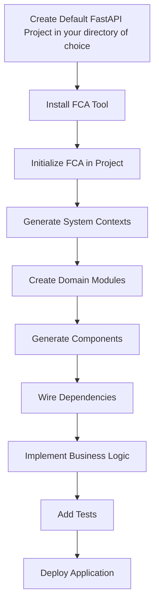

# Fast Clean Architecture

[](https://www.python.org/downloads/)
[](https://opensource.org/licenses/MIT)
[](https://github.com/psf/black)

A powerful CLI tool for scaffolding clean architecture in FastAPI projects. Generate well-structured, maintainable code following clean architecture principles with domain-driven design patterns.

## 🚀 Features

- **Clean Architecture**: Enforces separation of concerns with distinct layers
- **Domain-Driven Design**: Supports bounded contexts and domain modeling
- **Code Generation**: Automated scaffolding for entities, repositories, services, and more
- **Template System**: Customizable Jinja2 templates for code generation
- **Type Safety**: Full type hints and Pydantic validation
- **Modern Python**: Built for Python 3.8+ with async/await support
- **CLI Interface**: Intuitive command-line interface with rich output
- **Configuration Management**: YAML-based project configuration with versioning

## 📦 Installation

### From PyPI (Recommended)

#### Using pip
```bash
pip install fast-clean-architecture
```

#### Using Poetry
```bash
poetry add fast-clean-architecture
```

### From Source

#### Using pip
```bash
git clone https://github.com/alden-technologies/fast-clean-architecture.git
cd fast-clean-architecture
pip install -e .
```

#### Using Poetry
```bash
git clone https://github.com/alden-technologies/fast-clean-architecture.git
cd fast-clean-architecture
poetry install
```

### Development Installation

#### Using pip
```bash
git clone https://github.com/alden-technologies/fast-clean-architecture.git
cd fast-clean-architecture
pip install -e ".[dev]"
```

#### Using Poetry
```bash
git clone https://github.com/alden-technologies/fast-clean-architecture.git
cd fast-clean-architecture
poetry install --with dev
```

## 🏗️ Architecture Overview

Fast Clean Architecture follows the clean architecture pattern with these layers:

```
📁 project_root/
├── 📁 systems/
│   └── 📁 {system_name}/
│       └── 📁 {module_name}/
│           ├── 📁 domain/           # Business logic and rules
│           │   ├── 📁 entities/     # Domain entities
│           │   ├── 📁 repositories/ # Repository interfaces
│           │   └── 📁 value_objects/# Value objects
│           ├── 📁 application/      # Use cases and services
│           │   ├── 📁 services/     # Application services
│           │   ├── 📁 commands/     # Command handlers
│           │   └── 📁 queries/      # Query handlers
│           ├── 📁 infrastructure/   # External concerns
│           │   ├── 📁 repositories/ # Repository implementations
│           │   ├── 📁 external/     # External service clients
│           │   └── 📁 models/       # Database models
│           └── 📁 presentation/     # API layer
│               ├── 📁 api/          # FastAPI routers
│               └── 📁 schemas/      # Pydantic schemas
└── 📄 fca-config.yaml             # Project configuration
```

## 📋 Prerequisites

**Important**: This tool is designed to scaffold clean architecture components for FastAPI projects. You should have:

- **Python 3.8+** installed on your system
- **Basic understanding of FastAPI** and web API development
- **Familiarity with clean architecture principles** (recommended but not required)
- **A new or existing directory** where you want to create your FastAPI project structure

**Note**: This tool generates the architectural foundation and components for your FastAPI application. You'll need to create the main FastAPI application instance (`main.py`) using the FastAPI CLI and configure dependency injection to wire everything together.

## 🔄 FastAPI Developer Workflow Integration

Fast Clean Architecture fits seamlessly into the modern FastAPI development workflow:



### Workflow Steps:

1. **FastAPI Project Creation**: Create your FastAPI project instance and basic structure using either Poetry or pip
2. **FCA Installation & Setup**: Install FCA tool and initialize the clean architecture foundation
3. **Component Generation**: Generate entities, repositories, services, and API routers
4. **FastAPI Integration**: Update your `main.py` and include generated routers
5. **Dependency Injection**: Wire up services and repositories using FastAPI's DI system
6. **Business Logic**: Implement your domain-specific logic in the generated components
7. **Testing & Deployment**: Add tests and deploy your well-structured application

## 🚀 Quick Start

### 1. Create and Initialize Your FastAPI Project using Poetry

```bash
# Instantiate a new Poetry project
poetry new --flat my-fastapi-project --name custom_app_folder
cd my-fastapi-project

# Add FastAPI and Uvicorn
poetry add fastapi
poetry add uvicorn

# Create a basic main.py file
cat > main.py << 'EOF'
from fastapi import FastAPI

app = FastAPI(
    title="My Clean Architecture API",
    description="FastAPI application with clean architecture",
    version="1.0.0"
)

@app.get("/")
async def root():
    return {"message": "Hello World"}
EOF

# Test your FastAPI application
uvicorn custom_app_folder.main:app
```

### 2. Install and Initialize FCA

```bash
# Install Fast Clean Architecture tool
pip install fast-clean-architecture

# Interactive initialization
fca-scaffold init

# Or with arguments
fca-scaffold init --name "my-project" --description "My FastAPI project"
```

### 3. Create a System Context

```bash
# Create a new bounded context
fca-scaffold create-system-context user-management --description "User management system"
```

### 4. Create a Module

```bash
# Create a module within a system
fca-scaffold create-module user-management users --description "User domain module"
```

### 5. Generate Components

```bash
# Generate a complete domain entity
fca-scaffold create-component user-management users entities user

# Generate repository interface
fca-scaffold create-component user-management users repositories user

# Generate application service
fca-scaffold create-component user-management users services user

# Generate API router
fca-scaffold create-component user-management users api user
```

### 6. Integrate Generated Components

**Important**: Now enhance your existing `main.py` to include the generated routers and wire everything together.

Update your `main.py` to include the generated routers:

```python
# main.py (enhanced with generated components)
from fastapi import FastAPI
from systems.user_management.users.presentation.api.user_router import router as user_router

app = FastAPI(
    title="My Clean Architecture API",
    description="FastAPI application with clean architecture",
    version="1.0.0"
)

# Include generated routers
app.include_router(user_router, prefix="/api/v1", tags=["users"])

# Add middleware, exception handlers, startup events, etc.

@app.get("/")
async def root():
    return {"message": "Clean Architecture API is running!"}
```

### 7. Run Your Application

```bash
# Install FastAPI and uvicorn if not already installed
pip install fastapi uvicorn

# Run the application
uvicorn main:app --reload

# Or run directly
python main.py
```

Your API will be available at `http://localhost:8000` with automatic documentation at `http://localhost:8000/docs`.

## 📚 Detailed Usage

### Component Types

| Layer | Component | Description |
|-------|-----------|-------------|
| **Domain** | `entities` | Core business entities with domain logic |
| | `repositories` | Repository interfaces (abstract) |
| | `value_objects` | Immutable value objects |
| **Application** | `services` | Application services and use cases |
| | `commands` | Command handlers (CQRS) |
| | `queries` | Query handlers (CQRS) |
| **Infrastructure** | `repositories` | Repository implementations |
| | `external` | External service clients |
| | `models` | Database/ORM models |
| **Presentation** | `api` | FastAPI routers and endpoints |
| | `schemas` | Pydantic request/response schemas |

### CLI Options

```bash
# Global options
fca-scaffold --help
fca-scaffold --version
fca-scaffold --dry-run    # Preview changes without writing files
fca-scaffold --force      # Overwrite existing files
fca-scaffold --verbose    # Detailed output

# Command-specific help
fca-scaffold init --help
fca-scaffold create-component --help
```

### Configuration File

The `fca-config.yaml` file tracks your project structure:

```yaml
project:
  name: my-project
  description: My FastAPI project
  version: 0.1.0
  created_at: 2024-01-15T10:30:00Z
  updated_at: 2024-01-15T10:30:00Z
  systems:
    user-management:
      description: User management system
      created_at: 2024-01-15T10:35:00Z
      updated_at: 2024-01-15T10:35:00Z
      modules:
        users:
          description: User domain module
          created_at: 2024-01-15T10:40:00Z
          updated_at: 2024-01-15T10:40:00Z
          components:
            domain:
              entities: ["user"]
              repositories: ["user"]
            application:
              services: ["user"]
            presentation:
              api: ["user"]
```

## 🎨 Customization

### Custom Templates

You can customize the generated code by modifying templates:

1. Copy the default templates:
   ```bash
   cp -r $(python -c "import fast_clean_architecture; print(fast_clean_architecture.__path__[0])")/templates ./custom_templates
   ```

2. Modify templates in `./custom_templates/`

3. Use custom templates:
   ```bash
   fca-scaffold create-component --template-dir ./custom_templates user-management users entities user
   ```

### Template Variables

Templates have access to these variables:

```jinja2
{# System context #}
{{ system_name }}        # snake_case
{{ SystemName }}         # PascalCase
{{ system_name_camel }}  # camelCase

{# Module context #}
{{ module_name }}        # snake_case
{{ ModuleName }}         # PascalCase
{{ module_name_camel }}  # camelCase

{# Component context #}
{{ component_name }}     # snake_case
{{ ComponentName }}      # PascalCase
{{ component_name_camel }}# camelCase

{# Import paths #}
{{ entity_import }}      # Relative import path
{{ repository_import }}  # Relative import path
{{ service_import }}     # Relative import path

{# Metadata #}
{{ generated_at }}       # ISO timestamp
{{ generator_version }}  # Tool version
```

## 🧪 Testing

```bash
# Run all tests
pytest

# Run with coverage
pytest --cov=fast_clean_architecture

# Run specific test file
pytest tests/test_cli.py

# Run with verbose output
pytest -v
```

## 🔧 Development

### Setup Development Environment

```bash
git clone https://github.com/alden-technologies/fast-clean-architecture.git
cd fast-clean-architecture
python -m venv venv
source venv/bin/activate  # On Windows: venv\Scripts\activate
pip install -e ".[dev]"
```

### Code Quality

```bash
# Format code
black fast_clean_architecture tests

# Sort imports
isort fast_clean_architecture tests

# Type checking
mypy fast_clean_architecture

# Security scanning
bandit -r fast_clean_architecture

# Dependency scanning
safety check
```

### Pre-commit Hooks

```bash
pip install pre-commit
pre-commit install
```

## 📖 Examples

### E-commerce System

```bash
# Initialize project
fca-scaffold init --name "ecommerce-api"

# Create systems
fca-scaffold create-system-context catalog --description "Product catalog"
fca-scaffold create-system-context orders --description "Order management"
fca-scaffold create-system-context payments --description "Payment processing"

# Create modules
fca-scaffold create-module catalog products
fca-scaffold create-module catalog categories
fca-scaffold create-module orders orders
fca-scaffold create-module orders cart
fca-scaffold create-module payments payments

# Generate components
fca-scaffold create-component catalog products entities product
fca-scaffold create-component catalog products repositories product
fca-scaffold create-component catalog products services product
fca-scaffold create-component catalog products api product
```

### Blog System

```bash
# Initialize
fca-scaffold init --name "blog-api"

# Create system
fca-scaffold create-system-context blog

# Create modules
fca-scaffold create-module blog posts
fca-scaffold create-module blog authors
fca-scaffold create-module blog comments

# Generate full stack for posts
fca-scaffold create-component blog posts entities post
fca-scaffold create-component blog posts repositories post
fca-scaffold create-component blog posts services post
fca-scaffold create-component blog posts api post
fca-scaffold create-component blog posts schemas post
```

## 🤝 Contributing

We welcome contributions! Please see our [Contributing Guide](CONTRIBUTING.md) for details.

### Development Workflow

1. Fork the repository
2. Create a feature branch: `git checkout -b feature/amazing-feature`
3. Make your changes
4. Add tests for your changes
5. Run the test suite: `pytest`
6. Run code quality checks: `black . && isort . && mypy .`
7. Commit your changes: `git commit -m 'Add amazing feature'`
8. Push to the branch: `git push origin feature/amazing-feature`
9. Open a Pull Request

## 📄 License

This project is licensed under the MIT License - see the [LICENSE](LICENSE) file for details.

## 🙏 Acknowledgments

- Inspired by Uncle Bob's Clean Architecture
- Built with [Typer](https://typer.tiangolo.com/) for the CLI
- Templates powered by [Jinja2](https://jinja.palletsprojects.com/)
- Configuration management with [Pydantic](https://pydantic-docs.helpmanual.io/)

## 📞 Support

- 📧 Email: [opensource@aldentechnologies.com](mailto:opensource@aldentechnologies.com)
- 🐛 Issues: [GitHub Issues](https://github.com/alden-technologies/fast-clean-architecture/issues)
- 💬 Discussions: [GitHub Discussions](https://github.com/alden-technologies/fast-clean-architecture/discussions)

---

**Made with ❤️ by [Alden Technologies](https://aldentechnologies.com)**