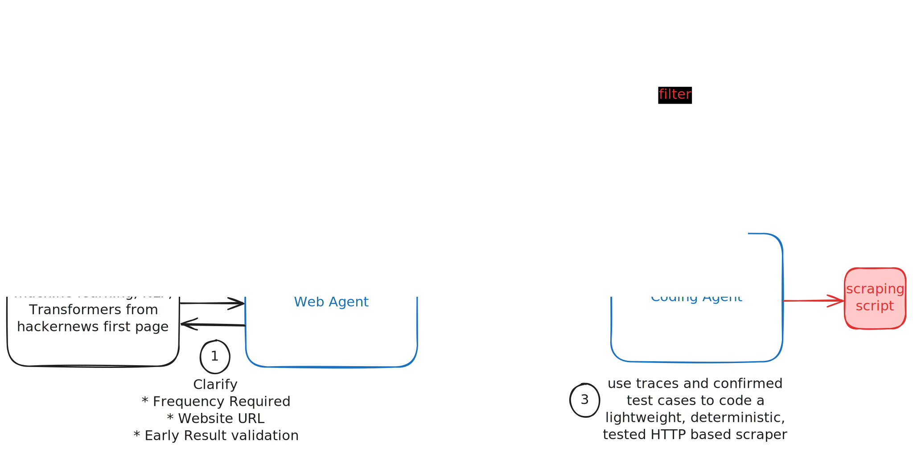

# HTTP-USE

Ultra efficient web scrapers AI developed on demand.

## How it Works

HTTP-USE is an intelligent web scraping system that creates lightweight, deterministic HTTP-based scrapers on demand. The workflow consists of three main stages:

1. **User Request & Clarification**: Users specify what data they want to extract (e.g., articles about machine learning from HackerNews). The system clarifies requirements including:
   - Frequency of scraping needed
   - Target website URL
   - Early result validation criteria

2. **Web Agent & Browser Interaction**: A web agent powered by Playwright MCP navigates the target website, captures screenshots, and generates test cases. This stage produces:
   - Navigation traces
   - Element confirmations
   - Validated test scenarios

3. **Code Generation**: A coding agent uses the traces and confirmed test cases to generate a lightweight, deterministic, and tested HTTP-based scraping script tailored to the specific requirements.

The system ensures efficient scraping by converting browser-based interactions into optimized HTTP requests, resulting in faster and more reliable data extraction.

