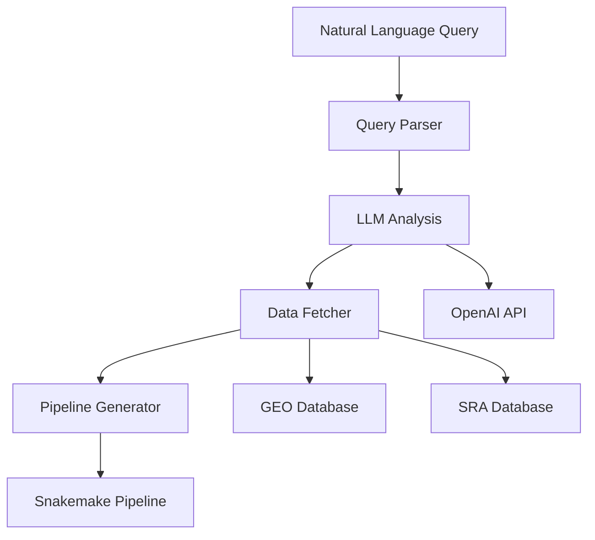

# LLMomics

[](https://www.python.org/downloads/)
[](https://opensource.org/licenses/Apache-2.0)
[](https://github.com/psf/black)

**LLMomics** is an open-source Python library that leverages Large Language Models (LLMs) to automatically generate complete bioinformatics pipelines from natural language queries. It dramatically reduces the technical barrier for researchers who need to perform omics analyses (genomics, transcriptomics, proteomics, metabolomics) without extensive computational expertise.

## Features

- **Natural Language Interface**: Generate pipelines from simple English queries
- **Multi-Omics Support**: RNA-seq, ChIP-seq, ATAC-seq, variant calling, and more
- **Public Database Integration**: Automatic data fetching from GEO, SRA, and other repositories
- **Production-Ready Pipelines**: Generates complete Snakemake workflows with proper logging and error handling
- **Extensible Architecture**: Easy to add new pipeline templates and data sources
- **Smart Query Parsing**: Automatically extracts dataset IDs, tools, and parameters from queries

## Table of Contents

- [Installation](#installation)
- [Quick Start](#quick-start)
- [Usage Examples](#usage-examples)
- [Configuration](#configuration)
- [Architecture](#architecture)
- [Contributing](#contributing)
- [Citation](#citation)
- [License](#license)

## Installation

### Prerequisites

- Python 3.8 or higher
- OpenAI API key (for LLM functionality)

### Install from source

```bash
# Clone the repository
git clone https://github.com/allanps/llmomics.git
cd llmomics

# Install in development mode
pip install -e .

# Or install directly
pip install .
```

### Set up environment variables

Create a `.env` file in your project directory:

```bash
# Required
OPENAI_API_KEY=your_openai_api_key_here

# Optional (for enhanced NCBI access)
NCBI_EMAIL=your.email@example.com
NCBI_API_KEY=your_ncbi_api_key_here
```

## Quick Start

### Basic Usage

Generate a complete RNA-seq differential expression pipeline with a single command:

```bash
llmomics run "Perform differential expression analysis with DESeq2 on GSE123456"
```

This command will:
1. Parse your natural language query
2. Fetch dataset information from GEO
3. Generate a complete Snakemake pipeline
4. Create all necessary configuration files
5. Provide clear instructions for running the analysis

### Search for Datasets

```bash
# Search across all databases
llmomics search "RNA-seq liver cancer"

# Search specific database
llmomics search "breast cancer" --database geo --limit 20
```

### Fetch Dataset Information

```bash
# Automatically detect database from ID
llmomics fetch GSE123456

# Specify database explicitly
llmomics fetch SRR999999 --database sra
```

### Check Configuration

```bash
llmomics config
```

## Usage Examples

### Example 1: RNA-seq Differential Expression

```bash
llmomics run "Analyze RNA-seq data from GSE200366 to find differentially expressed genes between treatment and control groups using DESeq2"
```

This generates a complete pipeline including:
- Quality control with FastQC
- Read trimming with Trim Galore
- Alignment with STAR
- Gene counting with featureCounts
- Differential expression with DESeq2
- MultiQC report generation

### Example 2: ChIP-seq Peak Calling

```bash
llmomics run "Perform ChIP-seq peak calling on H3K27ac data using MACS2"
```

### Example 3: Custom Parameters

```bash
llmomics run "RNA-seq analysis with p-value < 0.01 and fold change > 2.5 for GSE123456"
```

### Python API Usage

```python
from llmomics import LLMProvider, DataFetcher, PipelineGenerator

# Initialize components
llm = LLMProvider()
fetcher = DataFetcher()
generator = PipelineGenerator()

# Analyze query
query = "Perform RNA-seq analysis on GSE123456"
analysis = llm.analyze_query(query)

# Fetch dataset
dataset_info = fetcher.fetch("GSE123456")

# Generate pipeline
pipeline_path = generator.generate(
    pipeline_type="rna-seq",
    analysis_type="differential-expression",
    dataset_info=dataset_info
)
```

## Configuration

LLMomics uses a flexible configuration system with the following hierarchy:
1. Environment variables (highest priority)
2. `.env` file in current directory
3. Default values

### Key Configuration Options

| Setting | Environment Variable | Default | Description |
|---------|---------------------|---------|-------------|
| LLM Provider | `LLM_PROVIDER` | `openai` | LLM service to use |
| OpenAI API Key | `OPENAI_API_KEY` | Required | Your OpenAI API key |
| OpenAI Model | `OPENAI_MODEL` | `gpt-4` | Model to use |
| Output Directory | `LLMOMICS_OUTPUT_DIR` | `./pipelines` | Where to save pipelines |
| NCBI Email | `NCBI_EMAIL` | None | Email for NCBI API |

## Architecture



### Core Modules

- **`core`**: LLM communication and query processing
- **`data`**: Integration with bioinformatics databases
- **`pipeline`**: Snakemake pipeline generation

## Contributing

We welcome contributions! Please see our [Contributing Guidelines](CONTRIBUTING.md) for details.

### Development Setup

```bash
# Clone the repository
git clone https://github.com/allanps/llmomics.git
cd llmomics

# Install in development mode with dev dependencies
pip install -e ".[dev]"

# Run tests
pytest

# Format code
black src/

# Run linting
flake8 src/
```

## Documentation

For detailed documentation, visit our [documentation site](https://github.com/allanps/llmomics).

## Citation

If you use LLMomics in your research, please cite:

```bibtex
@software{llmomics2025,
  title = {LLMomics: LLM-powered bioinformatics pipeline generation},
  author = {Allan Paulo},
  year = {2025},
  url = {https://github.com/allanps/llmomics}
}
```

## Issues and Support

- Report bugs at [GitHub Issues](https://github.com/allanps/llmomics/issues)

## License

This project is licensed under the Apache License 2.0 - see the [LICENSE](LICENSE) file for details.

Licensed under the Apache License, Version 2.0 (the "License");
you may not use this file except in compliance with the License.
You may obtain a copy of the License at

    http://www.apache.org/licenses/LICENSE-2.0

Unless required by applicable law or agreed to in writing, software
distributed under the License is distributed on an "AS IS" BASIS,
WITHOUT WARRANTIES OR CONDITIONS OF ANY KIND, either express or implied.
See the License for the specific language governing permissions and
limitations under the License.
