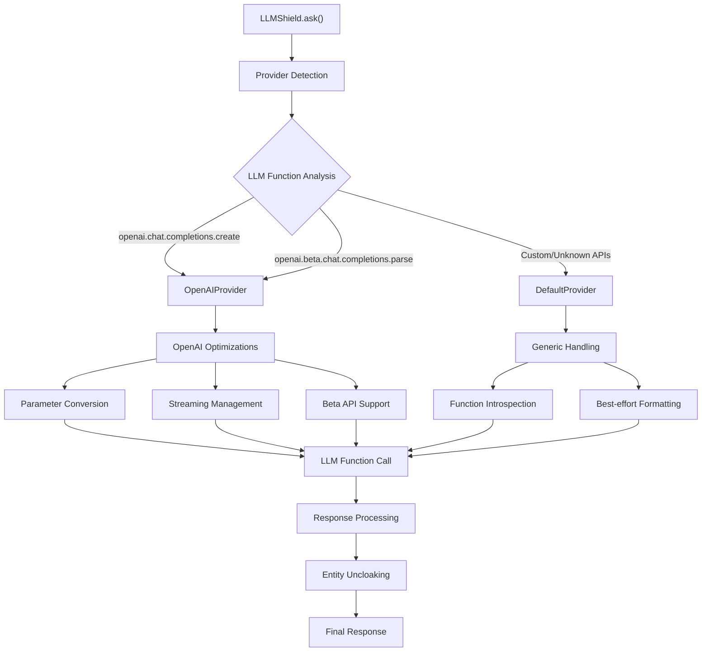

# llmshield

[](https://www.python.org/downloads/)
[](https://www.gnu.org/licenses/agpl-3.0)
[](https://github.com/yourusername/llmshield)

> **Enterprise-grade PII protection for Large Language Model interactions**

## Table of Contents

- [Overview](#overview)
- [Architecture](#architecture)
  - [Provider System](#provider-system)
  - [Provider Types](#provider-types)
  - [Automatic Detection](#automatic-detection)
- [Installation](#installation)
- [Quick Start](#quick-start)
  - [Basic Usage](#basic-usage)
  - [Direct LLM Integration](#direct-llm-integration)
  - [Streaming Support](#streaming-support)
- [Advanced Configuration](#advanced-configuration)
  - [Custom Delimiters](#custom-delimiters)
  - [Conversation Caching](#conversation-caching)
- [Supported LLM Providers](#supported-llm-providers)
- [Entity Detection](#entity-detection)
  - [Supported Entity Types](#supported-entity-types)
- [Best Practices](#best-practices)
  - [Security](#security)
  - [Performance](#performance)
  - [Integration](#integration)
- [Language Support](#language-support)
- [Requirements](#requirements)
- [Development](#development)
  - [Setup](#setup)
  - [Testing](#testing)
  - [Code Quality](#code-quality)
  - [Building and Distribution](#building-and-distribution)
- [Contributing](#contributing)
- [License](#license)
- [Production Usage](#production-usage)

## Overview

**llmshield** is a production-ready, zero-dependency Python library engineered for enterprise-grade protection of sensitive information in Large Language Model (LLM) interactions. It provides automatic detection and cloaking of personally identifiable information (PII) and sensitive entities, ensuring data privacy compliance while maintaining seamless LLM integration.

Built for accuracy and performance, llmshield employs a sophisticated multi-layered approach combining dictionary-based matching, pattern recognition, contextual analysis, and rule-based classification to achieve maximum entity detection precision.

- 🔒 **Comprehensive Entity Detection**: Advanced multi-layered detection system

  - **Proper Nouns**: Persons, Places, Organizations, Concepts
  - **Contact Information**: Email addresses, URLs, social handles
  - **Numeric Data**: Phone numbers, Credit card numbers, IDs
  - **Custom Entities**: Extensible detection framework

- 🚀 **Enterprise Performance**: Production-optimized with minimal latency overhead
- 🔌 **Zero Dependencies**: Pure Python implementation with no external requirements
- 🛡️ **End-to-End Protection**: Bidirectional security for prompts and responses
- 🎯 **Universal LLM Support**: Provider-agnostic with specialized optimizations
- 📊 **Conversation Memory**: Intelligent caching for multi-turn dialogues

## Architecture

llmshield employs a sophisticated **Provider System** that automatically detects and optimizes for different LLM APIs, ensuring seamless integration across platforms while maintaining enterprise-grade security and performance standards.

### Provider System

The library features an extensible provider architecture that handles LLM-specific parameter formatting and API quirks:



#### Provider Types

**OpenAI Provider** (`OpenAIProvider`)

- Automatic detection of OpenAI API functions
- Intelligent parameter conversion (`prompt` → `messages` format)
- Streaming support with proper chunk handling
- Beta API compatibility (structured outputs, function calling)
- Automatic stream parameter management for APIs that don't support it

**Default Provider** (`DefaultProvider`)

- Universal fallback for unknown LLM functions
- Function signature introspection
- Best-effort parameter mapping
- Compatible with most LLM libraries (Anthropic, Cohere, Hugging Face, etc.)

#### Automatic Detection

The provider system automatically detects your LLM function based on:

- Function name patterns (`chat.completions.create`, `beta.chat.completions.parse`)
- Module paths (`openai.*`)
- Function signatures and parameter inspection

## Installation

### Production Installation

Install llmshield from PyPI using pip:

```bash
pip install llmshield
```

### Development Installation

For contributors and advanced users:

```bash
# Clone the repository
git clone https://github.com/yourusername/llmshield.git
cd llmshield

# Install in development mode
pip install -e .
```

### Verification

Verify your installation:

```python
import llmshield
print(llmshield.__version__)
```

## Quick Start

### Basic Usage

```python
from llmshield import LLMShield

# Initialize with automatic provider detection
shield = LLMShield()

# Manual cloaking/uncloaking
cloaked_prompt, entity_map = shield.cloak(
    "Hi, I'm John Doe from Acme Corp (john.doe@acmecorp.com)"
)
print(cloaked_prompt)
# Output: "Hi, I'm <PERSON_0> from <ORG_1> (<EMAIL_2>)"

# Send to your LLM
llm_response = your_llm_function(cloaked_prompt)

# Restore original entities
original_response = shield.uncloak(llm_response, entity_map)
```

### Direct LLM Integration

```python
from openai import OpenAI
from llmshield import LLMShield

# OpenAI example with automatic provider detection
client = OpenAI(api_key="your-api-key")
shield = LLMShield(llm_func=client.chat.completions.create)

# Single-turn conversation
response = shield.ask(
    model="gpt-4",
    prompt="Hi, I'm Sarah Johnson (sarah.j@techcorp.com), help me write an email."
)

# Multi-turn conversation with automatic entity consistency
messages = [
    {"role": "user", "content": "I'm John Smith from DataCorp"},
    {"role": "assistant", "content": "Hello John! How can I help you today?"},
    {"role": "user", "content": "Can you email me at john@datacorp.com?"}
]

response = shield.ask(model="gpt-4", messages=messages)
```

### Streaming Support

```python
# Streaming with real-time entity protection
response_stream = shield.ask(
    model="gpt-4",
    prompt="Generate a report about Jane Doe (jane@example.com)",
    stream=True
)

for chunk in response_stream:
    print(chunk, end="", flush=True)
```

## Advanced Configuration

### Custom Delimiters

```python
# Configure entity placeholder format
shield = LLMShield(
    start_delimiter='[[',  # Default: '<'
    end_delimiter=']]'     # Default: '>'
)
# Entities will appear as [[PERSON_0]], [[EMAIL_1]], etc.
```

### Conversation Caching

```python
# Configure cache size for multi-turn conversations
shield = LLMShield(
    llm_func=your_llm_function,
    max_cache_size=256  # Default: 128
)
```

## Supported LLM Providers

llmshield works with **any LLM library or API**, with specialized optimizations for:

- **OpenAI** (GPT-4, GPT-3.5, all chat models)
- **OpenAI Beta APIs** (structured outputs, function calling)

### Compatible (via DefaultProvider)

- **Anthropic Claude** (via `anthropic` library)
- **Google Gemini** (via `google-generativeai`)
- **Cohere** (via `cohere` library)
- **Hugging Face Transformers**
- **Azure OpenAI**
- **AWS Bedrock**
- **Any custom LLM function**

## Entity Detection

llmshield uses a multi-layered approach combining:

- **Dictionary-based matching** for known entities
- **Pattern recognition** for structured data (emails, phones, etc.)
- **Contextual analysis** for proper nouns
- **Rule-based classification** for entity types

### Supported Entity Types

| Category      | Examples            | Placeholder Format |
| ------------- | ------------------- | ------------------ |
| Persons       | John Doe, Dr. Smith | `<PERSON_0>`       |
| Organizations | Acme Corp, NHS      | `<ORG_0>`          |
| Places        | London, Main Street | `<PLACE_0>`        |
| Emails        | user@domain.com     | `<EMAIL_0>`        |
| Phone Numbers | +1-555-0123         | `<PHONE_0>`        |
| URLs          | https://example.com | `<URL_0>`          |
| Credit Cards  | 4111-1111-1111-1111 | `<CREDIT_CARD_0>`  |

## Best Practices

### 🔒 Security Guidelines

- **Pre-transmission validation**: Always verify sensitive data is properly cloaked before LLM transmission
- **Entity map security**: Store entity mappings securely using encryption for persistent storage
- **Delimiter selection**: Choose delimiters that don't conflict with your data format or LLM training
- **Input sanitization**: Validate and sanitize all inputs before processing
- **Regular audits**: Periodically review cloaked outputs to ensure no PII leakage

### ⚡ Performance Optimization

- **Instance reuse**: Maintain single `LLMShield` instances to leverage conversation caching
- **Cache monitoring**: Track cache hit rates for multi-turn conversations (aim for >80%)
- **Delimiter alignment**: Select delimiters compatible with your LLM's tokenization
- **Batch processing**: Process multiple prompts in batches when possible
- **Memory management**: Configure appropriate cache sizes based on usage patterns

### 🔧 Integration Best Practices

- **Exception handling**: Implement comprehensive error handling for `ValueError` exceptions
- **Provider testing**: Validate functionality with your specific LLM provider before production
- **Structured outputs**: Leverage structured output capabilities for complex response processing
- **Monitoring**: Implement logging and monitoring for entity detection accuracy
- **Testing**: Include PII protection tests in your CI/CD pipeline

## Language Support

- **Primary**: English (optimized)
- **Secondary**: Spanish (good accuracy)
- **Experimental**: Other languages (reduced accuracy, potential PII leakage)

## Requirements

- **Python**: 3.10+
- **Dependencies**: None (zero-dependency architecture)
- **Memory**: Minimal footprint with efficient caching
- **Performance**: Sub-millisecond entity detection for typical prompts

## Development

### Setup

```bash
# Clone and setup development environment
git clone https://github.com/yourusername/llmshield.git
cd llmshield

# Create virtual environment
python -m venv venv
source venv/bin/activate  # On Windows: venv\Scripts\activate

# Install development dependencies
make dev-dependencies
```

### Testing

```bash
# Run full test suite
make tests

# Run with coverage
make coverage

# Test specific providers (requires API keys)
OPENAI_API_KEY=your-key python -m unittest tests/providers/test_openai.py
```

### Code Quality

```bash
# Format code
black llmshield/ tests/
isort llmshield/ tests/

# Lint
flake8 llmshield/ tests/
```

### Building and Distribution

#### Local Installation

```bash
# Install package locally in development mode
pip install -e .

# Or install from local build
python -m build
pip install dist/llmshield-*.whl
```

#### Building for Distribution

```bash
# Install build dependencies
pip install build twine

# Build the package
python -m build

# This creates:
# - dist/llmshield-*.tar.gz (source distribution)
# - dist/llmshield-*.whl (wheel distribution)
```

#### Publishing to PyPI

```bash
# Check the built package
twine check dist/*

# Upload to test PyPI first (recommended)
twine upload --repository testpypi dist/*

# Upload to production PyPI
twine upload dist/*
```

**Prerequisites for publishing:**

- PyPI account with API key configured
- Maintainer permissions on the llmshield project
- All tests passing and version bumped in `pyproject.toml`

## Contributing

We welcome contributions! Please see our [Contributing Guidelines](CONTRIBUTING.md) for details.

### Development Principles

- **Zero Dependencies**: Maintain pure Python implementation
- **Performance First**: Optimize for production workloads
- **Security Focus**: Prioritize data protection and privacy
- **Universal Compatibility**: Support all major LLM providers

## License

**GNU Affero General Public License v3.0** - See [LICENSE.txt](LICENSE.txt) for details.

## Production Usage

llmshield is trusted by:

- [brainful.ai](https://brainful.ai) - AI-powered enterprise solutions

---

## Get Started

Ready to secure your LLM interactions? Install llmshield today:

```bash
pip install llmshield
```
