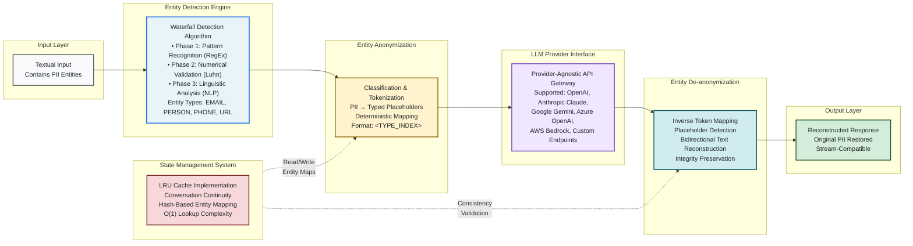

# LLMShield

[](https://www.python.org/downloads/)
[](https://www.gnu.org/licenses/agpl-3.0)
[](https://github.com/yourusername/llmshield)

A zero-dependency Python library for protecting personally identifiable information (PII) in Large Language Model interactions through automatic entity detection and cloaking.

## Overview

LLMShield provides enterprise-grade protection for sensitive information in LLM interactions by automatically detecting and replacing PII with placeholders before transmission, then restoring original values in responses. The library employs a multi-layered detection approach combining pattern recognition, dictionary matching, and contextual analysis.

**Key Features:**

- Zero external dependencies
- Automatic entity detection and cloaking
- Multi-turn conversation support with entity consistency
- Streaming response handling
- Universal LLM provider compatibility
- Production-optimized performance

## High-Level Data Flow

```mermaid
graph LR
    A["Raw Input<br/>'Contact Dr. Smith at smith@hospital.org'"] --> B["Entity Detection<br/>PERSON: Dr. Smith<br/>EMAIL: smith@hospital.org"]

    B --> C["PII Anonymization<br/>'Contact &lt;PERSON_0&gt; at &lt;EMAIL_1&gt;'"]

    C --> D["LLM Processing<br/>Safe text sent to<br/>OpenAI, Claude, etc."]

    D --> E["Response Restoration<br/>Placeholders → Original PII"]

    E --> F["Protected Output<br/>'I'll help you contact Dr. Smith<br/>at smith@hospital.org'"]

    %% Styling
    classDef flowStyle fill:#f8f9fa,stroke:#495057,stroke-width:2px,color:#212529
    classDef detectionStyle fill:#e8f4f8,stroke:#0c63e4,stroke-width:2px,color:#212529
    classDef anonymizationStyle fill:#fff3cd,stroke:#856404,stroke-width:2px,color:#212529
    classDef llmStyle fill:#f0e6ff,stroke:#6f42c1,stroke-width:2px,color:#212529
    classDef restorationStyle fill:#d1ecf1,stroke:#0c5460,stroke-width:2px,color:#212529

    class A flowStyle
    class B detectionStyle
    class C anonymizationStyle
    class D llmStyle
    class E restorationStyle
    class F flowStyle
```



## Under the Hood: System Architecture



## Installation

```bash
pip install llmshield
```

## Quick Start

### Basic Usage

```python
from llmshield import LLMShield

# Initialise shield
shield = LLMShield()

# Protect sensitive information
cloaked_prompt, entity_map = shield.cloak(
    "Contact John Doe at john.doe@company.com or call +1-555-0123"
)
print(cloaked_prompt)
# Output: "Contact <PERSON_0> at <EMAIL_1> or call <PHONE_NUMBER_2>"

# Process with LLM
llm_response = your_llm_function(cloaked_prompt)

# Restore original entities
restored_response = shield.uncloak(llm_response, entity_map)
```

**Note:** Individual `cloak()` and `uncloak()` methods support single messages only and do not maintain conversation history. For multi-turn conversations with entity consistency across messages, use the `ask()` method.

### Direct LLM Integration

```python
from openai import OpenAI
from llmshield import LLMShield

client = OpenAI(api_key="your-api-key")
shield = LLMShield(llm_func=client.chat.completions.create)

# Single request with automatic protection
response = shield.ask(
    model="gpt-4",
    prompt="Draft an email to Sarah Johnson at sarah.j@techcorp.com"
)

# Multi-turn conversation
messages = [
    {"role": "user", "content": "I'm John Smith from DataCorp"},
    {"role": "assistant", "content": "Hello! How can I help you?"},
    {"role": "user", "content": "Email me at john@datacorp.com"}
]

response = shield.ask(model="gpt-4", messages=messages)
```

### Streaming Support

```python
response_stream = shield.ask(
    model="gpt-4",
    prompt="Generate a report about Jane Doe (jane@example.com)",
    stream=True
)

for chunk in response_stream:
    print(chunk, end="", flush=True)
```

## Entity Detection

The library detects and protects the following entity types:

| Entity Type  | Examples            | Placeholder Format |
| ------------ | ------------------- | ------------------ |
| Person       | John Doe, Dr. Smith | `<PERSON_0>`       |
| Organization | Acme Corp, NHS      | `<ORGANISATION_0>` |
| Place        | London, Main Street | `<PLACE_0>`        |
| Email        | user@domain.com     | `<EMAIL_0>`        |
| Phone        | +1-555-0123         | `<PHONE_NUMBER_0>` |
| URL          | https://example.com | `<URL_0>`          |
| Credit Card  | 4111-1111-1111-1111 | `<CREDIT_CARD_0>`  |
| IP Address   | 192.168.1.1         | `<IP_ADDRESS_0>`   |

## Configuration

### Custom Delimiters

```python
shield = LLMShield(
    start_delimiter='[[',
    end_delimiter=']]'
)
# Entities appear as [[PERSON_0]], [[EMAIL_1]], etc.
```

### Conversation Caching

LLMShield implements an LRU (Least Recently Used) cache to maintain entity consistency across multi-turn conversations. The cache stores entity mappings for conversation histories, ensuring that all entities (persons, organizations, emails, phones, etc.) mentioned in different messages receive the same placeholders.

```python
shield = LLMShield(
    llm_func=your_llm_function,
    max_cache_size=1000  # Default: 1000
)
```

**Cache Sizing Guidelines:**

- **Small applications** (< 100 daily conversations): `max_cache_size=100-500`
- **Medium applications** (100-1000 daily conversations): `max_cache_size=1000-5000`
- **Large applications** (> 1000 daily conversations): `max_cache_size=5000-10000`

**Memory considerations:** Each cache entry stores approximately 1-2KB. A cache size of 1000 uses roughly 1-2MB of memory.

**Performance impact:** Cache hit rates above 80% significantly improve performance for multi-turn conversations by avoiding re-detection of previously seen entities.

## Provider Compatibility

LLMShield includes specialized support for OpenAI APIs and universal compatibility with other providers:

**Optimized Support:**

- OpenAI (GPT-4, GPT-3.5, all chat models)
- OpenAI Beta APIs (structured outputs)

**Universal Compatibility:**

- Anthropic Claude
- Google Gemini
- Cohere
- Hugging Face Transformers
- Azure OpenAI
- AWS Bedrock
- Custom LLM functions

## Language Support

- **English**: Full optimization and accuracy
- **Other languages**: Experimental support with reduced accuracy

## Requirements

- Python 3.12+
- Zero external dependencies

## Development

### Setup

```bash
git clone https://github.com/yourusername/llmshield.git
cd llmshield
python -m venv venv
source venv/bin/activate  # Windows: venv\Scripts\activate
pip install -e ".[dev]"
```

### Testing

```bash
# Run tests
make tests

# Coverage analysis
make coverage

# Code quality checks
make ruff

# Documentation coverage
make doc-coverage
```

## Building and Publishing

### Building the Package

```bash
# Install build dependencies
make dev-dependencies

# Build the package
make build
```

### Publishing to PyPI

1. **Update version** in `pyproject.toml`
2. **Run quality checks**:
   ```bash
   make tests
   make coverage
   make ruff
   ```
3. **Build and publish**:
   ```bash
   make build
   twine upload dist/*
   ```

## Security Considerations

- Validate cloaked outputs before LLM transmission
- Securely store entity mappings for persistent sessions
- Choose delimiters that don't conflict with your data format
- Implement comprehensive input validation
- Regularly audit entity detection accuracy

## Contributing

See [CONTRIBUTING.md](CONTRIBUTING.md) for development guidelines and contribution process.

## License

GNU Affero General Public License v3.0 - See [LICENSE.txt](LICENSE.txt) for details.

## Production Usage

LLMShield is used in production at [brainful.ai](https://brainful.ai).
