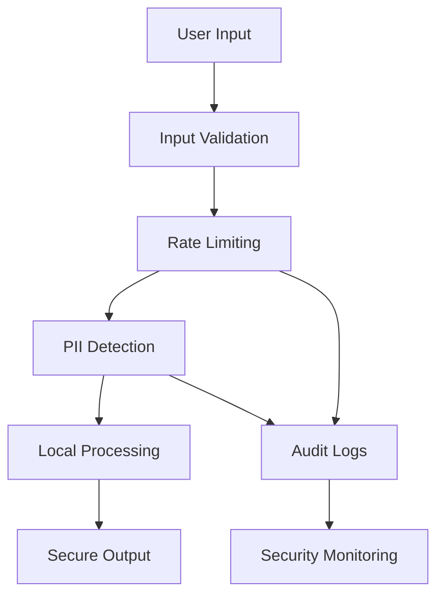

# Security Guide for MaskingEngine

This document provides security best practices for deploying and using MaskingEngine in production environments.

## Table of Contents

1. [Security Overview](#security-overview)
2. [Rate Limiting](#rate-limiting)
3. [Access Control](#access-control)
4. [Data Handling](#data-handling)
5. [Logging and Monitoring](#logging-and-monitoring)
6. [Network Security](#network-security)
7. [Deployment Security](#deployment-security)
8. [Configuration Security](#configuration-security)

---

## Security Overview

MaskingEngine is designed with security as a core principle:

- **Local-first processing**: No data is sent to external services
- **No telemetry**: No usage data is collected or transmitted
- **Minimal dependencies**: Reduced attack surface
- **Configurable security controls**: Rate limiting, access controls, and audit logging

### Security Model



---

## Rate Limiting

### API Rate Limiting

MaskingEngine includes built-in rate limiting for API endpoints:

```python
# Enable rate limiting in configuration
config = {
    "rate_limiting": {
        "enabled": True,
        "requests_per_minute": 60
    }
}
```

### Implementation

```python
from maskingengine.api.rate_limit import RateLimiter

# Custom rate limiting
limiter = RateLimiter(
    requests_per_minute=100,
    burst_limit=10
)

@limiter.limit("10/minute")
def sensitive_endpoint():
    # Your endpoint logic
    pass
```

### Production Recommendations

| Environment | Requests/Minute | Burst Limit | Notes |
|-------------|-----------------|-------------|-------|
| **Development** | Unlimited | N/A | No rate limiting |
| **Staging** | 1000 | 50 | Testing realistic limits |
| **Production** | 100-500 | 20-50 | Based on usage patterns |
| **Public API** | 60 | 10 | Conservative limits |

### Rate Limiting Best Practices

1. **Implement at multiple layers**:
   ```bash
   # Nginx level
   limit_req_zone $binary_remote_addr zone=api:10m rate=10r/s;
   
   # Application level (MaskingEngine)
   rate_limiting:
     enabled: true
     requests_per_minute: 60
   ```

2. **Monitor rate limit violations**:
   ```python
   # Log rate limit hits
   @app.middleware("http")
   async def rate_limit_logger(request, call_next):
       # Log rate limit violations for security monitoring
       pass
   ```

3. **Implement graceful degradation**:
   ```python
   # Return informative error messages
   {
       "error": "Rate limit exceeded",
       "retry_after": 60,
       "limit": "60 requests per minute"
   }
   ```

---

## Access Control

### Authentication Methods

#### API Key Authentication
```python
# Basic API key validation
API_KEYS = {
    "prod_key_123": {"name": "Production Service", "permissions": ["sanitize"]},
    "dev_key_456": {"name": "Development Team", "permissions": ["sanitize", "validate"]}
}

@app.middleware("http")
async def api_key_auth(request, call_next):
    api_key = request.headers.get("X-API-Key")
    if not api_key or api_key not in API_KEYS:
        return Response(status_code=401)
    return await call_next(request)
```

#### JWT Token Authentication
```python
import jwt

def verify_jwt(token: str) -> dict:
    try:
        payload = jwt.decode(token, SECRET_KEY, algorithms=["HS256"])
        return payload
    except jwt.InvalidTokenError:
        raise HTTPException(status_code=401, detail="Invalid token")
```

### Role-Based Access Control

```yaml
# roles.yaml
roles:
  viewer:
    permissions:
      - "validate-config"
      - "list-models"
      - "list-packs"
  
  sanitizer:
    permissions:
      - "sanitize"
      - "test-sample"
      - "validate-config"
  
  admin:
    permissions:
      - "*"  # All permissions
```

### IP Whitelisting

```python
ALLOWED_IPS = [
    "192.168.1.0/24",    # Internal network
    "10.0.0.0/8",        # Private network
    "172.16.0.0/12"      # Docker network
]

@app.middleware("http")
async def ip_whitelist(request, call_next):
    client_ip = request.client.host
    if not is_ip_allowed(client_ip, ALLOWED_IPS):
        return Response(status_code=403)
    return await call_next(request)
```

---

## Data Handling

### Input Validation

```python
from pydantic import BaseModel, validator

class SanitizeRequest(BaseModel):
    content: str
    format: Optional[str] = "text"
    
    @validator('content')
    def validate_content_length(cls, v):
        if len(v) > 1_000_000:  # 1MB limit
            raise ValueError('Content too large')
        return v
    
    @validator('format')
    def validate_format(cls, v):
        if v not in ['text', 'json', 'html']:
            raise ValueError('Invalid format')
        return v
```

### Memory Management

```python
# Configure memory limits
config = {
    "max_content_size": 1_000_000,  # 1MB
    "max_concurrent_requests": 10,
    "streaming": {
        "enabled": True,
        "chunk_size": 4096
    }
}

# Use streaming for large inputs
@app.post("/sanitize/stream")
async def sanitize_stream(request: Request):
    async def process_chunks():
        session = StreamingMaskingSession()
        async for chunk in request.stream():
            yield session.process_chunk(chunk)
```

### Temporary Data Handling

```python
# Secure temporary file handling
import tempfile
import os

def secure_temp_processing(content: str):
    # Use secure temporary files
    with tempfile.NamedTemporaryFile(mode='w', delete=True, 
                                   dir='/secure/tmp', 
                                   prefix='masking_') as tmp_file:
        tmp_file.write(content)
        tmp_file.flush()
        
        # Process the file
        result = process_file(tmp_file.name)
        
        # File is automatically deleted
        return result
```

---

## Logging and Monitoring

### Security Logging

```python
import logging
from datetime import datetime

# Configure security logger
security_logger = logging.getLogger('maskingengine.security')
security_logger.setLevel(logging.INFO)

# Security event types
class SecurityEvent:
    RATE_LIMIT_EXCEEDED = "rate_limit_exceeded"
    INVALID_AUTH = "invalid_authentication"
    LARGE_REQUEST = "large_request_detected"
    SUSPICIOUS_PATTERN = "suspicious_pattern_detected"

def log_security_event(event_type: str, details: dict):
    security_logger.warning(f"Security Event: {event_type}", extra={
        'timestamp': datetime.utcnow().isoformat(),
        'event_type': event_type,
        'client_ip': details.get('client_ip'),
        'user_agent': details.get('user_agent'),
        'details': details
    })
```

### Audit Logging

```python
# Audit all sanitization requests
def audit_sanitization_request(request_id: str, metadata: dict):
    audit_logger.info("Sanitization request", extra={
        'request_id': request_id,
        'timestamp': datetime.utcnow().isoformat(),
        'content_length': metadata.get('content_length'),
        'format': metadata.get('format'),
        'pii_detected': metadata.get('pii_count'),
        'processing_time_ms': metadata.get('processing_time'),
        'client_ip': metadata.get('client_ip')
    })
```

### Monitoring Alerts

Set up alerts for security events:

```yaml
# alerts.yaml
alerts:
  - name: "High Rate Limit Violations"
    condition: "rate_limit_exceeded > 10 per minute"
    action: "notify_security_team"
  
  - name: "Large Content Processing"
    condition: "content_length > 500KB"
    action: "log_and_monitor"
  
  - name: "Authentication Failures"
    condition: "invalid_auth > 5 per minute from same IP"
    action: "block_ip_temporarily"
```

---

## Network Security

### HTTPS Configuration

```python
# Force HTTPS in production
@app.middleware("http")
async def force_https(request, call_next):
    if not request.url.scheme == "https" and not request.url.hostname == "localhost":
        https_url = request.url.replace(scheme="https")
        return RedirectResponse(https_url, status_code=301)
    return await call_next(request)
```

### Security Headers

```python
@app.middleware("http")
async def security_headers(request, call_next):
    response = await call_next(request)
    
    # Security headers
    response.headers["X-Content-Type-Options"] = "nosniff"
    response.headers["X-Frame-Options"] = "DENY"
    response.headers["X-XSS-Protection"] = "1; mode=block"
    response.headers["Strict-Transport-Security"] = "max-age=31536000; includeSubDomains"
    response.headers["Content-Security-Policy"] = "default-src 'self'"
    response.headers["Referrer-Policy"] = "strict-origin-when-cross-origin"
    
    return response
```

### CORS Configuration

```python
from fastapi.middleware.cors import CORSMiddleware

# Restrictive CORS policy
app.add_middleware(
    CORSMiddleware,
    allow_origins=["https://yourdomain.com"],  # Specific domains only
    allow_credentials=True,
    allow_methods=["POST"],  # Only required methods
    allow_headers=["Content-Type", "Authorization"],
)
```

---

## Deployment Security

### Container Security

```dockerfile
# Dockerfile security best practices
FROM python:3.11-slim

# Create non-root user
RUN useradd -r -s /bin/false maskingengine

# Set secure file permissions
COPY --chown=maskingengine:maskingengine . /app
RUN chmod -R 755 /app

# Run as non-root
USER maskingengine
WORKDIR /app

# Health check
HEALTHCHECK --interval=30s --timeout=10s --start-period=5s --retries=3 \
    CMD curl -f http://localhost:8000/health || exit 1
```

### Environment Isolation

```bash
# Production environment variables
export PYTHONPATH="/app"
export PYTHONDONTWRITEBYTECODE=1
export PYTHONUNBUFFERED=1

# Security settings
export MASKING_ENV="production"
export MASKING_DEBUG="false"
export MASKING_LOG_LEVEL="WARNING"

# Secrets management
export API_SECRET_KEY="$(cat /run/secrets/api_secret)"
export JWT_SECRET="$(cat /run/secrets/jwt_secret)"
```

### Resource Limits

```yaml
# docker-compose.yml
services:
  maskingengine:
    deploy:
      resources:
        limits:
          memory: 512M
          cpus: '0.5'
        reservations:
          memory: 256M
          cpus: '0.25'
    
    # Security options
    security_opt:
      - no-new-privileges:true
    
    # Read-only filesystem
    read_only: true
    tmpfs:
      - /tmp:noexec,nosuid,size=100m
```

---

## Configuration Security

### Secrets Management

```python
# Use environment variables for secrets
import os
from pathlib import Path

def load_secret(secret_name: str) -> str:
    # Try Docker secrets first
    secret_path = Path(f"/run/secrets/{secret_name}")
    if secret_path.exists():
        return secret_path.read_text().strip()
    
    # Fall back to environment variable
    return os.environ.get(secret_name.upper())

# Usage
API_SECRET = load_secret("api_secret_key")
```

### Configuration Validation

```python
# Validate security-related configuration
def validate_production_config(config: dict) -> list:
    issues = []
    
    # Check rate limiting
    if not config.get("rate_limiting", {}).get("enabled"):
        issues.append("Rate limiting should be enabled in production")
    
    # Check logging
    if config.get("log_level", "INFO") == "DEBUG":
        issues.append("Debug logging should be disabled in production")
    
    # Check HTTPS
    if not config.get("force_https", True):
        issues.append("HTTPS should be enforced in production")
    
    return issues
```

### Secure Defaults

```yaml
# production.yaml - Secure production defaults
security:
  rate_limiting:
    enabled: true
    requests_per_minute: 60
  
  authentication:
    required: true
    method: "api_key"  # or "jwt"
  
  logging:
    level: "WARNING"
    audit_enabled: true
    security_events: true
  
  network:
    force_https: true
    allowed_hosts: ["yourdomain.com"]
  
  content:
    max_size_mb: 1
    allowed_formats: ["text", "json"]
```

---

## Security Checklist

### Pre-Deployment

- [ ] Rate limiting configured and tested
- [ ] Authentication implemented
- [ ] HTTPS enforced
- [ ] Security headers configured
- [ ] Input validation implemented
- [ ] Audit logging enabled
- [ ] Resource limits set
- [ ] Secrets properly managed
- [ ] Security scanning completed

### Production Monitoring

- [ ] Rate limit violations monitored
- [ ] Authentication failures tracked
- [ ] Large request alerts configured
- [ ] Error rate monitoring
- [ ] Performance monitoring
- [ ] Log aggregation configured
- [ ] Security event alerting

### Regular Maintenance

- [ ] Dependency updates reviewed
- [ ] Security patches applied
- [ ] Log files rotated
- [ ] Access credentials rotated
- [ ] Security configuration reviewed
- [ ] Incident response plan tested

---

## Incident Response

### Security Incident Types

1. **Rate Limit Attacks**: Automated tools hitting rate limits
2. **Authentication Bypass**: Attempts to circumvent auth
3. **Large Content Attacks**: Attempts to exhaust resources
4. **Data Exfiltration**: Unusual patterns in responses

### Response Procedures

```python
# Automated incident response
class SecurityIncidentHandler:
    def handle_rate_limit_violation(self, client_ip: str):
        # Temporarily block IP
        self.block_ip(client_ip, duration_minutes=15)
        self.notify_security_team(f"Rate limit violation from {client_ip}")
    
    def handle_auth_failure(self, client_ip: str, attempts: int):
        if attempts > 5:
            self.block_ip(client_ip, duration_minutes=60)
            self.alert_security_team(f"Multiple auth failures from {client_ip}")
    
    def handle_large_content(self, size_mb: float, client_ip: str):
        if size_mb > 10:  # Suspiciously large
            self.log_security_event("large_content_attack", {
                "size_mb": size_mb,
                "client_ip": client_ip
            })
```

---

## Additional Resources

- [OWASP API Security Top 10](https://owasp.org/www-project-api-security/)
- [FastAPI Security Documentation](https://fastapi.tiangolo.com/tutorial/security/)
- [Docker Security Best Practices](https://docs.docker.com/engine/security/)
- [Python Security Guidelines](https://python-security.readthedocs.io/)

Remember: Security is an ongoing process, not a one-time setup. Regularly review and update your security measures.