# MaskingEngine Workflow Diagrams

This document provides visual workflow diagrams for different MaskingEngine usage patterns to help you choose the right approach for your use case.

## Overview of Workflow Types

MaskingEngine supports three main workflow patterns:

1. **[Sanitize-Only](#sanitize-only-workflow)** - Permanent PII removal (logs, analytics, training data)
2. **[Round-Trip with Session](#round-trip-session-workflow)** - AI pipelines with automatic rehydration
3. **[Round-Trip with Manual Map](#round-trip-manual-workflow)** - Custom rehydration control

---

## Sanitize-Only Workflow

**Use Cases**: Logs, analytics, training data, permanent PII removal

```mermaid
graph TD
    A[Original Content<br/>with PII] --> B[MaskingEngine<br/>Sanitizer]
    B --> C[Masked Content<br/><<PLACEHOLDERS>>]
    C --> D[Store/Process<br/>Safely]
    
    B -.-> E[Mask Map<br/>Generated]
    E -.-> F[Discard Map<br/>❌ Not Needed]
    
    style A fill:#ffebee
    style C fill:#e8f5e8
    style D fill:#e3f2fd
    style F fill:#fafafa,stroke-dasharray: 5 5
```



**Code Example**:
```python
from maskingengine import Sanitizer

sanitizer = Sanitizer()
masked_content, mask_map = sanitizer.sanitize(
    "User john@example.com called about order #12345"
)

# Use masked_content for logs/analytics
logger.info(f"Customer inquiry: {masked_content}")

# mask_map is discarded - no rehydration needed
```

**Benefits**:
- ✅ Simple, one-way process
- ✅ No storage overhead
- ✅ Perfect for compliance (GDPR, HIPAA)
- ✅ Safe for long-term data retention

---

## Round-Trip Session Workflow

**Use Cases**: AI pipelines, chatbots, LLM integrations, authorized user access


**Code Example**:
```python
from maskingengine import RehydrationPipeline, Sanitizer, RehydrationStorage

# Setup
sanitizer = Sanitizer()
storage = RehydrationStorage()
pipeline = RehydrationPipeline(sanitizer, storage)

# Step 1: Sanitize with session
user_input = "Please help john@example.com with his account"
session_id = "user_123_conversation_456"

masked_content, storage_path = pipeline.sanitize_with_session(
    user_input, session_id
)

# Step 2: Process with LLM (with preservation prompt)
llm_prompt = f"""
IMPORTANT: Keep all <<TYPE_HASH_INDEX>> tokens exactly as shown.

User request: {masked_content}
"""
llm_response = your_llm.complete(llm_prompt)

# Step 3: Rehydrate response
final_response = pipeline.rehydrate_with_session(
    llm_response, session_id
)

# Step 4: Cleanup (optional)
pipeline.complete_session(session_id)
```

**Benefits**:
- ✅ Automatic session management
- ✅ Built-in cleanup capabilities
- ✅ Perfect for AI pipelines
- ✅ Session isolation and security

---

## Round-Trip Manual Workflow

**Use Cases**: Custom storage, batch processing, fine-grained control


**Code Example**:
```python
from maskingengine import Sanitizer, Rehydrator

# Step 1: Sanitize
sanitizer = Sanitizer()
masked_content, mask_map = sanitizer.sanitize(
    "Contact support@company.com for user jane@example.com"
)

# Step 2: Store mask map in your system
your_database.store_mask_map(request_id="req_789", mask_map=mask_map)

# Step 3: Process masked content
processed_content = your_processing_system(masked_content)

# Step 4: Later - retrieve and rehydrate
stored_mask_map = your_database.get_mask_map(request_id="req_789")
rehydrator = Rehydrator()
final_content = rehydrator.rehydrate(processed_content, stored_mask_map)
```

**Benefits**:
- ✅ Full control over storage
- ✅ Custom retention policies
- ✅ Integration with existing systems
- ✅ Batch processing capabilities

---

## Decision Flow Chart

**Which workflow should you use?**


---

## Performance Comparison

| Workflow Type | Initial Speed | Memory Usage | Storage Overhead | Complexity |
|---------------|---------------|---------------|------------------|------------|
| **Sanitize-Only** | Fastest | Minimal | None | Low |
| **Session-Based** | Fast | Low | Automatic cleanup | Medium |
| **Manual Control** | Fast | Low | User-controlled | High |

### Speed Breakdown by Mode:


---

## API Endpoint Mapping

### REST API Workflow Mapping:

```mermaid
graph TD
    subgraph "Sanitize-Only"
        A1[POST /sanitize] --> A2[Response with<br/>sanitized_content + mask_map]
        A2 --> A3[Use sanitized_content<br/>Discard mask_map]
    end
    
    subgraph "Session-Based Round-Trip"
        B1[POST /session/sanitize] --> B2[Response with<br/>sanitized_content + session_id]
        B2 --> B3[LLM Processing]
        B3 --> B4[POST /session/rehydrate]
        B4 --> B5[Response with<br/>rehydrated_content]
        B5 --> B6[DELETE /session/{id}<br/>Optional cleanup]
    end
    
    subgraph "Manual Round-Trip"
        C1[POST /sanitize] --> C2[Store mask_map<br/>in your system]
        C2 --> C3[Processing]
        C3 --> C4[POST /rehydrate<br/>with stored mask_map]
        C4 --> C5[Response with<br/>rehydrated_content]
    end
    
    style A1 fill:#e8f5e8
    style B1 fill:#fff3e0
    style C1 fill:#e3f2fd
```

---

## CLI Workflow Examples

### Sanitize-Only:
```bash
# One-way masking for logs
echo "Error: user john@example.com failed login" | \
  maskingengine mask --stdin --regex-only >> secure.log
```

### Session-Based:
```bash
# Step 1: Mask with session
maskingengine session-sanitize input.txt session_123 -o masked.txt

# Step 2: Process masked.txt with external tool
your_ai_tool masked.txt > ai_response.txt

# Step 3: Rehydrate
maskingengine session-rehydrate ai_response.txt session_123 -o final.txt --cleanup
```

### Manual Control:
```bash
# Step 1: Mask and save both outputs
maskingengine mask input.txt -o masked.txt
# (mask map automatically saved as input.txt.mask_map.json)

# Step 2: Process
your_tool masked.txt > processed.txt

# Step 3: Rehydrate
maskingengine rehydrate processed.txt input.txt.mask_map.json -o final.txt
```

---

## Security Considerations by Workflow

### Data Flow Security:


### Security Best Practices:

| Workflow | Storage Duration | Access Control | Cleanup |
|----------|------------------|----------------|---------|
| **Sanitize-Only** | N/A (no storage) | N/A | Automatic |
| **Session-Based** | Temporary (hours) | Session isolation | Automatic + manual |
| **Manual Control** | User-defined | User-implemented | User-controlled |

---

## Integration Patterns

### Common Integration Scenarios:

```mermaid
graph TB
    subgraph "Web Application"
        W1[User Input] --> W2[Session Workflow]
        W2 --> W3[LLM Response]
        W3 --> W4[User Output]
    end
    
    subgraph "Data Pipeline"
        D1[Raw Data] --> D2[Sanitize-Only]
        D2 --> D3[Analytics/ML]
    end
    
    subgraph "Enterprise System"
        E1[Customer Data] --> E2[Manual Workflow]
        E2 --> E3[Custom Database]
        E3 --> E4[Authorized Access]
    end
    
    subgraph "Microservices"
        M1[Service A] --> M2[API Session Workflow]
        M2 --> M3[Service B]
        M3 --> M4[Service C]
    end
    
    style W2 fill:#fff3e0
    style D2 fill:#e8f5e8
    style E2 fill:#e3f2fd
    style M2 fill:#f3e5f5
```



This comprehensive workflow guide helps you choose the right MaskingEngine pattern for your specific use case, whether you need simple PII removal or complex AI pipeline integration with rehydration capabilities.