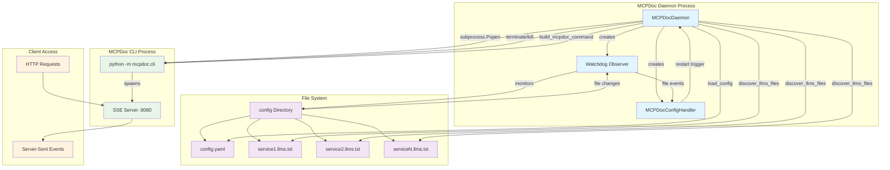

# MCPDoc Daemon

[](https://pypi.org/project/mcpdoc-daemon/)

A simple daemon that monitors configuration files and automatically reloads [mcpdoc](https://github.com/langchain-ai/mcpdoc)
when changes are detected.

## About MCPDoc

[MCPDoc](https://github.com/langchain-ai/mcpdoc) is a tool that serves documentation using the Model Context Protocol (MCP). It allows you to create
documentation servers that can be consumed by LLM applications, providing structured access to documentation from various
sources including local `llms.txt` files and direct URLs.

This daemon provides automated monitoring and reloading capabilities for the `mcpdoc` server, making it easy to provide
up-to-date documentation to LLMs using a single MCP server configuration.

## Features

- Monitors a mounted directory for `config.yaml` and `*.llms.txt` files
- Automatically restarts mcpdoc when configuration changes
- Supports dynamic URL discovery from `.llms.txt` files
- Uses file watching for immediate response to changes
- Container-ready with Podman/Docker support
- Uses `watchdog` library for file monitoring with debouncing
- Executes mcpdoc CLI as a subprocess for better isolation and compatibility

## Architecture Overview



### Architecture Components

1. **MCPDocDaemon**: Main daemon class that orchestrates the entire process
2. **MCPDocConfigHandler**: File system event handler for configuration changes
3. **Watchdog Observer**: Monitors the config directory for file changes
4. **MCPDoc CLI Process**: Subprocess running the mcpdoc server
5. **Configuration Files**: YAML config and .llms.txt documentation files

### Process Flow

1. **Initialization**: Daemon starts and creates file monitoring setup
2. **Configuration Loading**: Reads config.yaml and discovers .llms.txt files
3. **Command Building**: Constructs mcpdoc CLI command with appropriate flags
4. **Subprocess Launch**: Starts mcpdoc CLI as a subprocess with SSE transport
5. **File Monitoring**: Continuously watches for configuration file changes
6. **Auto-Restart**: Gracefully terminates and restarts subprocess on changes

## Installation

### Using `pipx`

```bash
pipx install mcpdoc-daemon
```

## Quick Start

1. By default, the daemon will use a directory named `mcpdoc` in your platform's default config directory:
   - On Linux: `~/.config/mcpdoc/`
   - On macOS: `~/Library/Application Support/mcpdoc/`
   - On Windows: `C:\Users\<username>\AppData\Local\mcpdoc\`

   You can create this directory if it doesn't exist:
```bash
# For Linux
mkdir -p ~/.config/mcpdoc
```

2. Add your configuration files to this directory:
   - `config.yaml` - mcpdoc configuration
   - `*.llms.txt` - LLM text files (e.g., `fastapi.llms.txt`, `something.llms.txt`)

   Alternatively, you can specify a custom config directory using the `--config-dir` option.

3. Build and run the container:

### Using Docker Compose / Podman Compose
```bash
podman compose up --build
# or
docker compose up --build
```

### Local Development (Python)
```bash
poetry install
poetry run mcpdoc-daemon
```

## Manual Container Usage

Build the container:
```bash
podman build -t mcpdoc-daemon .
```

Run the container:
```bash
podman run -d \
  --name mcpdoc-daemon \
  -p 8080:8080 \
  -v ./config:/config:z,ro \
  ghcr.io/abn/mcpdoc-daemon:latest --config-dir /config
```

Note: When using containers, you need to explicitly set the config directory to `/config` using the `--config-dir` option to use the mounted volume.

## Configuration Structure

Your configuration directory should contain:

```
<config-dir>/
├── config.yaml          # Main mcpdoc configuration (YAML format)
├── config.json          # Alternative JSON configuration (if no YAML)
├── fastapi.llms.txt     # FastAPI documentation URLs
├── something.llms.txt   # Other service documentation URLs
└── ...                  # Additional .llms.txt files
```

Where `<config-dir>` is either:
- The platform's default config directory + `/mcpdoc` (default)
- A custom directory specified with `--config-dir`
- The `/config` directory when using containers with the appropriate volume mount

**Note**: If both `config.yaml` and `config.json` exist, the daemon will prioritize `config.yaml` and pass it to mcpdoc using the `--yaml` flag. If only `config.json` exists, it will be passed using the `--json` flag.

## Generated Command

The daemon will automatically generate and execute a command similar to:
```bash
python -m mcpdoc.cli --yaml <config-dir>/config.yaml \
  --urls "fastapi:<config-dir>/fastapi.llms.txt" "something:<config-dir>/something.llms.txt" \
  --follow-redirects --timeout 10.0 \
  --allowed-domains '*' \
  --transport sse \
  --host 0.0.0.0 \
  --port 8080 \
  --log-level INFO
```

Where `<config-dir>` is the path to your configuration directory.

## File Monitoring

The daemon monitors your configuration directory for:
- File modifications
- File creation/deletion
- File moves

The implementation uses the `watchdog` library with debouncing to prevent excessive restarts when multiple file changes
occur in rapid succession.

When relevant files (`config.yaml`, `config.json`, or `*.llms.txt`) change, mcpdoc is automatically restarted with the
updated configuration.

## Containerization

The container uses multi-stage builds with Poetry for better caching and smaller final images:

### Features:
- **Multi-stage builds**: Separate builder and runtime stages for optimal image size
- **Layer caching**: Poetry and pip caches are mounted for faster builds
- **Configurable base image**: Uses `ARG BASE_IMAGE=docker.io/python:3.13-slim`
- **Runtime optimization**: Minimal runtime image with only required dependencies
- **Poetry integration**: Uses Poetry for dependency management instead of pip

### Build Stages:
- **`base`**: Sets up Poetry and basic environment
- **`builder`**: Installs dependencies and copies application files
- **`runtime-base`**: Builds the wheel package
- **`runtime`** (default): Production-ready minimal image

## Implementation Details

The implementation (`mcpdoc_daemon.py`) offers several features:

- **CLI Integration**: Executes mcpdoc CLI as a subprocess for better isolation and compatibility
- **SSE Transport**: Uses Server-Sent Events transport for real-time communication
- **Advanced Monitoring**: Watchdog library provides robust cross-platform file monitoring
- **Debouncing**: Prevents excessive restarts during rapid file changes
- **Configurability**: Environment variables and command-line options
- **Development Mode**: Can run locally without containers
- **Process Management**: Graceful subprocess termination with fallback to force kill

### Environment Variables

- `MCPDOC_CONFIG_DIR`: Configuration directory (default: `<platform config dir>/mcpdoc`)
- `MCPDOC_HOST`: Server host (default: `0.0.0.0`)
- `MCPDOC_PORT`: Server port (default: `8080`)
- `MCPDOC_LOG_LEVEL`: Logging level (default: `INFO`)
- `MCPDOC_TRANSPORT`: Transport method (default: `sse`)

### Command Line Options

```bash
mcpdoc-daemon --help
```

## Access

Once running, mcpdoc will be accessible at `http://localhost:8080`

## Logs

View container logs:
```bash
podman logs -f mcpdoc-daemon
```

## Stopping

Stop the daemon:
```bash
podman compose down
```

Or for manual container:
```bash
podman stop mcpdoc-daemon
```

## Systemd User Service

You can run MCPDoc Daemon as a systemd user service. See [systemd.md](./docs/systemd.md) for more information.
