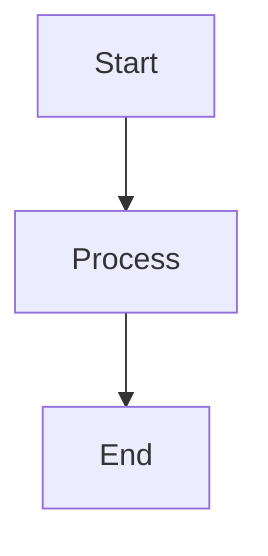

# MkDocs Mermaid to Image Plugin

[](https://python.org/downloads/)
[](https://mkdocs.org/)
[](https://github.com/nuitsjp/mkdocs-mermaid-to-image/blob/main/LICENSE)

**MkDocs環境でMermaidダイアグラムを静的画像として事前レンダリングし、PDF出力に対応させるプラグインです。**

## 特徴

- MermaidダイアグラムをPNG/SVG画像として事前レンダリング
- PDF出力対応
- 標準テーマ（default, dark, forest, neutral）対応
- キャッシュ機能による高速ビルド
- 豊富な設定オプション
- エラーハンドリングと詳細ログ

## クイックスタート

詳細な手順は[インストールガイド](installation.md)をご覧ください。

```bash
npm install -g @mermaid-js/mermaid-cli
pip install mkdocs mkdocs-material mkdocs-with-pdf
git clone https://github.com/nuitsjp/mkdocs-mermaid-to-image
cd mkdocs-mermaid-to-image
pip install -e .
```

## サポートダイアグラム

フローチャート、シーケンス図、クラス図、状態図、ER図、ユーザージャーニー、ガントチャート、円グラフ、Git図

## 使用例

````markdown

````


HTML出力: ``
PDF出力: 画像として正常に表示

## ドキュメント

- [インストールガイド](installation.md)
- [設定オプション](configuration.md)
- [使用方法](usage.md)
- [トラブルシューティング](troubleshooting.md)
- [コントリビューション](contributing.md)

## コントリビューション

コントリビューションを歓迎します。詳細は[コントリビューションガイド](contributing.md)をご覧ください。

- [Issues](https://github.com/nuitsjp/mkdocs-mermaid-to-image/issues)
- [Pull Requests](https://github.com/nuitsjp/mkdocs-mermaid-to-image/pulls)

## 📄 ライセンス

このプロジェクトはMITライセンスの下で公開されています。詳細は [LICENSE](https://github.com/nuitsjp/mkdocs-mermaid-to-image/blob/main/LICENSE) ファイルを参照してください。

## 謝辞

[MkDocs](https://mkdocs.org/)、[Material for MkDocs](https://squidfunk.github.io/mkdocs-material/)、[Mermaid.js](https://mermaid.js.org/)、[mkdocs-with-pdf](https://github.com/orzih/mkdocs-with-pdf)

---

**Made with ❤️ by [nuitsjp](https://github.com/nuitsjp)**
