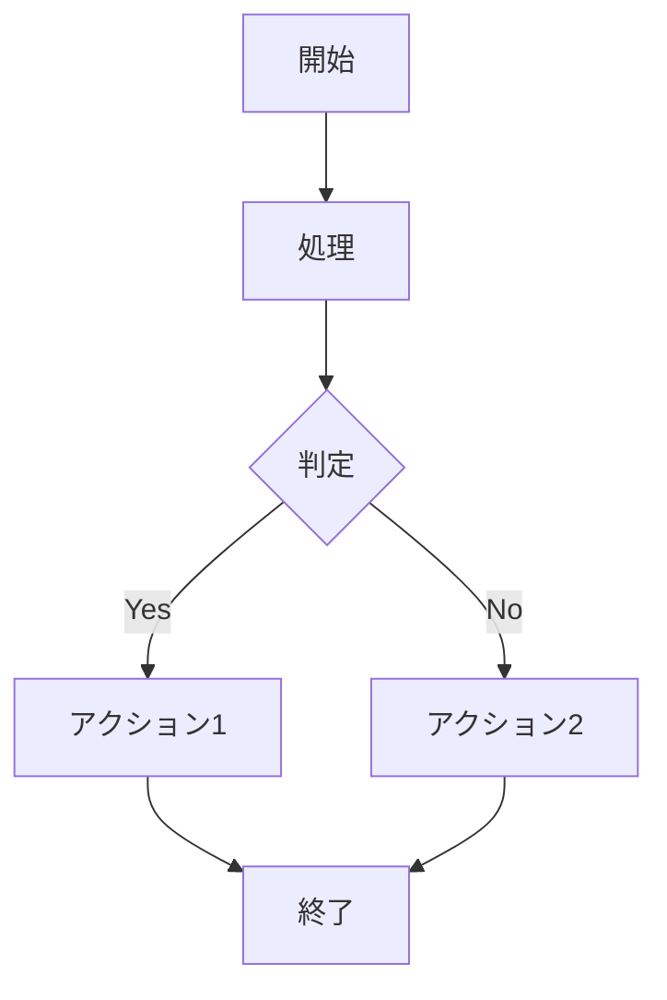
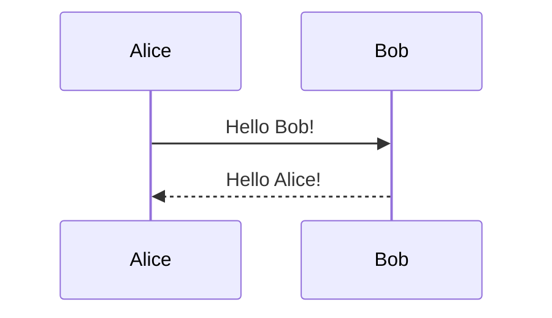

# 使用方法

## 基本的なMermaidダイアグラム



## テーマ属性付きダイアグラム



## サポートされるダイアグラムタイプ

- フローチャート: `graph`, `flowchart`
- シーケンス図: `sequenceDiagram`
- クラス図: `classDiagram`
- 状態図: `stateDiagram`
- ER図: `erDiagram`
- ユーザージャーニー: `journey`
- ガントチャート: `gantt`
- 円グラフ: `pie`
- Git図: `gitgraph`

## ビルド実行

```bash
mkdocs build    # HTMLサイト生成
mkdocs serve    # 開発サーバー起動
```

## 生成ファイルの確認

生成された画像ファイルは`assets/images/`ディレクトリに保存されます。

```bash
mkdocs build --verbose  # 詳細ログでビルド
```

## 生成される成果物

Markdownのコードブロックが画像タグに置き換えられ、PDF出力でも正常に表示されます。

## テストと開発

```bash
pytest                           # 全テスト実行
black mkdocs_mermaid_to_image/   # コードフォーマット
flake8 mkdocs_mermaid_to_image/  # リント
mypy mkdocs_mermaid_to_image/    # 型チェック
```
