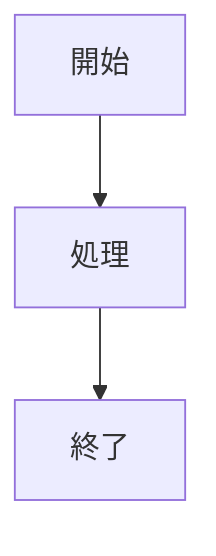
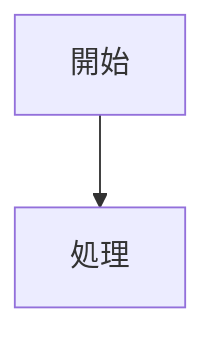

# MkDocs Mermaid to Image Plugin

[](https://badge.fury.io/py/mkdocs-mermaid-to-image)
[](https://python.org/downloads/)
[](https://mkdocs.org/)
[](https://github.com/nuitsjp/mkdocs-mermaid-to-image/blob/main/LICENSE)

**MkDocs環境でMermaidダイアグラムを静的画像として事前レンダリングし、PDF出力に対応させるプラグインです。**

## 概要

このプラグインは、MkDocsドキュメント内のMermaidダイアグラムを事前に静的画像（PNG/SVG）に変換し、ドキュメントビルド時に画像として埋め込むことで、PDF出力やオフライン表示を可能にします。

### 主な特徴

- 🖼️ **静的画像変換**: MermaidダイアグラムをPNG/SVG画像として事前レンダリング
- 📄 **PDF出力対応**: mkdocs-with-pdfなどのPDF生成プラグインと完全互換
- 🎨 **テーマサポート**: default, dark, forest, neutralテーマに対応
- ⚡ **高速ビルド**: キャッシュ機能による効率的なビルド処理
- 🔧 **豊富な設定**: 画像サイズ、フォーマット、テーマなど詳細な設定が可能
- 🛠️ **エラーハンドリング**: 詳細なログとエラー処理による安定動作

### サポートするダイアグラム

フローチャート、シーケンス図、クラス図、状態図、ER図、ユーザージャーニー、ガントチャート、円グラフ、Git図など、Mermaid.jsがサポートする全ての図表タイプ

## 必要条件

- **Python**: 3.9以上
- **MkDocs**: 1.4.0以上
- **Node.js**: Mermaid CLI (`@mermaid-js/mermaid-cli`) の実行に必要

## インストール

### 1. Mermaid CLIのインストール

```bash
npm install -g @mermaid-js/mermaid-cli
```

### 2. プラグインのインストール

#### PyPIからインストール（リリース版）

```bash
pip install mkdocs-mermaid-to-image
```

#### 開発版のインストール

```bash
git clone https://github.com/nuitsjp/mkdocs-mermaid-to-image.git
cd mkdocs-mermaid-to-image
pip install -e .
```

## 設定

### 最小構成（推奨）

プラグインは適切なデフォルト値を持っているため、最小構成で動作可能です：

```yaml
plugins:
  - mermaid-to-image
```

### 基本設定

必要に応じて設定をカスタマイズできます：

```yaml
plugins:
  - mermaid-to-image:
      enabled: true          # デフォルト: true
      output_dir: assets/images  # デフォルト: assets/images
      theme: default         # デフォルト: default
      image_format: png      # デフォルト: png
```

### 完全な設定例

```yaml
site_name: My Documentation
theme:
  name: material

plugins:
  - search
  - mermaid-to-image:
      # 基本設定
      enabled: true
      output_dir: assets/images
      image_format: png  # png or svg

      # Mermaid設定
      theme: default  # default, dark, forest, neutral
      background_color: white

      # 画像サイズ
      width: 800
      height: 600
      scale: 1.0

      # パフォーマンス
      cache_enabled: true
      cache_dir: .mermaid_cache

      # エラーハンドリング
      error_on_fail: false
      log_level: INFO

      # 高度な設定
      mmdc_path: mmdc  # Mermaid CLIのパス
      css_file: null   # カスタムCSSファイル
      puppeteer_config: null  # Puppeteer設定ファイル

markdown_extensions:
  - pymdownx.superfences:
      custom_fences:
        - name: mermaid
          class: mermaid
```

## 使用方法

### 1. Markdownでの記述

ドキュメント内でMermaidダイアグラムを記述：

````markdown

````

### 2. ビルド実行

```bash
mkdocs build
```

### 3. 結果

- 元のMermaidコードが画像タグに置換されます
- 画像ファイルが`assets/images/`ディレクトリに生成されます

**変換前:**
```markdown

```

**変換後:**
```html

```

## 開発

このプラグインの開発に参加したい方は、[開発ガイド](docs/development.md)をご覧ください。

開発ガイドには以下の内容が含まれています：
- 🛠️ 開発環境のセットアップ手順
- 🧪 テスト実行とデバッグ方法
- 📋 コーディング規約とベストプラクティス
- 🔄 開発ワークフローとリリース手順
- 🐛 トラブルシューティングガイド

### クイックスタート

```bash
# リポジトリをクローン
git clone https://github.com/nuitsjp/mkdocs-mermaid-to-image.git
cd mkdocs-mermaid-to-image

# 開発環境セットアップ
uv add --dev --editable .

# 開発サーバー起動
uv run mkdocs serve
```

詳細は[開発ガイド](docs/development.md)をご確認ください。

## トラブルシューティング

### よくある問題

1. **Mermaid CLIが見つからない**
   ```bash
   npm install -g @mermaid-js/mermaid-cli
   ```

2. **画像が生成されない**
   - ログレベルをDEBUGに設定して詳細を確認
   - `mmdc_path`の設定を確認

3. **PDF出力で画像が表示されない**
   - 画像パスが正しいか確認
   - 相対パスの設定を確認

### ログの確認

```yaml
plugins:
  - mermaid-to-image:
      log_level: DEBUG
```

## コントリビューション

プロジェクトへの貢献を歓迎します！

1. このリポジトリをフォーク
2. 機能ブランチを作成 (`git checkout -b feature/amazing-feature`)
3. 変更をコミット (`git commit -m 'Add amazing feature'`)
4. ブランチにプッシュ (`git push origin feature/amazing-feature`)
5. プルリクエストを作成

詳細は[コントリビューションガイド](docs/contributing.md)をご覧ください。

## ライセンス

このプロジェクトはMITライセンスの下で公開されています。詳細は[LICENSE](LICENSE)ファイルを参照してください。

## 謝辞

- [MkDocs](https://mkdocs.org/) - 静的サイトジェネレーター
- [Material for MkDocs](https://squidfunk.github.io/mkdocs-material/) - 美しいテーマ
- [Mermaid.js](https://mermaid.js.org/) - ダイアグラム記法
- [mermaid-cli](https://github.com/mermaid-js/mermaid-cli) - コマンドライン画像生成

---

**Made with ❤️ by [nuitsjp](https://github.com/nuitsjp)**
