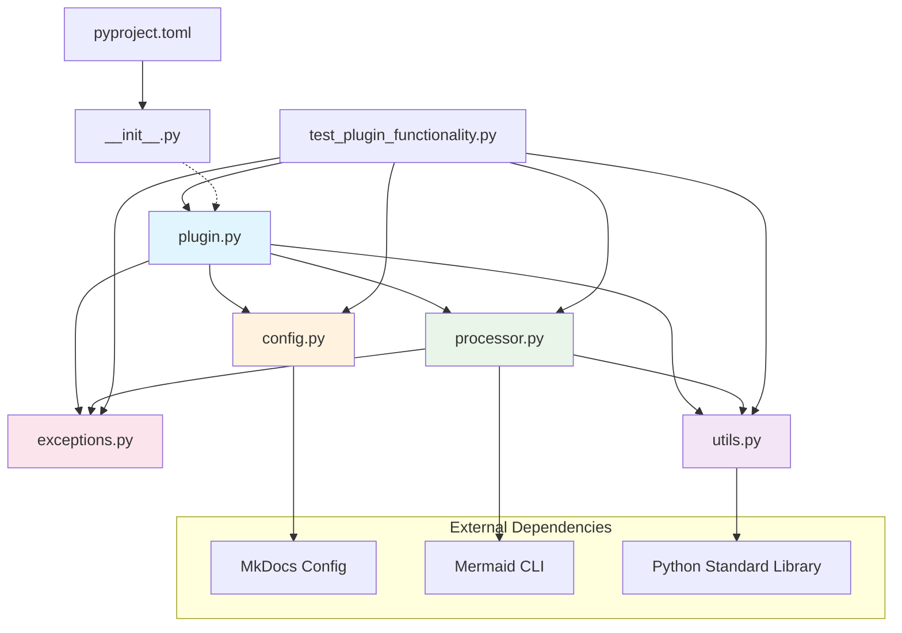
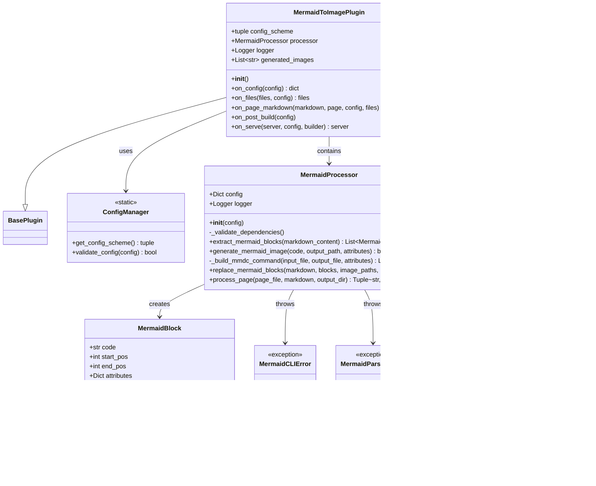
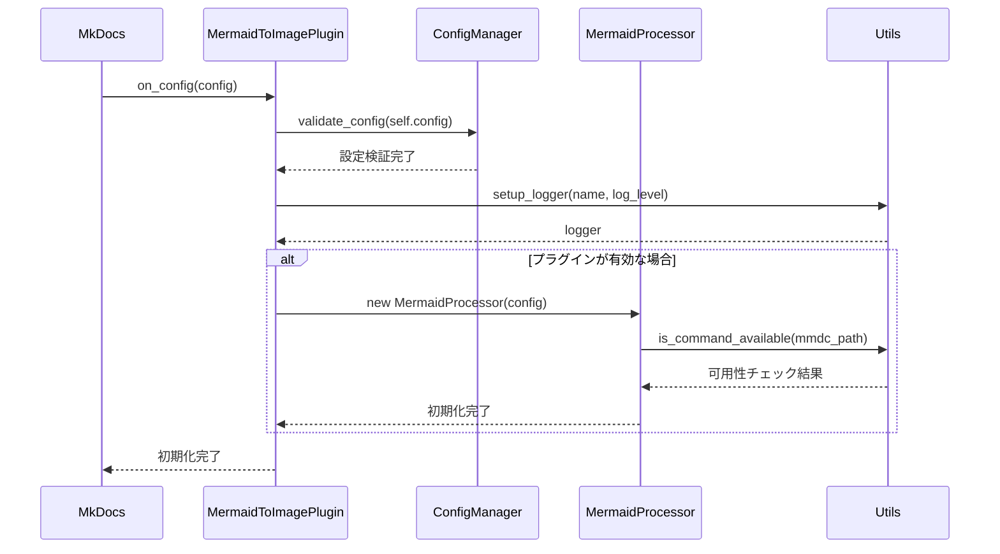
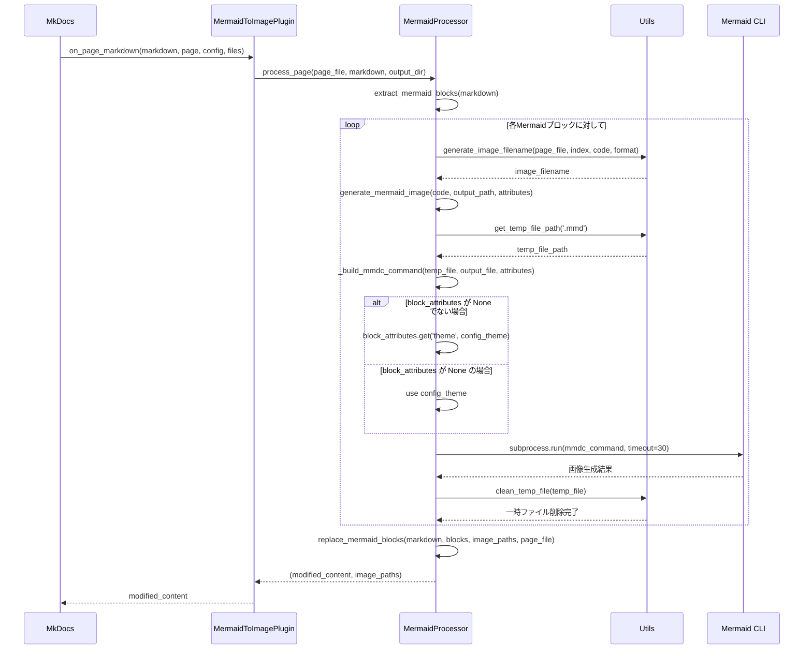
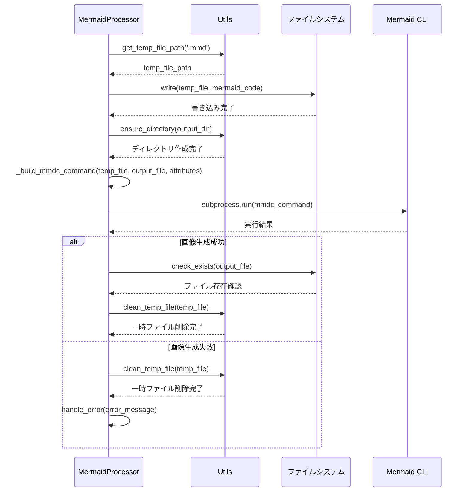

# MkDocs Mermaid to Image Plugin - アーキテクチャ設計

## 概要

MkDocs Mermaid to Image Pluginは、MkDocsプロジェクト内のMermaid図を静的画像（PNG/SVG）に変換するプラグインです。Mermaid CLIを使用してMarkdownファイル内のMermaidコードブロックを画像に変換し、それらを画像参照に置き換えます。

**参考**: MkDocsプラグインシステムの詳細については [`docs/mkdocs-architecture.md`](docs/mkdocs-architecture.md) を参照してください。

## プロジェクト構造

```
mkdocs-mermaid-to-image/
├── src/                              # ソースコードディレクトリ（Src Layout）
│   └── mkdocs_mermaid_to_image/      # メインパッケージ
│       ├── __init__.py               # パッケージ初期化
│       ├── plugin.py                 # MkDocsプラグインメインクラス
│       ├── processor.py              # Mermaid処理エンジン
│       ├── config.py                 # 設定管理
│       ├── exceptions.py             # カスタム例外
│       ├── utils.py                  # ユーティリティ関数
│       └── tests/                    # テストファイル
├── docs/                             # ドキュメント
├── pyproject.toml                    # Python プロジェクト設定（PEP 621準拠）
├── test_plugin_functionality.py     # 統合テストスクリプト
├── DESIGN.md                         # 設計ドキュメント
└── README.md                         # プロジェクト説明
```

## ファイル依存関係図



## クラス図



## プラグイン処理フロー

### 1. プラグイン初期化フロー（on_config）



### 2. ページ処理フロー（on_page_markdown）



### 3. 画像生成フロー



## 開発・本番環境での処理分岐戦略

このプラグインでは、`mkdocs build`（本番ビルド）と`mkdocs serve`（開発サーバー）で異なる最適化を適用します。

### on_startupフックを活用したモード判定

MkDocs 1.4以降の推奨パターンに従い、`on_startup`フックでコマンドタイプを判定し、処理を分岐します。

```python
class MermaidToImagePlugin(BasePlugin):
    def __init__(self):
        super().__init__()
        self.command = None
        self.is_serve_mode = False
        self.serve_session_active = False

    def on_startup(self, *, command, **kwargs):
        """MkDocs起動時にコマンドタイプを記録"""
        self.command = command  # 'build', 'serve', 'gh-deploy'
        self.is_serve_mode = (command == 'serve')

        self.logger.info(f"Plugin initialized in {command.upper()} mode")

    def on_serve(self, server, *, config, builder):
        """開発サーバー設定（serveコマンド時のみ）"""
        self.serve_session_active = True
        # 追加のファイル監視設定やキャッシュ設定
        return server

    def on_page_markdown(self, markdown, page, **kwargs):
        """モード別処理分岐"""
        if self.is_serve_mode and not self.serve_session_active:
            # serve時の初回ビルド: 中程度の最適化
            return self._process_serve_initial_mode(markdown, page)
        elif self.serve_session_active:
            # serve時の2回目以降: 高速処理
            return self._process_serve_fast_mode(markdown, page)
        else:
            # build時: 最高品質
            return self._process_build_mode(markdown, page)
```

### モード別処理戦略

#### ビルドモード（本番）
- 最高品質設定での画像生成
- 完全なエラーチェック
- 詳細なログ出力

#### サーブモード初回
- 中程度の品質設定
- 基本的なエラーチェック
- キャッシュの初期化

#### サーブモード継続
- 軽量・高速な処理
- メモリキャッシュの活用
- 最小限のエラーチェック

## プラグイン設定管理

### 設定スキーマの拡張

開発・本番環境の分岐制御に対応した設定項目：

```python
@staticmethod
def get_config_scheme():
    return (
        ('enabled', config_options.Type(bool, default=True)),
        ('mmdc_path', config_options.Type(str, default='mmdc')),
        ('output_format', config_options.Choice(['png', 'svg'], default='png')),
        ('theme', config_options.Choice(['default', 'dark', 'neutral'], default='default')),
        ('width', config_options.Type(int, default=800)),
        ('height', config_options.Type(int, default=600)),
        ('background_color', config_options.Type(str, default='white')),
        ('scale', config_options.Type(float, default=1.0)),
        ('output_dir', config_options.Type(str, default='images/mermaid')),
        ('cache_enabled', config_options.Type(bool, default=True)),
        ('timeout', config_options.Type(int, default=30)),
        ('log_level', config_options.Choice(['DEBUG', 'INFO', 'WARNING', 'ERROR'], default='INFO')),

        # 開発・本番分岐設定
        ('processing_mode', config_options.Choice(['auto', 'build', 'serve-initial', 'serve-fast'], default='auto')),
        ('serve_optimization', config_options.Type(bool, default=True)),
        ('build_vs_serve_strategy', config_options.Choice(['quality-first', 'speed-first', 'balanced'], default='quality-first')),
    )
```

## エラーハンドリング戦略

### 例外階層

```python
class MermaidPreprocessorError(Exception):
    """Mermaid処理に関する基底例外"""
    pass

class MermaidCLIError(MermaidPreprocessorError):
    """Mermaid CLI実行エラー"""
    pass

class MermaidConfigError(MermaidPreprocessorError):
    """設定関連エラー"""
    pass

class MermaidParsingError(MermaidPreprocessorError):
    """Mermaidコード解析エラー"""
    pass
```

### エラー発生時の処理戦略

1. **設定エラー**: ビルドを停止
2. **CLI実行エラー**: 該当ページのみスキップ、警告出力
3. **解析エラー**: 該当ブロックのみスキップ、警告出力

## パフォーマンス最適化

### キャッシュ戦略

1. **ハッシュベースキャッシュ**: Mermaidコードのハッシュ値で画像の再生成判定
2. **メモリキャッシュ**: 開発サーバーモードでの高速化
3. **ファイルシステムキャッシュ**: 既存画像の存在チェック

### 並行処理

複数のMermaidブロックの画像生成を並行実行（設定可能）：

```python
def process_blocks_parallel(self, blocks, max_workers=4):
    """並行処理による画像生成の高速化"""
    with concurrent.futures.ThreadPoolExecutor(max_workers=max_workers) as executor:
        futures = [
            executor.submit(self.generate_mermaid_image, block.code, output_path, block.attributes)
            for block, output_path in zip(blocks, output_paths)
        ]
        concurrent.futures.wait(futures)
```

## テスト戦略

### 単体テスト構造

```
src/mkdocs_mermaid_to_image/tests/
├── test_config.py         # 設定管理テスト
├── test_plugin.py         # プラグインメインロジックテスト
├── test_processor.py      # Mermaid処理エンジンテスト
├── test_utils.py          # ユーティリティ関数テスト
└── fixtures/
    └── sample.md          # テスト用Markdownファイル
```

### 統合テスト

- `test_plugin_functionality.py`: エンドツーエンドの機能テスト
- 実際のMkDocsビルドプロセスでの動作確認
- 複数の設定パターンでのテスト

## デプロイメント戦略

### パッケージングと配布

1. **PyPI配布**: `pyproject.toml`によるモダンなパッケージング
2. **依存関係管理**: Mermaid CLIの自動検出と警告
3. **バージョニング**: セマンティックバージョニング

### 継続的インテグレーション

```yaml
# .github/workflows/test.yml の例
name: Test
on: [push, pull_request]
jobs:
  test:
    strategy:
      matrix:
        python-version: [3.8, 3.9, "3.10", "3.11", "3.12"]
        mkdocs-version: ["1.4.0", "1.5.0", "latest"]
    steps:
      - uses: actions/setup-node@v3
        with:
          node-version: '18'
      - run: npm install -g @mermaid-js/mermaid-cli
      - uses: actions/setup-python@v4
        with:
          python-version: ${{ matrix.python-version }}
      - run: pip install mkdocs==${{ matrix.mkdocs-version }}
      - run: pip install -e .
      - run: python -m pytest
```

    Note over Config: 設定項目の検証開始
    Config->>Config: check width > 0 and height > 0
    Config->>Config: check scale > 0
    alt CSS ファイルが指定されている場合
        Config->>FileSystem: os.path.exists(config['css_file'])
        FileSystem-->>Config: 存在確認結果
    end
    alt Puppeteer設定ファイルが指定されている場合
        Config->>FileSystem: os.path.exists(config['puppeteer_config'])
        FileSystem-->>Config: 存在確認結果
    end
    Config-->>Plugin: 設定検証完了

    Plugin->>Utils: setup_logger(__name__, self.config['log_level'])
    Utils->>Utils: logging.getLogger(name)
    alt ハンドラーが未設定の場合
        Utils->>Utils: handler = StreamHandler()
        Utils->>Utils: formatter = Formatter()
        Utils->>Utils: logger.addHandler(handler)
    end
    Utils->>Utils: logger.setLevel(log_level)
    Utils-->>Plugin: logger

    alt プラグインが無効化されている場合
        Plugin->>Plugin: log "plugin is disabled"
        Plugin-->>MkDocs: return config (早期リターン)
    else プラグインが有効な場合
        Plugin->>Processor: new MermaidProcessor(config)

        Note over Processor: MermaidProcessor初期化開始
        Processor->>Processor: self.config = config
        Processor->>Utils: setup_logger(__name__, config.get('log_level', 'INFO'))
        Utils-->>Processor: logger
        Processor->>Processor: _validate_dependencies()

        Note over Processor: 依存関係検証
        Processor->>Utils: is_command_available(self.config['mmdc_path'])
        Utils->>Utils: from shutil import which
        Utils->>Utils: which(command)
        Utils-->>Processor: コマンド可用性結果
        alt mmdc コマンドが見つからない場合
            Processor->>Processor: raise MermaidCLIError(...)
        end

        Processor-->>Plugin: processor初期化完了

        Plugin->>Utils: ensure_directory(output_dir)
        Utils->>Utils: Path(directory).mkdir(parents=True, exist_ok=True)
