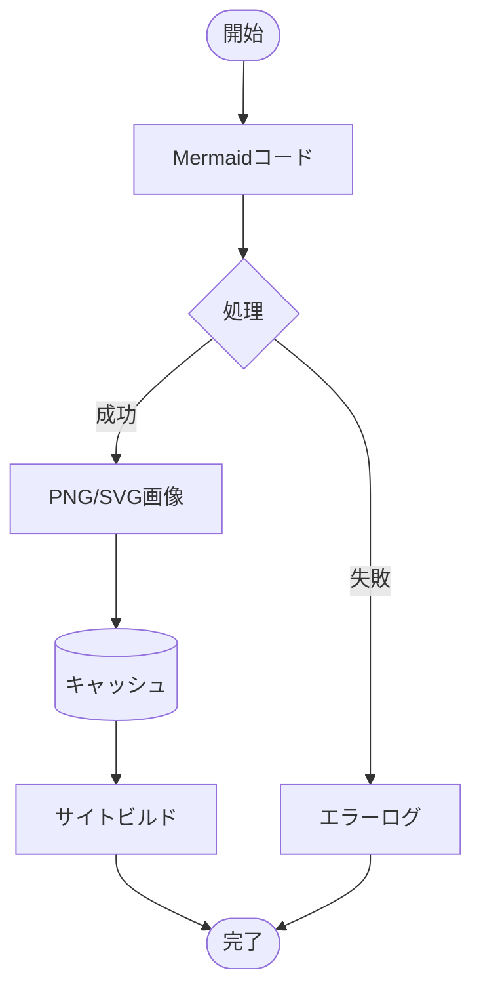

# MkDocs Mermaid to Image Plugin

[](https://python.org/downloads/)
[](https://mkdocs.org/)
[](LICENSE)

**MkDocs環境でMermaidダイアグラムを静的画像として事前レンダリングし、PDF出力に対応させるプラグインです。**

- [Sample PDF](MkDocs-Mermaid-to-Image.pdf)

## ✨ 特徴

- MermaidダイアグラムをPNG/SVG画像として事前レンダリング
- PDF出力対応
- 標準テーマサポート
- キャッシュ機能による高速ビルド

## 🚀 クイックスタート

### 自動セットアップ（推奨）

```bash
git clone https://github.com/nuitsjp/mkdocs-mermaid-to-image
cd mkdocs-mermaid-to-image
./scripts/setup.sh
```

### 手動インストール

#### 1. 依存関係のインストール
```bash
# Node.js環境（Mermaid CLI用）
npm install -g @mermaid-js/mermaid-cli

# Python環境
pip install mkdocs mkdocs-material
```

#### 2. プラグインのインストール
```bash
pip install -e .
```

## 💡 サンプル

このプラグインを使用すると、Mermaidダイアグラムが自動的に静的画像に変換されます：


複雑なフローチャートも対応：


