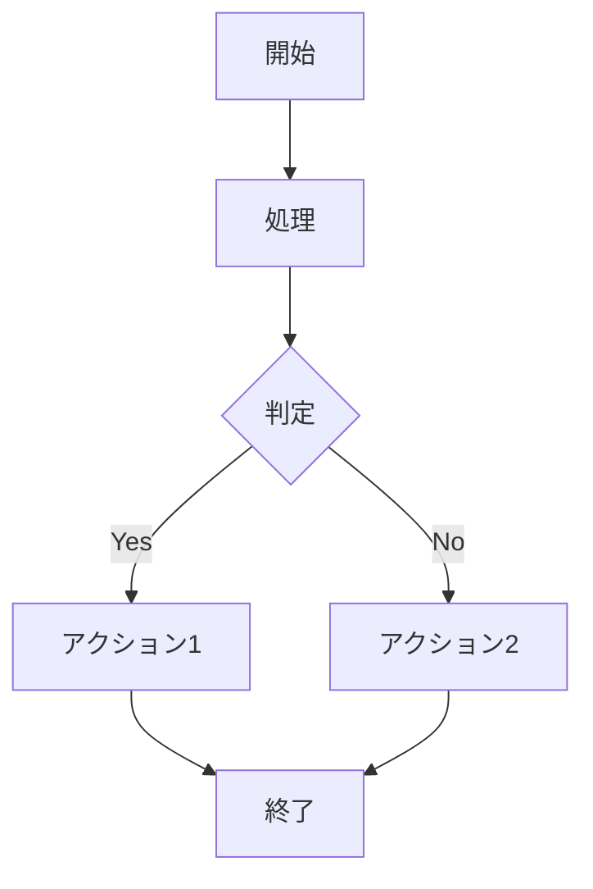

# 使用方法

## プラグイン設定

`mkdocs.yml`でプラグインを設定してください：

```yaml
plugins:
  - mermaid-to-image:
      enabled: true              # デフォルト: true
      output_dir: "assets/images" # デフォルト: "assets/images"
      image_format: "png"        # "png" または "svg" (デフォルト: "png")
      theme: "default"           # "default", "dark", "forest", "neutral"
      width: 800                 # デフォルト: 800
      height: 600                # デフォルト: 600
      scale: 1.0                 # デフォルト: 1.0
      background_color: "white"  # デフォルト: "white"
      cache_enabled: true        # デフォルト: true
      cache_dir: ".mermaid_cache" # デフォルト: ".mermaid_cache"
      preserve_original: false   # デフォルト: false
      error_on_fail: false       # デフォルト: false
      log_level: "INFO"          # "DEBUG", "INFO", "WARNING", "ERROR"
```

### 主要設定項目

- **enabled**: プラグインの有効/無効
- **output_dir**: 生成画像の保存ディレクトリ
- **image_format**: 出力形式（PNG/SVG）
- **theme**: ダイアグラムテーマ
- **width/height**: 画像サイズ（px）
- **scale**: 画像の拡大率
- **cache_enabled**: キャッシュ機能の有効/無効
- **preserve_original**: 元のMermaidコードを保持するか
- **error_on_fail**: エラー時にビルドを停止するか

### 高度な設定

```yaml
plugins:
  - mermaid-to-image:
      mmdc_path: "mmdc"                    # mermaid-cliコマンドパス
      mermaid_config: "path/to/config.json" # Mermaid設定ファイル
      css_file: "path/to/custom.css"       # カスタムCSSファイル
      puppeteer_config: "path/to/config.json" # Puppeteer設定ファイル
      temp_dir: "/tmp/mermaid"             # 一時ディレクトリ
```

## Mermaidダイアグラムの記述

### 基本的な記述方法



## ビルドと実行

### 通常のビルド

```bash
mkdocs build    # 静的サイト生成（画像変換実行）
mkdocs serve    # 開発サーバー（画像変換スキップ）
```

### ログレベル指定

```bash
mkdocs build --verbose  # 詳細ログ
```

環境変数でログレベルを制御することも可能：

```bash
LOG_LEVEL=DEBUG mkdocs build
```

## 生成される成果物

- **変換前**: Mermaidコードブロック
- **変換後**: 画像タグ（``）
- **生成画像**: 設定した`output_dir`に保存
- **キャッシュ**: 設定した`cache_dir`に保存（再利用）

### 生成画像の確認

```bash
# デフォルト設定の場合
ls site/assets/images/

# カスタム設定の場合
ls site/[your_output_dir]/
```

## パフォーマンス最適化

### キャッシュ活用

- `cache_enabled: true`（推奨）
- 同じダイアグラムの再生成を回避
- ビルド時間を大幅短縮

### 並列処理対応

```yaml
plugins:
  - mermaid-to-image:
      # 大量のダイアグラムがある場合は一時ディレクトリを分離
      temp_dir: "/tmp/mermaid_build"
```
