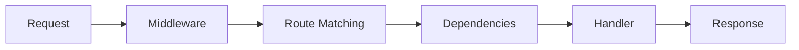

# Core Concepts

Nexios is a modern, async-first Python web framework built on ASGI. It combines high performance with developer-friendly features while maintaining a clean and maintainable architecture.

::: tip Framework Philosophy
Nexios is designed around these core principles:
- **Simplicity**: Clean, intuitive APIs that are easy to learn and use
- **Performance**: High-performance async operations with minimal overhead
- **Flexibility**: Extensive customization options for any use case
- **Type Safety**: Full type hint support for better development experience
- **Production Ready**: Built-in features for security, testing, and deployment
- **Developer Experience**: Excellent tooling and documentation
:::

::: tip Architecture Benefits
Nexios architecture provides:
- **Scalability**: Handle thousands of concurrent connections
- **Maintainability**: Clean separation of concerns and modular design
- **Testability**: Easy to test individual components in isolation
- **Extensibility**: Simple to add custom functionality and middleware
- **Performance**: Optimized for high-throughput applications
- **Security**: Built-in security features and best practices
:::

::: tip ASGI
ASGI (Asynchronous Server Gateway Interface) is the foundation that enables Nexios to handle concurrent connections efficiently.
:::

::: tip ASGI Benefits
ASGI provides several advantages over traditional WSGI:
- **Concurrent Requests**: Handle multiple requests simultaneously
- **WebSocket Support**: Native WebSocket support without additional servers
- **Real-time Features**: Built-in support for real-time communication
- **Better Performance**: More efficient request handling
- **Modern Standards**: Aligned with modern web standards
:::

## Framework Architecture

### 1. ASGI Foundation
Nexios is built on ASGI (Asynchronous Server Gateway Interface), providing:
- Native async/await support
- High performance request handling
- WebSocket support
- Lifespan protocol implementation
- Server agnostic (works with Uvicorn, Hypercorn, etc.)

::: warning Server Selection
While Nexios works with any ASGI server, we recommend:
- **Uvicorn**: For development (auto-reload support, fast startup)
- **Hypercorn**: For production (more configuration options, HTTP/2 support)
- **Granian**: For high-performance scenarios (Rust-based, very fast)
- **Daphne**: For Django compatibility (if migrating from Django)
:::

::: tip Server Configuration
**Development:**
```bash
uvicorn main:app --reload --host 0.0.0.0 --port 8000
```

**Production:**
```bash
uvicorn main:app --host 0.0.0.0 --port 8000 --workers 4
```
:::

### 2. Request Lifecycle


Each request goes through:
1. ASGI server receives the request
2. Middleware chain processes request
3. Router matches URL to handler
4. Dependencies are resolved
5. Handler processes request
6. Response is sent back through middleware

::: tip Performance
The middleware chain is optimized to minimize overhead. Middleware can short-circuit the chain for better performance.

**Performance Tips:**
- Keep middleware lightweight
- Use early returns for security checks
- Cache expensive operations
- Monitor middleware performance
- Use async middleware when possible
:::

::: tip Request Flow Optimization
1. **Early Validation**: Validate requests early in the middleware chain
2. **Caching**: Cache expensive operations and database queries
3. **Connection Pooling**: Use connection pools for database and external services
4. **Async Operations**: Use async/await for I/O operations
5. **Response Streaming**: Stream large responses to reduce memory usage
:::

### 3. Core Components

#### Routing System
```python
from nexios import NexiosApp

app = NexiosApp()

@app.get("/items/{item_id:int}")
async def get_item(request, response):
    return response.json({"id": request.path_params.item_id})
```

::: details Available Path Parameter Types
- `str` (default)
- `int`
- `float`
- `uuid`
- `path`
- `date`
- `datetime`
- Custom types via `register_path_converter()`
:::

Features:
- Path parameters with type conversion
- Query string parsing
- HTTP method handlers
- Nested routers
- WebSocket routes

#### Middleware System
```python
from nexios.middleware import BaseMiddleware

class CustomMiddleware(BaseMiddleware):
    async def __call__(self, request, response, call_next):
        # Pre-processing
        response = await call_next()
        # Post-processing
        return response
```

::: warning Middleware Order
The order of middleware matters! Consider:
1. Authentication first
2. Session handling
3. CORS/CSRF protection
4. Custom business logic
:::

Built-in middleware:
- CORS
- CSRF Protection
- Session handling
- Authentication
- Static files

#### Event System
```python
@app.on_startup()
async def startup():
    await initialize_database()

@app.on_shutdown()
async def shutdown():
    await cleanup_resources()
```

::: tip Event Types
Nexios supports multiple event types:
- `startup`: Application initialization
- `shutdown`: Graceful shutdown
- `request`: Per-request lifecycle
- `websocket`: WebSocket events
- Custom events via `app.event_emitter`
:::

Events for:
- Application startup/shutdown
- Request lifecycle
- WebSocket connections
- Error handling

#### Dependency Injection
```python
from nexios import Depend

async def get_db():
    async with Database() as db:
        yield db

@app.get("/users")
async def list_users(request, response, db=Depend(get_db)):
    users = await db.query("SELECT * FROM users")
    return response.json(users)
```

::: warning Resource Management
Always use `yield` in dependencies that need cleanup:
```python
async def get_redis():
    redis = await create_redis_pool()
    try:
        yield redis
    finally:
        redis.close()
        await redis.wait_closed()
```
:::

Features:
- Async dependency resolution
- Scoped dependencies
- Dependency overriding
- Dependency caching

### 4. WebSocket Support

```python
from nexios.websockets import WebSocket, Channel

@app.websocket("/ws/{room_id}")
async def chat_room(websocket: WebSocket, room_id: str):
    channel = Channel(f"room:{room_id}")
    await channel.connect(websocket)
    
    try:
        while True:
            message = await websocket.receive_json()
            await channel.broadcast(message)
    except WebSocketDisconnect:
        await channel.disconnect(websocket)
```

::: tip WebSocket Best Practices
1. Always handle disconnections gracefully
2. Implement heartbeat mechanism
3. Use channels for pub/sub patterns
4. Validate messages using Pydantic
:::

Features:
- WebSocket channels
- Connection management
- JSON message handling
- Error handling
- Room/group support

### 5. Security Features

#### Authentication
```python
from nexios.auth import AuthBackend

class JWTAuth(AuthBackend):
    async def authenticate(self, request):
        token = request.headers.get("Authorization")
        return await validate_token(token)

app.auth_backend = JWTAuth()
```

::: danger Security
Never store sensitive data in JWTs. Use them only for:
- User identification
- Basic permissions
- Short-lived sessions
:::

#### Session Management
```python
from nexios.session import SessionMiddleware

app.add_middleware(SessionMiddleware,
    secret_key="your-secret-key",
    session_cookie="session-id"
)
```

::: warning Cookie Security
Always set these cookie options in production:
- `secure=True`: HTTPS only
- `httponly=True`: No JS access
- `samesite="lax"`: CSRF protection
:::

#### CSRF Protection
```python
from nexios.middleware import CSRFMiddleware

app.add_middleware(CSRFMiddleware)
```

::: tip CSRF Configuration
The middleware automatically:
1. Generates CSRF tokens
2. Validates tokens on unsafe methods
3. Sets secure cookie attributes
4. Provides template helpers
:::

### 6. Testing Support

```python
from nexios.testing import TestClient

async def test_endpoint():
    async with TestClient(app) as client:
        response = await client.get("/api/endpoint")
        assert response.status_code == 200
```

::: details Testing Features
- Async test client
- WebSocket testing
- Dependency overrides
- Response assertions
- Coverage support
- Parallel test execution
:::

## Design Philosophy

1. **Explicit is Better Than Implicit**
   - Clear request/response flow
   - No hidden magic
   - Explicit dependency injection

2. **Async First**
   - Native async/await support
   - Non-blocking I/O
   - Scalable by design

3. **Developer Experience**
   - Clear error messages
   - Comprehensive logging
   - Type hints and validation
   - OpenAPI documentation

4. **Extensible Architecture**
   - Custom middleware
   - Plugin system
   - Event hooks
   - Custom authentication

5. **Performance Focused**
   - Minimal overhead
   - Efficient routing
   - Optional features
   - Resource pooling

## Use Cases

::: tip Common Use Cases
1. REST APIs
2. Real-time applications
3. Microservices
4. WebSocket servers
5. Server-side rendering
6. API gateways
:::

For detailed examples and API reference, check the [API Documentation](/api/) section.

---

Let me know if you'd like a diagram, project use-case examples, or want this split into sections (e.g., `philosophy.md`, `why.md`).
```
