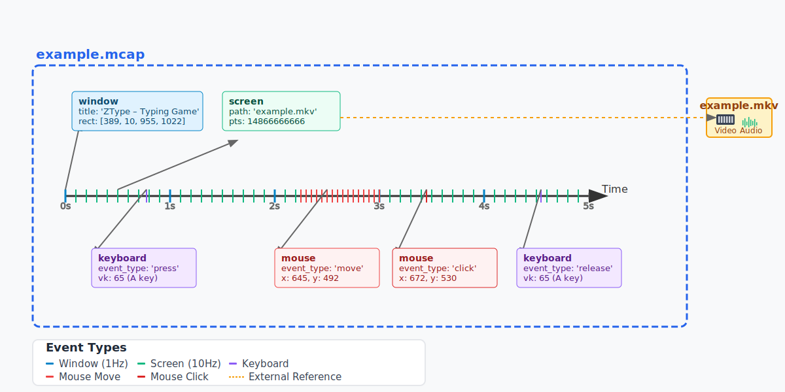

# Introducing OWAMcap

## Overview

OWAMcap is a specification for using the open-source [mcap](https://mcap.dev/) container file format with Open World Agents (OWA) message definitions. It defines how to structure multimodal desktop log data within standard mcap files using OWA-specific message schemas.

**What makes a file "OWAMcap":**

- Standard mcap file format with OWA profile designation
- OWA's predefined message types for desktop interaction data (mouse, keyboard, screen, etc.)
- Optimized storage strategies (e.g., external video files referenced from mcap)

!!! tip "So, what exactly is mcap?"
    mcap is a format that records various timestamped events like keyboard inputs, mouse movements, and screen captures. OWAMcap leverages this by defining specific message schemas for desktop interaction data. See the [Format Specification](#format-specification) for details.


*Visualization of how OWAMcap stores multimodal data with precise timestamps*

## The Vision: A Universal Standard for Desktop Interaction Data

### The Current Problem
The biggest obstacle to building foundation models for desktop automation is **data fragmentation**. Each research group collects data in proprietary formats, making it nearly impossible to combine datasets. This mirrors the robotics community, where enormous resources are continuously wasted converting between incompatible formats instead of advancing research.

**Real-World Example: Open-X Embodiment's Herculean Effort**

The [Open-X Embodiment](https://robotics-transformer-x.github.io/) project perfectly illustrates this challenge. To create their unified robotics dataset, researchers had to:

- **Manually convert 22 different datasets** from completely different formats
- **Spend months** writing custom parsers for each proprietary format
- **Standardize** action spaces, observation formats, and metadata schemas
- **Validate** data integrity across heterogeneous sources
- **Maintain** conversion scripts as source datasets evolved

This massive undertaking required an entire team's effort for what should have been a straightforward data combination task. **The same challenge now faces desktop automation**.

<!-- TODO: Add infographic showing data conversion complexity -->

*Illustration of the exponential complexity when converting between N different proprietary formats*

### OWAMcap as the Universal Standard
OWAMcap establishes a unified foundation that enables:

**🎯 Seamless Data Integration**
- Datasets from different organizations can be directly combined
- No costly conversion processes between proprietary formats
- Enables building truly large-scale, diverse training datasets

**🚀 Foundation Model Enablement**
- Aggregated data from multiple sources in a unified format
- Efficient random access for training large models
- Standardized preprocessing pipelines across the community

**🔗 Breaking Down Data Silos**
Imagine a future where:
- Research institutions directly share desktop interaction datasets
- Companies contribute to common training pools without format barriers
- Individual researchers access and combine datasets from multiple sources seamlessly
- Foundation models train on massive, diverse datasets spanning different applications

<!-- TODO: Add before/after comparison diagram -->

*Before: Fragmented data silos requiring costly conversion. After: Direct dataset combination with OWAMcap*

### The Community Impact
By establishing OWAMcap as a standard, we redirect enormous resources currently spent on data format conversion toward actual research and model development. This is particularly crucial for foundation models, which require vast amounts of diverse data to achieve their full potential.

!!! success "Preventing the 'Format Wars'"
    The desktop automation field is at a critical juncture. Without standardization, we risk repeating robotics' mistakes: researchers spending months on format conversion, valuable datasets remaining isolated, and foundation models unable to reach their potential due to fragmented training data.

## Technical Innovation: Hybrid Storage Strategy

<!-- TODO: Add architectural diagram showing mcap + external video storage -->

*OWAMcap's innovative approach: lightweight mcap metadata with external video storage*

OWAMcap's most innovative feature is its approach to video data:

- **Video data**: Stored in external files (`.mkv`) with efficient encoding
- **Metadata**: Stored in mcap with precise timestamps and frame references
- **Result**: Minimal file sizes with frame-accurate synchronization

```python
class ScreenCaptured(OWAMessage):
    _type = "desktop/ScreenCaptured"

    # Timestamps and frame references
    utc_ns: int | None = None
    path: str | None = None  # e.g., "example.mkv"
    pts: int | None = None   # Precise frame timestamp

    # Optional in-memory frame data
    frame_arr: Optional[np.ndarray] = Field(None, exclude=True)
    shape: Optional[Tuple[int, int]] = None

    def lazy_load(self) -> np.ndarray:
        """Load frame data on-demand from external video file."""
        if self.frame_arr is None and self.path and self.pts:
            rgb_array = _video_reader.get_frame_at_pts(self.path, self.pts)
            self.frame_arr = cv2.cvtColor(rgb_array, cv2.COLOR_RGB2BGRA)
        return self.frame_arr
```

**Benefits**: Storage efficiency, library compatibility, lazy loading, and seamless integration with existing video tools.

<!-- TODO: Add storage comparison chart -->

*Storage size comparison: Traditional formats vs. OWAMcap's hybrid approach*

## Usage Example

Sample datasets demonstrating the format:

- `example.mcap` [[Download]](https://github.com/open-world-agents/open-world-agents/blob/main/docs/data/example.mcap) - Metadata and timestamps
- `example.mkv` [[Download]](https://github.com/open-world-agents/open-world-agents/blob/main/docs/data/example.mkv) - Video data

<!-- TODO: Add interactive demo or video walkthrough -->
<video controls width="100%">
  <source src="videos/owamcap-demo.mp4" type="video/mp4">
  Your browser does not support the video tag.
</video>
*Interactive demonstration of loading and exploring OWAMcap data*

### File Overview
```bash
$ owl mcap info example.mcap
library:   mcap-owa-support 0.3.2; mcap 1.2.2
profile:   owa
messages:  751029
duration:  1h27m38.9810357s
compression: zstd (86.96% reduction)
channels:
    (1) window          5257 msgs (1.00 Hz) : desktop/WindowInfo
    (2) keyboard/state  5256 msgs (1.00 Hz) : desktop/KeyboardState
    (3) mouse/state     5256 msgs (1.00 Hz) : desktop/MouseState
    (4) screen        303524 msgs (57.72 Hz): desktop/ScreenCaptured
    (5) mouse         429580 msgs (81.69 Hz): desktop/MouseEvent
    (6) keyboard        2156 msgs (2.92 Hz) : desktop/KeyboardEvent
```

**Key insight**: Only 21 MiB for 1.5 hours of multimodal data, thanks to external video storage.

### Message Examples
```bash
$ owl mcap cat example.mcap --n 4 --no-pretty
Topic: window, Message: {'title': 'ZType – Typing Game - Chromium', 'rect': [389, 10, 955, 1022]}
Topic: mouse, Message: {'event_type': 'move', 'x': 1597, 'y': 1112}
Topic: screen, Message: {'path': 'example.mkv', 'pts': 14866666666, 'utc_ns': 1741628814056571100}
Topic: keyboard, Message: {'event_type': 'release', 'vk': 162}
```

This structured data enables precise reconstruction of user interactions synchronized with screen captures, and most importantly, **direct combination with datasets from other sources**.

## Format Specification

### Technical Definition
OWAMcap consists of:

- **Base**: Standard mcap format with JSON schema
- **Profile**: `owa` designation in mcap metadata  
- **Messages**: Must implement [`BaseMessage`](https://github.com/open-world-agents/open-world-agents/blob/main/projects/owa-core/owa/core/message.py#L7) interface
- **Support**: [`mcap-owa-support`](https://github.com/open-world-agents/open-world-agents/tree/main/projects/mcap-owa-support) package for reading/writing

```python
class BaseMessage(ABC):
    _type: str

    @abstractmethod
    def serialize(self, buffer: io.BytesIO): ...

    @classmethod  
    @abstractmethod
    def deserialize(cls, buffer: io.BytesIO) -> Self: ...

    @classmethod
    @abstractmethod
    def get_schema(cls): ...
```

### Design Rationale

**Why mcap?** 

Few open-source formats support heterogeneous timestamped data. ROS bagfiles require heavy ROS dependencies, while mcap is self-contained and optimized for random access—critical for VLA model training.

**Why external video storage?**

- Video codecs (H.264, H.265) are highly optimized
- Maintains compatibility with existing video libraries
- Enables selective frame loading for large datasets
- Prevents metadata files from becoming unwieldy

**Why standardization matters?**

Without OWAMcap, the desktop automation field risks repeating robotics' mistakes: fragmented datasets, wasted conversion efforts, and limited foundation model potential. By establishing this standard early, we enable the community to focus on advancing capabilities rather than solving compatibility problems.

!!! success "The Bottom Line"
    OWAMcap transforms desktop interaction data from isolated, proprietary collections into a unified resource for building the next generation of foundation models. It's not just a file format—it's the infrastructure for collaborative progress in desktop automation.