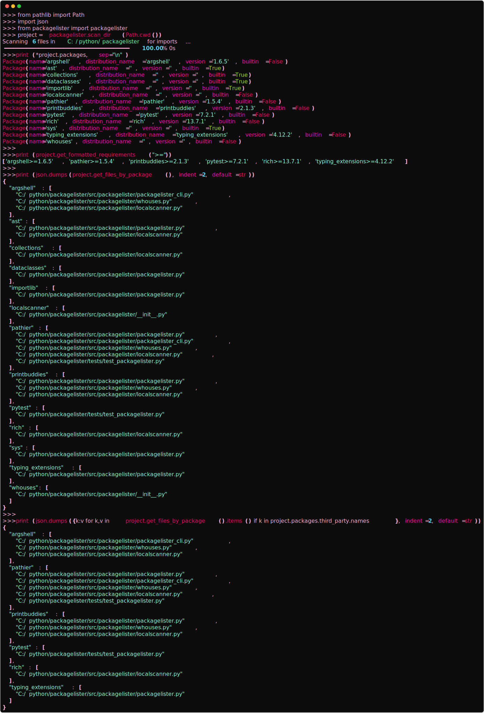
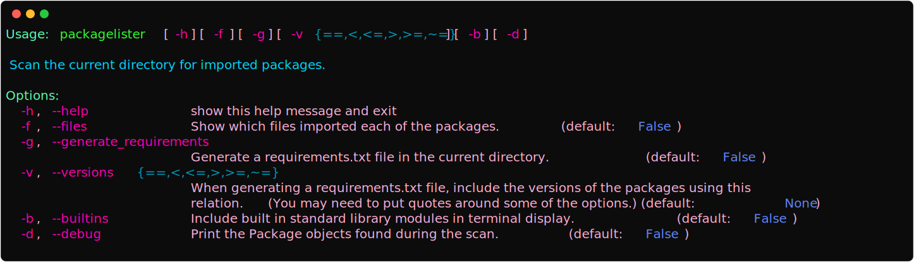
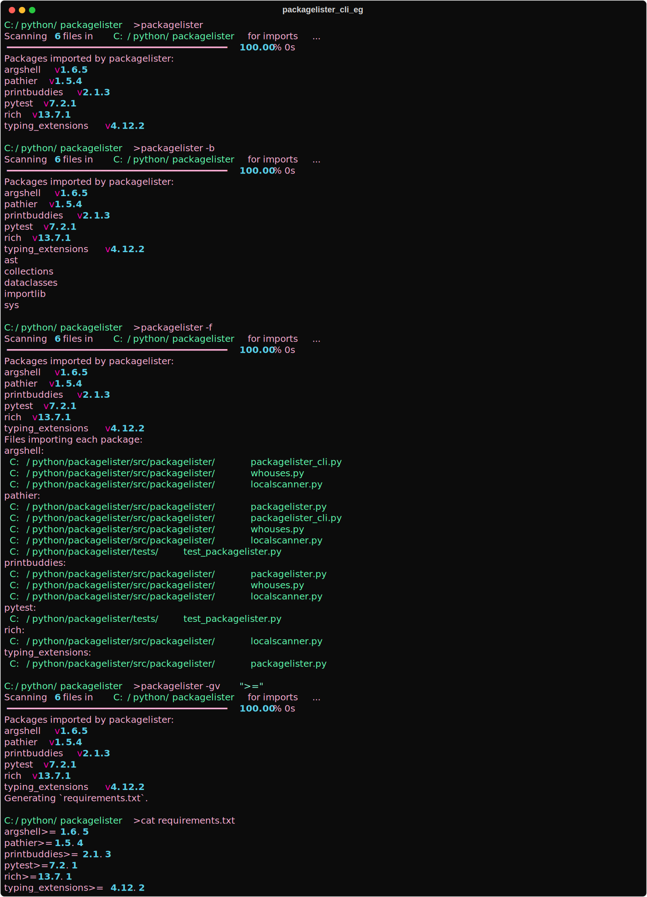
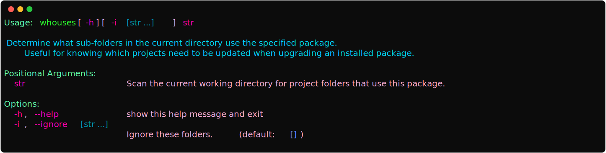
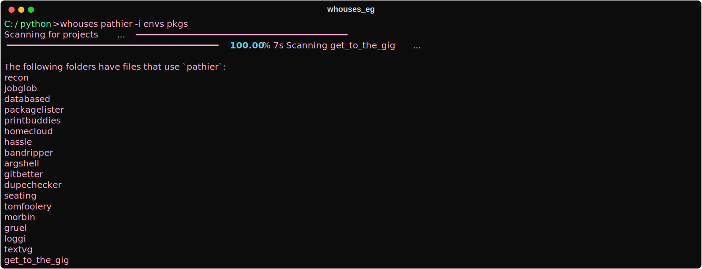
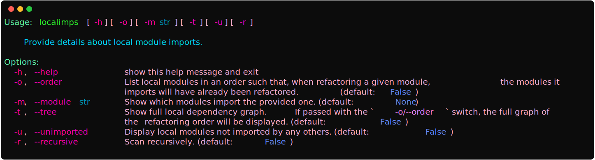
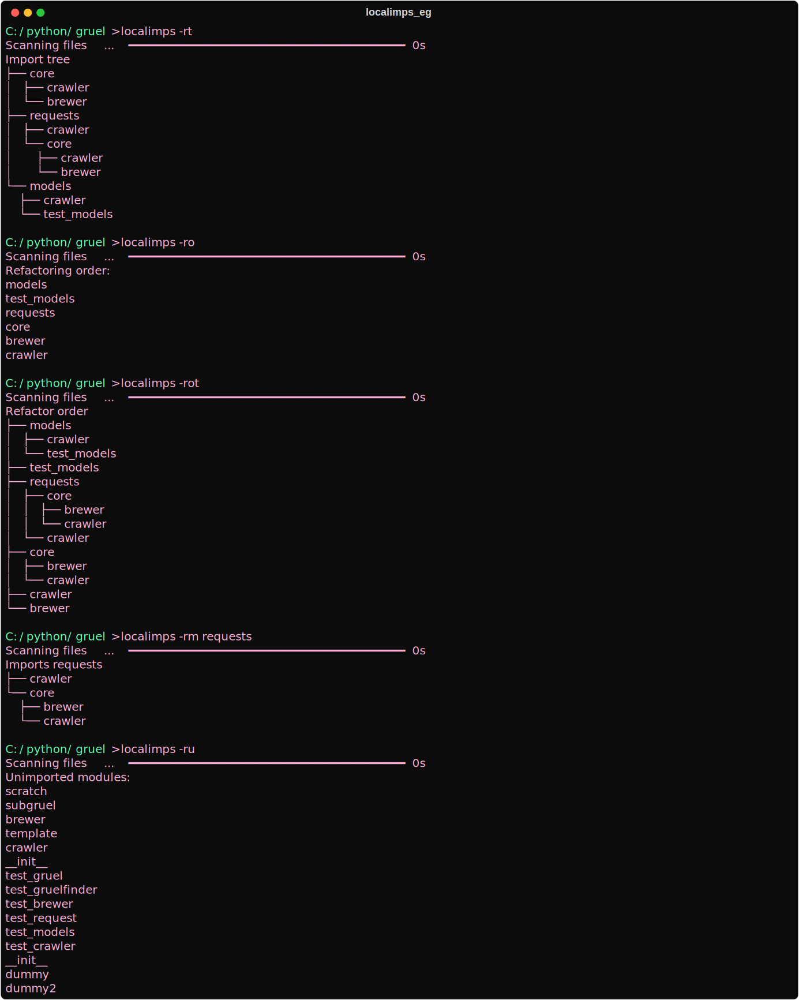

# packagelister

Determine what packages and versions a project imports.  

Install with:

```console
pip install packagelister
```

## Usage

---

Can be used either programmatically or with the included cli.  

### Programmatic  



### CLI

There are three cli tools included in this package: `packagelister`, `whouses`, and `localimps`.  

#### packagelister

For the current directory, can be used to print the packages used by the current directory,
generate a `requirements.txt` file, and view which files import a package.





#### whouses

Given a package name, scan the current directory for which sub-directories use that package.  
Useful for knowing which projects you'll need to update when upgrading an installed package.  





#### localimps

For displaying information about local modules and import structure.




