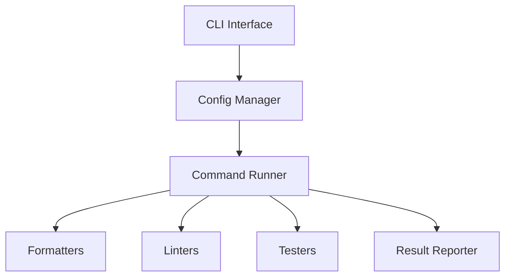

# システムパターン

## アーキテクチャ概要

## 主要コンポーネント

### CLIインターフェース

- コマンドライン引数の解析
- 設定の初期化
- 実行モードの制御

### 設定管理

- pyproject.tomlからの設定読み込み
- 除外パターンの管理
- コマンドエイリアスの解決
- デフォルト設定の提供

### コマンド実行

- 並列実行の制御
- エラーハンドリング
- ファイル変更の検出
- 実行結果の集約

### レポート生成

- 実行結果のフォーマット
- サマリー情報の生成
- 終了コードの決定

## デザインパターン

### コマンドパターン

- 各ツールを独立したコマンドとして実装
- 共通インターフェースによる統一的な実行
- 新規ツールの追加が容易

### ファクトリーパターン

- コマンド実行オブジェクトの生成
- 設定に基づく動的な実行環境構築

### オブザーバーパターン

- 実行状態の監視
- 結果のリアルタイム報告
- エラー状態の追跡

## エラー処理

### 終了コード

- 0: 成功（変更なし）
- 1: エラーまたは変更あり
- --exit-zero-even-if-formattedオプションによる制御

### エラーレポート

- コマンド単位の結果表示
- エラー詳細のログ出力
- サマリー情報の提供

## 拡張性

### プラグイン的な構造

- 新規ツールの追加が容易
- 設定による柔軟なカスタマイズ
- エイリアスによる機能グループ化

### 並列処理

- Formatter: 直列実行（副作用防止）
- Linter/Tester: 並列実行（パフォーマンス最適化）
