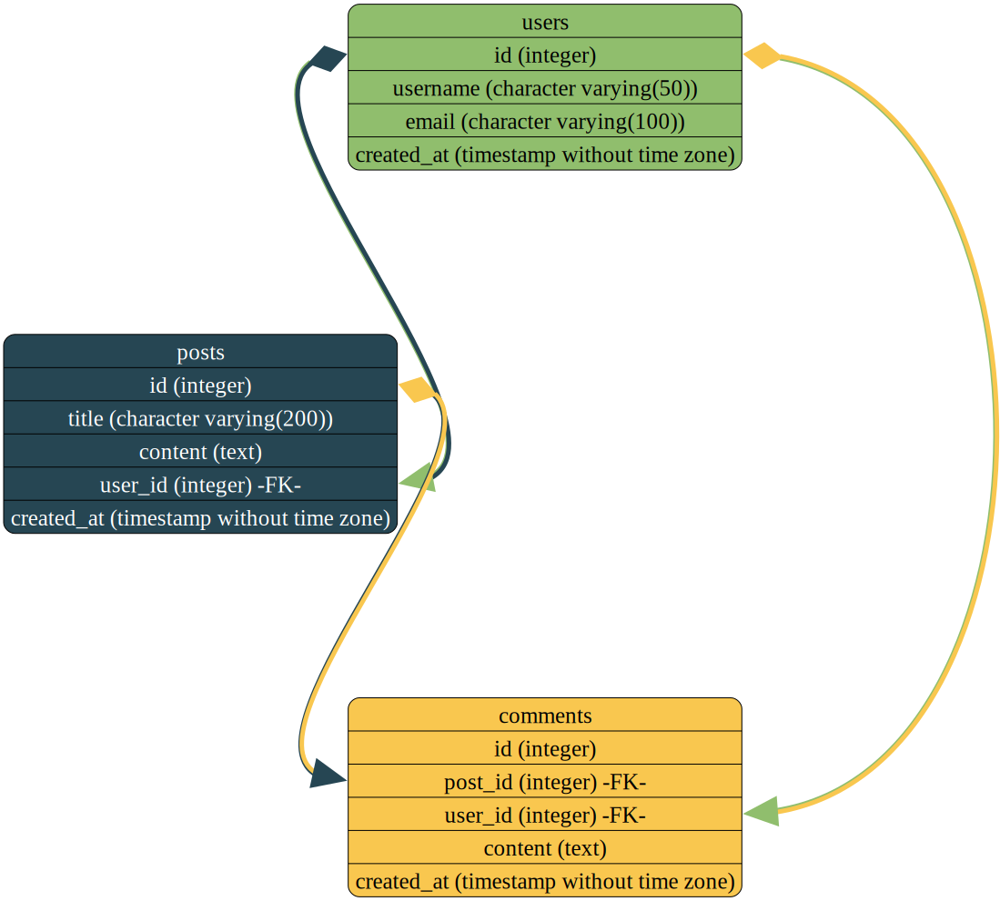

# Python ERD Generator

A Python application that parses SQL dump files and generates Entity Relationship Diagrams (ERDs) using Graphviz.

## Features

- Parse PostgreSQL dump files to extract table definitions and relationships
- Generate interactive SVG Entity Relationship Diagrams
- Automatic color coding for tables with accessible color palette
- Support for complex SQL structures including foreign keys, constraints, and various data types
- Table filtering to exclude temporary/utility tables
- Comprehensive test suite with >90% code coverage

## Installation

1. Install pypgsvg:

```bash
pip install .
```

2. Ensure Graphviz is installed on your system:
   - **macOS**: `brew install graphviz`
   - **Ubuntu/Debian**: `sudo apt-get install graphviz`
   - **Windows**: Download from <https://graphviz.org/download/>

## Usage

### Basic Usage

Generate an ERD from your SQL dump file:

```bash
pypgsvg your_database.sql
```

This will create an SVG file with the same name as your input file (e.g., `your_database_erd.svg`).

### Example Output

Here's an example of the generated ERD from a sample database schema with users, posts, and comments:

[](Samples/sample_schema_erd.svg)

*Simple Blog Schema - showing basic relationships between users, posts, and comments*

---

For more complex databases, pypgsvg can handle extensive schemas with many tables and relationships:

[](Samples/schema_erd.svg)

*Complex Database Schema - demonstrating pypgsvg's ability to visualize large, real-world database structures*

*View the interactive SVG diagrams:*

- [Simple Schema Example](Samples/sample_schema_erd.svg)
- [Complex Database Schema Example](Samples/schema_erd.svg)

The diagram shows:

- **Tables** as nodes with their column definitions
- **Foreign key relationships** as directed edges between tables
- **Automatic color coding** for visual distinction
- **Accessible color palette** with proper contrast for readability

### Usage

Specify a custom output filename:

```bash
pypgsvg your_database_dump.sql --output custom_diagram.svg
```

View the diagram immediately after generation:

```bash
pypgsvg your_database_dump.sql --view
```

### Python API Usage

For programmatic use:

```python
from src.pypgsvg import parse_sql_dump, generate_erd_with_graphviz

# Load SQL dump
with open("your_database_dump.sql", "r", encoding='utf-8') as file:
    sql_content = file.read()

# Parse tables and relationships
tables, foreign_keys, errors = parse_sql_dump(sql_content)

# Generate ERD
if not errors:
    generate_erd_with_graphviz(tables, foreign_keys, "database_diagram")
    print("ERD generated successfully!")
else:
    print("Parsing errors found:", errors)
```

## Testing

Run the complete test suite with coverage:

```bash
# Run all tests with coverage
pytest

# Run specific test categories
pytest -m unit          # Unit tests only
pytest -m integration   # Integration tests only

# Run with verbose output
pytest -v

# Generate HTML coverage report
pytest --cov-report=html
open htmlcov/index.html  # View coverage report
```

## Project Structure

```text
├── src/
│   └── create_graph.py          # Main application code
├── tests/
│   ├── conftest.py              # Test fixtures and configuration
│   ├── test_utils.py            # Tests for utility functions
│   ├── test_parser.py           # Tests for SQL parsing
│   ├── test_erd_generation.py   # Tests for ERD generation
│   └── test_integration.py      # Integration tests
├── requirements.txt             # Python dependencies
├── pyproject.toml              # pytest configuration
└── README.md                   # This file
```

## Configuration

### Table Exclusion

The application automatically excludes tables matching certain patterns (defined in `should_exclude_table`):

- Views (`vw_`)
- Backup tables (`bk`)
- Temporary fix tables (`fix`)
- Duplicate tables (`dups`, `duplicates`)
- Match tables (`matches`)
- Version logs (`versionlog`)
- Old tables (`old`)
- Member data (`memberdata`)

### Color Palette

The ERD uses an accessible color palette with automatic contrast calculation for text readability following WCAG guidelines.

## Supported SQL Features

- `CREATE TABLE` statements with various column types
- `CREATE TABLE IF NOT EXISTS`
- `ALTER TABLE ... ADD CONSTRAINT ... FOREIGN KEY`
- Quoted identifiers
- Complex data types (numeric, timestamp, jsonb, etc.)
- Multiple constraint variations

## Error Handling

The application includes comprehensive error handling for:

- Malformed SQL syntax
- Missing table references in foreign keys
- Unicode encoding issues
- File reading errors

## Contributing

1. Follow PEP 8 style guidelines
2. Write tests for new functionality
3. Maintain >90% test coverage
4. Use type hints where appropriate
5. Update documentation as needed

## Dependencies

- `graphviz>=0.20.1` - For generating diagrams
- `pytest>=7.4.0` - Testing framework
- `pytest-cov>=4.1.0` - Coverage reporting
- `pytest-mock>=3.11.0` - Mocking utilities
