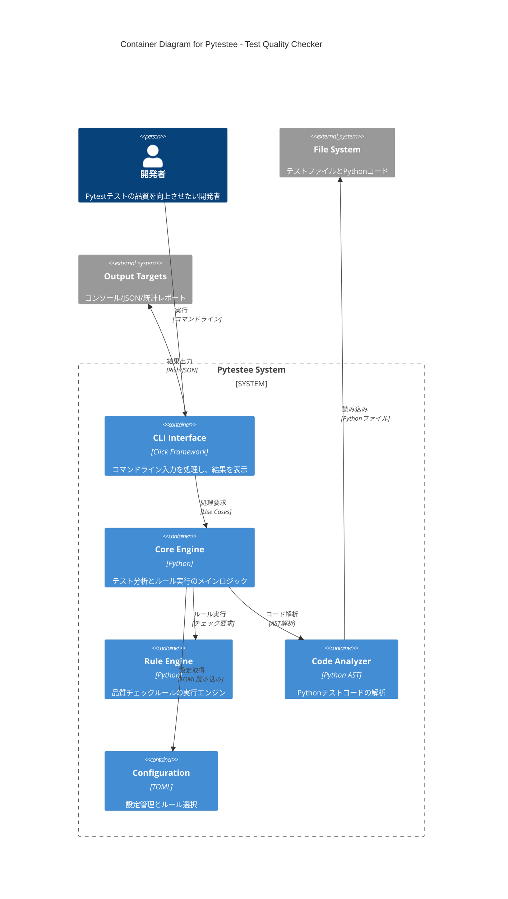
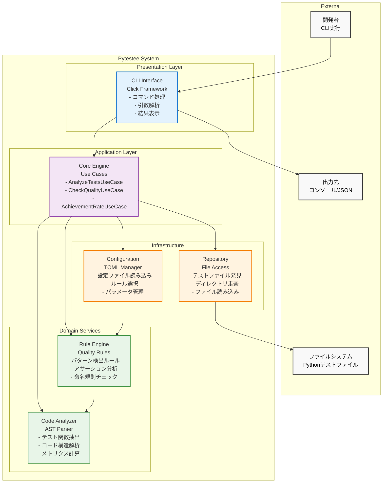

# Pytestee アーキテクチャドキュメント

## 概要

Pytesteeは、pytestテストの品質をチェックするCLIツールです。Clean Architectureの原則に従い、ルールベースのシステムでテスト品質の問題とパターンを検出します。

## C4モデル - Container レベル アーキテクチャ図

### システム概要


### 詳細Container図


## Containerの詳細説明

### 1. CLI Interface（プレゼンテーション層）
**責任**: ユーザーインターフェースとコマンド処理
- **技術**: Click Framework
- **機能**: 
  - コマンドライン引数の解析
  - サブコマンド処理（analyze, check, achievement-rate）
  - Rich形式での結果表示
  - JSON出力対応

### 2. Core Engine（アプリケーション層）
**責任**: ビジネスロジックの協調とワークフロー管理
- **技術**: Python Use Cases
- **主要Use Cases**:
  - `AnalyzeTestsUseCase`: 複数ファイルの一括分析
  - `CheckQualityUseCase`: 単一ファイルの品質チェック
  - `CalculateAchievementRateUseCase`: ルール達成率の計算

### 3. Rule Engine（ドメインサービス）
**責任**: 品質チェックルールの実行
- **技術**: Python Rule Classes
- **ルールカテゴリ**:
  - **PTCM**: コメントパターン検出
  - **PTST**: 構造的パターン検出
  - **PTLG**: 論理フローパターン検出
  - **PTAS**: アサーション分析
  - **PTNM**: 命名規則チェック

### 4. Code Analyzer（ドメインサービス）
**責任**: Pythonコードの静的解析
- **技術**: Python AST（抽象構文木）
- **機能**:
  - テスト関数・クラスの抽出
  - コード構造の解析
  - アサーション数の計算
  - パターン検出のサポート

### 5. Configuration（インフラ層）
**責任**: 設定管理とルール選択
- **技術**: TOML設定ファイル
- **機能**:
  - `.pytestee.toml`、`pyproject.toml`の読み込み
  - ルールの有効/無効制御
  - ルール固有パラメータの管理
  - 競合ルールの検証

### 6. Repository（インフラ層）
**責任**: ファイルシステムアクセス
- **技術**: Python標準ライブラリ
- **機能**:
  - テストファイルの自動発見
  - ディレクトリの再帰的走査
  - ファイル内容の読み込み

## ルールシステムの組織

### ルールカテゴリ（ruffに類似した命名規則）

**PTCM (Pattern Comment)**: コメントベースパターン検出
- `PTCM001`: コメント内のAAAパターン
- `PTCM002`: コメント内のGWTパターン
- `PTCM003`: AAAまたはGWTパターン

**PTST (Pattern Structural)**: 構造的パターン検出
- `PTST001`: 空行による構造的パターン

**PTLG (Pattern Logic)**: 論理フローパターン検出
- `PTLG001`: AST分析による論理フローパターン

**PTAS (Pattern Test Assertion)**: アサーション分析
- `PTAS001`: アサーション不足
- `PTAS002`: アサーション過多
- `PTAS003`: 高アサーション密度
- `PTAS004`: アサーション未検出
- `PTAS005`: 適切なアサーション数

**PTNM (Pattern Test Naming)**: 命名規則
- `PTNM001`: 関数名の日本語文字
- `PTNM002`: クラス名の日本語文字


## データフロー

```
CLI Command → Handler → UseCase → Repository → AST Parser → TestFile
                  ↓
            ConfigManager → Registry → Rules → Analyzers
                  ↓
            CheckResults → Presenter → Console/JSON Output
```

### 詳細フロー：
1. **CLI層**がユーザーコマンドを受信し、適切なハンドラーに委譲
2. **ハンドラー**が依存性注入されたユースケースを作成
3. **ユースケース**が設定を読み込み、リポジトリ経由でテストファイルを発見
4. **リポジトリ**がAST parserを使用してPythonファイルを`TestFile`オブジェクトに変換
5. **Registry**が設定に基づいて有効なルールインスタンスを作成
6. **ルール**が注入されたアナライザーを使用してテスト関数を分析し、`CheckResult`を返却
7. **ユースケース**が結果を`AnalysisResult`に集約
8. **Presenter**が結果をフォーマットしてユーザーに表示

## 主要な設計原則

### 1. Clean Architecture準拠
- 関心の分離と依存性逆転の明確な実装
- 外部への依存は抽象インターフェースを通じて管理

### 2. ルールベースシステム
- 各品質チェックが独立したルールモジュールとして実装
- 新しいルールの追加が既存コードの変更を要求しない

### 3. 設定駆動型
- `select`/`ignore`配列によるruff風のルール選択
- ルール固有のパラメータ設定（例：アサーション閾値）
- 競合ルールの自動検証

### 4. 依存性注入パターン
- 設定がルール選択を駆動
- アナライザーがルールに注入される
- インターフェースベース設計によるテスタビリティ

### 5. 型安全性
- コードベース全体の包括的な型ヒント
- Return Objectパターンによる結果処理
- 設定エラー用のカスタム例外

## 拡張性のポイント

### 新しいルールの追加
1. 適切な`infrastructure/rules/`サブディレクトリにルールモジュールを作成
2. `BaseRule`を継承し`check()`メソッドを実装
3. レジストリにルールを追加
4. 競合がある場合は`RuleValidator`を更新
5. 良い例・悪い例を含む包括的なテスト追加

### 新しいアナライザーの追加
- 静的メソッドによる分析ロジックの実装
- ルールへの依存性注入による利用
- テスト容易性のための純粋関数設計

### 新しい出力形式の追加
- `IPresenter`インターフェースを実装
- 既存のRichコンソールまたはJSON形式を参考
- CLI層での選択可能な形式として登録

## パフォーマンス考慮事項

### AST解析の効率化
- ファイル単位での並列処理可能な設計
- メモリ効率的なAST走査
- 必要な情報のみの抽出

### ルール実行の最適化
- ステートレスなルール設計による並列実行可能性
- アナライザーによる共通処理の再利用
- 早期終了による不要な処理の回避

このアーキテクチャにより、pytesteeは柔軟性、保守性、拡張性のバランスを保ちながら、Python エコシステムの確立されたパターン（ruffやmypyなどのツールに類似）に従っています。