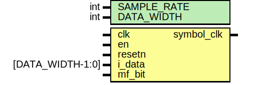

# Entity: clock_recovery 
- **File**: clock_recovery.sv

## Diagram

## Description

This file generated by [rtl-generator](https://github.com/burnettlab/rtl-generator.git), written by Brandon Hippe
## Generator arguments:
|   Argument   |   Value   |
| :----------: | :-------: |
|  adc_width   |     4     |
|   clk_freq   |  16000000 |
|   ek_shift   |     2     |
|     fsym     |  1000000  |
|    ifreq     | 1250000.0 |
| mf_clock_rec |   False   |
|  tau_shift   |     11    |
## Included modules:
- [Preamble Detect](preamble_detect/preamble_detect.md)

## Generics

| Generic name | Type | Value | Description |
| ------------ | ---- | ----- | ----------- |
| SAMPLE_RATE  | int  | 16    |             |
| DATA_WIDTH   | int  | 4     |             |

## Ports

| Port name  | Direction | Type             | Description |
| ---------- | --------- | ---------------- | ----------- |
| clk        | input     |                  |             |
| en         | input     |                  |             |
| resetn     | input     |                  |             |
| i_data     | input     | [DATA_WIDTH-1:0] |             |
| q_data     |           |                  |             |
| mf_bit     | input     |                  |             |
| symbol_clk | output    |                  |             |

## Signals

| Name                                        | Type                                           | Description |
| ------------------------------------------- | ---------------------------------------------- | ----------- |
| error_calc_counter                          | logic [clog2(SAMPLE_RATE):0]                   |             |
| shift_counter                               | logic [clog2(SAMPLE_RATE):0]                   |             |
| I_k                                         | logic signed [BUFFER_SIZE-1:0][DATA_WIDTH-1:0] |             |
| Q_k                                         | logic signed [BUFFER_SIZE-1:0][DATA_WIDTH-1:0] |             |
| i_1                                         | logic signed [DATA_WIDTH-1:0]                  |             |
| q_1                                         | logic signed [DATA_WIDTH-1:0]                  |             |
| i_2                                         | logic signed [DATA_WIDTH-1:0]                  |             |
| q_2                                         | logic signed [DATA_WIDTH-1:0]                  |             |
| i_3                                         | logic signed [DATA_WIDTH-1:0]                  |             |
| q_3                                         | logic signed [DATA_WIDTH-1:0]                  |             |
| i_4                                         | logic signed [DATA_WIDTH-1:0]                  |             |
| q_4                                         | logic signed [DATA_WIDTH-1:0]                  |             |
| e_k                                         | logic signed [ERROR_RES-1:0]                   |             |
| tau_int                                     | logic signed [ERROR_RES-1:0]                   |             |
| tau_int_1                                   | logic signed [ERROR_RES-1:0]                   |             |
| re1                                         | logic signed [ERROR_RES-1:0]                   |             |
| re2                                         | logic signed [ERROR_RES-1:0]                   |             |
| im1                                         | logic signed [ERROR_RES-1:0]                   |             |
| im2                                         | logic signed [ERROR_RES-1:0]                   |             |
| y1                                          | logic signed [ERROR_RES-1:0]                   |             |
| y2                                          | logic signed [ERROR_RES-1:0]                   |             |
| e_k_shifted                                 | logic signed [E_K_RES-1:0]                     |             |
| tau                                         | logic signed [TAU_RES-1:0]                     |             |
| tau_1                                       | logic signed [TAU_RES-1:0]                     |             |
| dtau                                        | logic signed [D_TAU_RES-1:0]                   |             |
| i_1_sqr                                     | logic signed [ERROR_RES-1:0]                   |             |
| q_1_sqr                                     | logic signed [ERROR_RES-1:0]                   |             |
| i_2_sqr                                     | logic signed [ERROR_RES-1:0]                   |             |
| q_2_sqr                                     | logic signed [ERROR_RES-1:0]                   |             |
| i_3_sqr                                     | logic signed [ERROR_RES-1:0]                   |             |
| q_3_sqr                                     | logic signed [ERROR_RES-1:0]                   |             |
| i_4_sqr                                     | logic signed [ERROR_RES-1:0]                   |             |
| q_4_sqr                                     | logic signed [ERROR_RES-1:0]                   |             |
| iq_12                                       | logic signed [ERROR_RES-1:0]                   |             |
| iq_34                                       | logic signed [ERROR_RES-1:0]                   |             |
| re_correction =  /* #{(re_correction)} */ 1 | integer                                        |             |
| im_correction =  /* #{(im_correction)} */ 0 | integer                                        |             |
| do_error_calc                               | logic                                          |             |
| shift_counter_p1                            | logic [D_TAU_RES-1:0]                          |             |
| preamble_detected                           | logic                                          |             |

## Constants

| Name            | Type | Value                 | Description |
| --------------- | ---- | --------------------- | ----------- |
| PIPELINE_STAGES |      | 1                     |             |
| E_K_SHIFT       |      | 2                     |             |
| TAU_SHIFT       |      | 11                    |             |
| SAMPLE_POS      |      | 2                     |             |
| BUFFER_SIZE     |      | SAMPLE_RATE + 3       |             |
| ERROR_RES       |      | 18 + 0                |             |
| TAU_RES         |      | ERROR_RES - TAU_SHIFT |             |
| E_K_RES         |      | ERROR_RES - E_K_SHIFT |             |
| D_TAU_RES       |      | (SAMPLE_RATE + 1)     |             |

## Processes
- error_calculation: (  )
  - **Type:** always_comb
- update_state: ( @(posedge clk or negedge resetn) )
  - **Type:** always_ff

## Instantiations

- pd: preamble_detect
