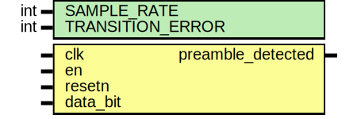

# Entity: preamble_detect 
- **File**: preamble_detect.sv

## Diagram

## Description

This file generated by [rtl-generator](https://github.com/burnettlab/rtl-generator.git), written by Brandon Hippe
## Generator arguments:
| Argument |  Value   |
| :------: | :------: |
| clk_freq | 16000000 |
|   fsym   | 1000000  |

## Generics

| Generic name     | Type | Value | Description |
| ---------------- | ---- | ----- | ----------- |
| SAMPLE_RATE      | int  | 16    |             |
| TRANSITION_ERROR | int  | 1     |             |

## Ports

| Port name         | Direction | Type | Description |
| ----------------- | --------- | ---- | ----------- |
| clk               | input     |      |             |
| en                | input     |      |             |
| resetn            | input     |      |             |
| data_bit          | input     |      |             |
| preamble_detected | output    |      |             |

## Signals

| Name              | Type                   | Description |
| ----------------- | ---------------------- | ----------- |
| transition_buffer | logic [BUFFER_LEN-1:0] |             |
| last_bit          | logic                  |             |
| valid_transition  | logic                  |             |
| i                 | int                    |             |
| j                 | int                    |             |

## Constants

| Name         | Type | Value                                                       | Description |
| ------------ | ---- | ----------------------------------------------------------- | ----------- |
| PREAMBLE_LEN |      | 8                                                           |             |
| BUFFER_LEN   |      | (PREAMBLE_LEN - 1) * SAMPLE_RATE + 2 * TRANSITION_ERROR - 1 |             |

## Processes
- preamble_detect_logic: (  )
  - **Type:** always_comb
- transition_buffer_update: ( @(posedge clk or negedge resetn) )
  - **Type:** always_ff
