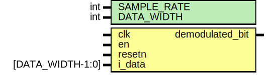

# Entity: matched_filter 
- **File**: matched_filter.sv

## Diagram

## Description

This file generated by [rtl-generator](https://github.com/burnettlab/rtl-generator.git), written by Brandon Hippe
## Generator arguments:
|  Argument |   Value   |
| :-------: | :-------: |
| adc_width |     4     |
|    amp    |     15    |
|  clk_freq |  16000000 |
|    fsym   |  1000000  |
|   ifreq   | 1250000.0 |
### Template Table:
|   Template   |  0 |  1 |  2 |  3 |   4 |   5 |   6 |   7 |   8 |   9 |  10 |  11 |  12 |  13 |  14 |  15 |
| :----------: |--: |--: |--: |--: |---: |---: |---: |---: |---: |---: |---: |---: |---: |---: |---: |---: |
| 0 Template I | 15 | 14 | 11 |  6 |   0 |  -6 | -11 | -14 | -15 | -14 | -11 |  -6 |   0 |   6 |  11 |  14 |
| 0 Template Q |  0 |  6 | 11 | 14 |  15 |  14 |  11 |   6 |   0 |  -6 | -11 | -14 | -15 | -14 | -11 |  -6 |
| 1 Template I | 15 | 12 |  6 | -3 | -11 | -15 | -14 |  -8 |   0 |   8 |  14 |  15 |  11 |   3 |  -6 | -12 |
| 1 Template Q |  0 |  8 | 14 | 15 |  11 |   3 |  -6 | -12 | -15 | -12 |  -6 |   3 |  11 |  15 |  14 |   8 |

## Generics

| Generic name | Type | Value | Description |
| ------------ | ---- | ----- | ----------- |
| SAMPLE_RATE  | int  | 16    |             |
| DATA_WIDTH   | int  | 4     |             |

## Ports

| Port name       | Direction | Type             | Description |
| --------------- | --------- | ---------------- | ----------- |
| clk             | input     |                  |             |
| en              | input     |                  |             |
| resetn          | input     |                  |             |
| i_data          | input     | [DATA_WIDTH-1:0] |             |
| q_data          |           |                  |             |
| demodulated_bit | output    |                  |             |

## Signals

| Name              | Type                                           | Description |
| ----------------- | ---------------------------------------------- | ----------- |
| i_buffer          | logic signed [SAMPLE_RATE-1:0][DATA_WIDTH-1:0] |             |
| q_buffer          | logic signed [SAMPLE_RATE-1:0][DATA_WIDTH-1:0] |             |
| low_score         | logic signed [SCORE_WIDTH-1:0]                 |             |
| high_score        | logic signed [SCORE_WIDTH-1:0]                 |             |
| low_i_i_prod_sum  | logic signed [PROD_SUM_WIDTH-1:0]              |             |
| low_i_q_prod_sum  | logic signed [PROD_SUM_WIDTH-1:0]              |             |
| low_q_i_prod_sum  | logic signed [PROD_SUM_WIDTH-1:0]              |             |
| low_q_q_prod_sum  | logic signed [PROD_SUM_WIDTH-1:0]              |             |
| high_i_i_prod_sum | logic signed [PROD_SUM_WIDTH-1:0]              |             |
| high_i_q_prod_sum | logic signed [PROD_SUM_WIDTH-1:0]              |             |
| high_q_i_prod_sum | logic signed [PROD_SUM_WIDTH-1:0]              |             |
| high_q_q_prod_sum | logic signed [PROD_SUM_WIDTH-1:0]              |             |
| low_i_i_sqr       | logic signed [SQR_WIDTH-1:0]                   |             |
| low_i_q_sqr       | logic signed [SQR_WIDTH-1:0]                   |             |
| low_q_i_sqr       | logic signed [SQR_WIDTH-1:0]                   |             |
| low_q_q_sqr       | logic signed [SQR_WIDTH-1:0]                   |             |
| high_i_i_sqr      | logic signed [SQR_WIDTH-1:0]                   |             |
| high_i_q_sqr      | logic signed [SQR_WIDTH-1:0]                   |             |
| high_q_i_sqr      | logic signed [SQR_WIDTH-1:0]                   |             |
| high_q_q_sqr      | logic signed [SQR_WIDTH-1:0]                   |             |

## Constants

| Name            | Type | Value                       | Description |
| --------------- | ---- | --------------------------- | ----------- |
| PIPELINE_STAGES |      | 1                           |             |
| TEMPLATE_WIDTH  |      | 5                           |             |
| PROD_WIDTH      |      | DATA_WIDTH + TEMPLATE_WIDTH |             |
| PROD_SUM_WIDTH  |      | (SAMPLE_RATE) + PROD_WIDTH  |             |
| SQR_WIDTH       |      | 2 * PROD_SUM_WIDTH          |             |
| SCORE_WIDTH     |      | SQR_WIDTH + 1               |             |

## Processes
- input_buffer: ( @(posedge clk or negedge resetn) )
  - **Type:** always_ff
- calculate_scores: (  )
  - **Type:** always_comb
