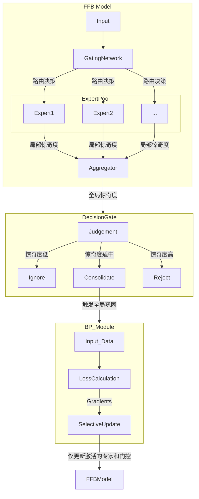
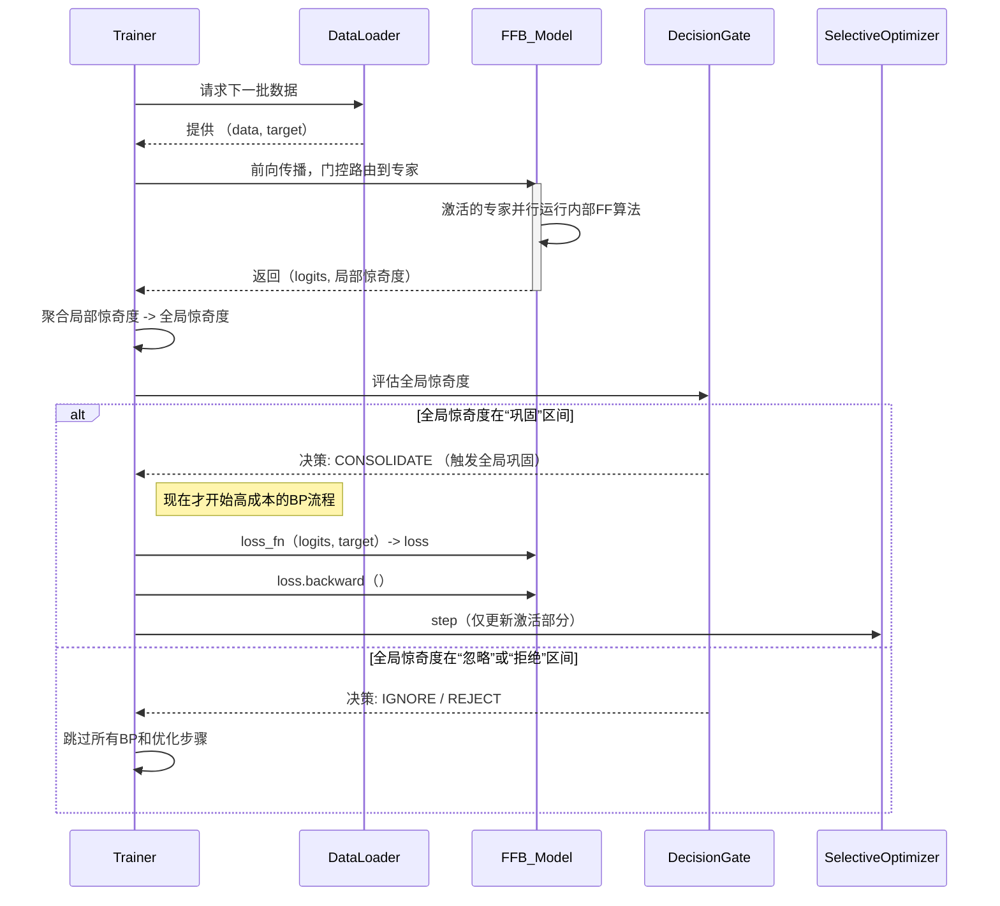

# **技术笔记：FFB (Forward-Forward-Backwards) 框架**

**文档版本:** 2.2
**核心理念:** 一个受认知科学（特别是整合预测工作空间理论, IPWT）和Geoffrey Hinton的“前向-前向算法”启发的持续学习框架。它旨在通过模拟生物大脑的**双模态学习算法**，构建一个能高效学习、缓解灾难性遗忘、并具备认知稳态（Cognitive Homeostasis）的智能体。

---

## **1. 设计哲学：从“单一蛮力”到“双模态智慧”**

当前深度学习模型的核心缺陷在于其“单一蛮力”的学习范式：无论输入是常规的、重复的，还是颠覆性的、全新的，模型都采用相同的、高成本的全局反向传播（Backpropagation, BP）进行更新。这不仅计算效率低下，也使其在持续学习中极易发生“灾难性遗忘”。

FFB框架的设计哲学，是实现从**被动的权重更新**到**主动的认知判断**的根本性转变。其灵感源于生物大脑并非只有一个学习算法，而是拥有一套高效协作的双模态系统：

1. **快速、局部的无监督学习 （由前向-前向算法驱动）**: 大部分时间里，大脑通过局部的、低成本的神经可塑性（类似Hebbian学习）来处理熟悉的、预期内的信息流。Hinton的**前向-前向（Forward-Forward, FF）算法**为模拟这一过程提供了完美的计算模型。FF通过对比真实数据（正样本）和构造数据（负样本）的“goodness”评分，实现了无需反向传播的快速特征学习。
2. **高成本、全局性的监督巩固 （由反向传播驱动）**: 只有当低成本系统遇到重大的“预测错误”或“惊奇”事件时，大脑才会调动全局性的神经调质（如多巴胺），触发系统性的、高成本的记忆巩固。在FFB中，**反向传播（BP）**被视为这种宝贵且稀有的高成本工具，仅在必要时用于“深度思考”和知识整合。

FFB框架的目标，是为人工智能复现这种认知效率。它将FF和BP两种截然不同的算法整合在一个统一的框架下，通过**FF产生的惊奇度**作为认知判断的触发器，让模型**学会如何学习**：何时仅需FF进行“无意识”处理，何时需要BP进行“有意识”的巩固。

---

## **2. 核心架构**

FFB的核心是一个由**前向-前向专家**组成的混合模型（MoE），它为知识的模块化存储、低成本学习和选择性全局更新提供了物理基础。

**架构组件:**

- **前向-前向专家池 (Forward-Forward Expert Pool):** `E = {E_1, E_2, ..., E_k}`。每个专家内部采用**FF算法**进行快速、无监督的特征学习。至关重要的是，每个专家都能根据其FF过程中的“goodness”评分，独立地产出一个**局部的“惊奇度”信号**。
- **门控网络 (Gating Network):** 根据当前输入，动态决定将信息路由到哪个或哪些专家。
- **惊奇度聚合器 (Aggregator):** 收集被激活专家的局部惊奇度信号，并将它们整合成一个单一的**全局惊奇度**值。这个值代表了当前输入对模型现有知识体系的整体挑战程度。
- **决策门 (Decision Gate):** 框架的“前额叶皮层”。它接收全局惊奇度，并根据预设的“钟形曲线”策略做出三种行为决策之一。
- **选择性反向传播模块 (Selective BP Module):** 这是一个**条件性**模块。只有在“决策门”发出“巩固”指令时，它才会被激活，执行一次经典的反向传播，并**仅对当前被激活的专家和门控网络**进行权重更新。

---

## **3. 双模态训练周期：一个序列图**

FFB的训练循环从根本上不同于传统模式，它将FF的低成本循环与BP的高成本事件清晰地分离开。

**训练循环详解：**

1. **低成本前向循环 (FF-Loop):**
    - 模型接收数据，门控网络选择专家。
    - 被激活的专家内部执行**FF算法**，快速更新自身对特征的理解，并计算出各自的**局部惊奇度**。
    - 这些局部惊奇度被汇总为**全局惊奇度**。
    - *注意：到目前为止，整个过程没有涉及任何反向传播，计算成本极低。*

2. **认知判断 (The Gate):** “决策门”根据全局惊奇度做出判断。这是学习模式切换的关键点。

3. **高成本巩固事件 (BP-Event):**

- **仅当**决策为“巩固”时，系统才会触发一次昂贵的BP事件。
- 它会利用已有的`logits`和`target`计算损失，执行一次完整的`loss.backward()`，然后调用优化器。
- **选择性更新:** 优化器被严格限制，**只更新**在步骤1中被激活的专家以及门控网络的参数。这确保了新知识的“写入”不会破坏未被激活的、存储着旧知识的专家。

---

## **4. 理论贡献与收益**

- **真正实现了双模态学习算法的统一:** FFB不再是单一算法的策略切换，而是将**FF（低成本、无监督）**和**BP（高成本、监督）**两种截然不同的算法，通过`Surprise`这一认知度量无缝整合，形成了协同工作的机制。
- **极高的计算效率:** 在处理大量常规、冗余数据时，模型**完全跳过**了成本高昂的反向传播和优化器计算，仅执行轻量级的FF算法，从而大幅提升训练和推理效率。
- **更强的生物学合理性:** FFB框架更贴近大脑的学习方式——局部的、持续的Hebbian式学习（FF）构成了“无意识”处理的基础，而全局的、由神经调质触发的系统性巩固（BP）则对应了“有意识”的深度学习事件。
- **为持续学习提供根本性解决方案:** 通过“选择性全局巩固”，FFB在学习新知识（更新激活的专家）和保护旧知识（保持休眠的专家不变）之间取得了根本性的平衡，有望从机制上解决灾难性遗忘问题。
