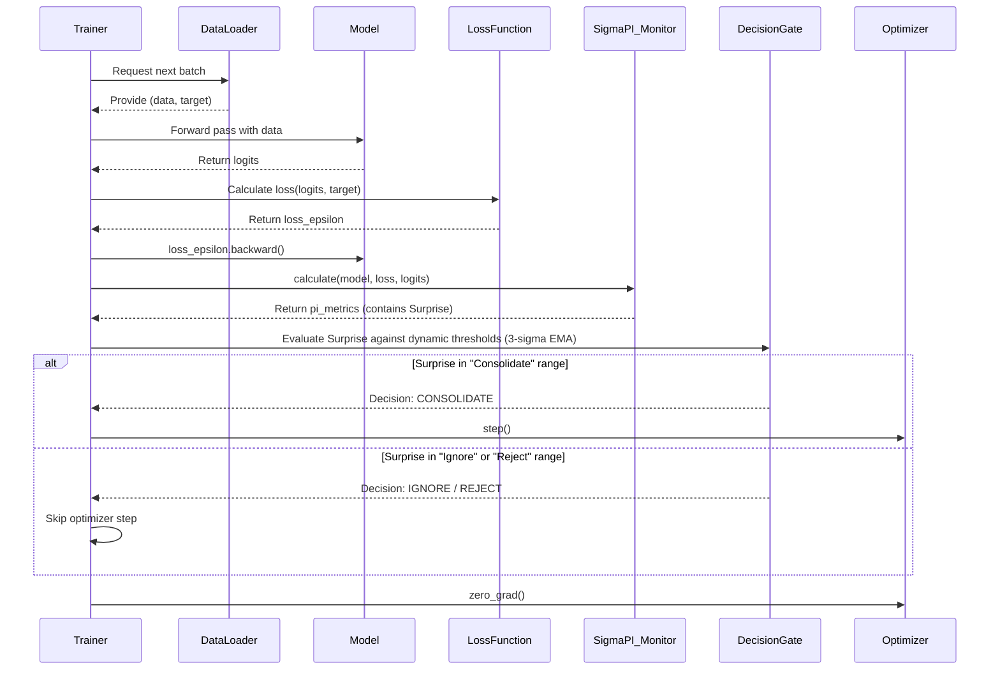

# **技术笔记：GBP (Gated Backpropagation) 框架**

**文档版本:** 1.0
**核心理念:** GBP 是 FFB (Forward-Forward-Backwards) 框架核心思想的一个轻量级、可直接应用的实现。它专注于解决一个核心问题：模型应该**何时**进行权重更新？通过引入基于 `Surprise` 的动态决策门，GBP 赋予了标准训练流程一种初级的认知控制能力。

---

## **1. 设计哲学：从“盲目更新”到“选择性学习”**

传统的深度学习训练循环是“盲目的”：每一个批次的数据都会触发一次梯度计算和权重更新。然而，并非所有数据都具有同等的学习价值。有些数据可能只是噪声，有些可能过于超前或异常，过早地学习它们可能会损害模型的稳定性。

GBP 的设计哲学是：**让模型学会“挑剔”**。

它不再对所有输入都一视同仁地进行更新，而是通过实时评估每一批次训练数据带来的“惊奇度”（`Surprise`，即梯度范数），来判断这次学习是否“值得”。这使得模型能够：

- **忽略噪声**: 跳过那些 `Surprise` 过低的冗余数据批次。
- **避免创伤**: 拒绝由那些 `Surprise` 过高的异常或 OOD 数据批次所驱动的、可能破坏性的更新。
- **聚焦关键**: 只在 `Surprise` 适中的“学习区”内进行权重巩固。

---

## **2. 核心机制：3-Sigma 动态决策门**

GBP 的核心是一个在训练循环中运行的动态决策门。它不需要复杂的架构改造（如 MoE），理论上可以应用于任何神经网络。

**机制详解:**

1. **梯度计算**: 与标准流程一样，模型计算损失并执行 `loss.backward()`。这是计算 `Surprise` 的前提。
2. **惊奇度评估**: `ΣPI` 监视器计算当前训练批次产生的 `Surprise` 值。
3. **动态阈值更新**: GBP 维护着 `Surprise` 的一个指数移动平均（EMA）和平方的 EMA。通过这两个值，它可以实时计算出 `Surprise` 的均值和标准差。
4. **3-Sigma 决策**:
   - **学习区 (Consolidate)**: 如果当前的 `Surprise` 值落在 `(EMA - 3*std, EMA + 3*std)` 这个动态区间内，则被认为是“有价值的学习信号”。优化器执行 `optimizer.step()`。
   - **忽略/拒绝区**: 如果 `Surprise` 值落在此区间之外，则被认为是噪声或潜在的“认知创伤”。优化器将被跳过，不执行更新。
5. **梯度清零**: 无论是否更新，最后都会执行 `optimizer.zero_grad()`，为下一个批次做准备。

---

## **3. 与 FFB 的关系**

GBP 是 FFB 框架思想的最小可行实现。它只关注**何时（When）和在哪（Where）**更新，而完整的 FFB 框架还关注**如何（How）**更新（例如，在反向传播处于ignore状态时，使用FF进行小更新）。

## **4. 实现参考**

本框架的一个具体代码实现可以在 `test/ViT/vit_trainer.py` 的 `train_gbp` 函数中找到。该函数清晰地展示了如何计算动态阈值并根据 `Surprise` 值来选择性地调用 `optimizer.step()`。
