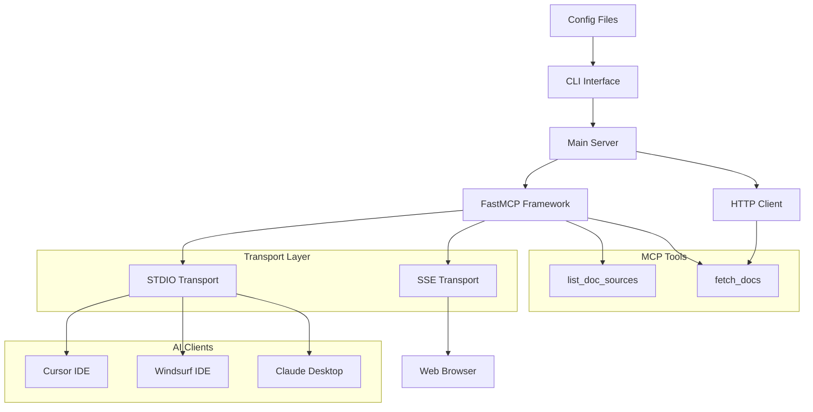

# Архитектура SuperDocs

## 🏗️ Общее описание

SuperDocs - это расширенный MCP (Model Context Protocol) сервер для документации, который предоставляет AI-ассистентам интеллектуальный доступ к документации через стандартизированный интерфейс.

### Ключевые принципы архитектуры

1. **Модульность** - четкое разделение функциональности по модулям
2. **Расширяемость** - возможность добавления новых источников и форматов
3. **Безопасность** - контроль доступа к источникам данных
4. **Производительность** - кэширование и оптимизация запросов
5. **Совместимость** - поддержка MCP протокола

## 📁 Структура проекта

```
superdocs/
├── superdocs/                     # Основной пакет
│   ├── __init__.py               # Инициализация пакета
│   ├── _version.py               # Версионирование
│   ├── main.py                   # Ядро MCP сервера
│   ├── cli.py                    # Командная строка
│   ├── langgraph.py              # Специализированный сервер для LangGraph
│   └── splash.py                 # ASCII арт для SSE режима
├── tests/                        # Тестирование
│   └── unit_tests/
│       ├── __init__.py
│       ├── test_imports.py       # Тесты импортов
│       └── test_main.py          # Тесты основной функциональности
├── docs/                         # Документация (создается)
│   └── architecture/             # Архитектурная документация
├── dist/                         # Собранные пакеты
├── .venv/                        # Виртуальное окружение
├── .github/                      # GitHub Actions
├── pyproject.toml                # Конфигурация проекта
├── uv.lock                       # Заблокированные зависимости
├── README.md                     # Основная документация
├── PUBLISH.md                    # Инструкции по публикации
├── LICENSE                       # Лицензия MIT
├── Makefile                      # Команды разработки
├── .gitignore                    # Git исключения
├── .gitlab-ci.yml                # GitLab CI/CD
├── sample_config.yaml            # Пример YAML конфигурации
└── sample_config.json            # Пример JSON конфигурации
```

## 🔧 Архитектурные компоненты

### 1. Ядро системы
- **[main.py](components/main.md)** - Основной MCP сервер с инструментами документации
- **[cli.py](components/cli.md)** - Интерфейс командной строки и обработка аргументов

### 2. Специализированные модули
- **[langgraph.py](components/langgraph.md)** - Специализированный сервер для LangGraph документации
- **[splash.py](components/splash.md)** - ASCII арт и визуальные элементы

### 3. Конфигурация и метаданные
- **[_version.py](components/version.md)** - Управление версиями
- **[pyproject.toml](components/config.md)** - Конфигурация проекта и зависимости

## 🌐 Схема взаимодействия



## 🔄 Жизненный цикл запроса

1. **Инициализация**: CLI парсит аргументы и создает конфигурацию
2. **Создание сервера**: `create_server()` настраивает MCP сервер с инструментами
3. **Регистрация инструментов**: Добавляются `list_doc_sources()` и `fetch_docs()`
4. **Запуск транспорта**: Сервер запускается в режиме STDIO или SSE
5. **Обработка запросов**: AI-клиент вызывает MCP инструменты
6. **Получение данных**: HTTP запросы к источникам документации
7. **Возврат результата**: Конвертация в Markdown и отправка клиенту

## 🔐 Модель безопасности

### Контроль доступа
- **Allowed Domains**: Белый список доменов для HTTP запросов
- **Local Files**: Белый список локальных файлов
- **Path Validation**: Проверка на path traversal атаки

### Защита от атак
- **Timeouts**: Ограничение времени запросов (10 сек)
- **Size Limits**: Ограничение размера загружаемого контента
- **Redirect Limits**: Контроль редиректов

## 📊 Модель данных

### DocSource
```python
class DocSource(TypedDict):
    name: NotRequired[str]        # Имя источника (опционально)
    llms_txt: str                 # URL или путь к источнику
    description: NotRequired[str] # Описание (опционально)
```

### Конфигурация сервера
- **doc_sources**: Список источников документации
- **follow_redirects**: Следовать ли HTTP редиректам
- **timeout**: Таймаут HTTP запросов
- **allowed_domains**: Дополнительные разрешенные домены

## 🚀 Точки расширения

### 1. Новые транспорты
Можно добавить поддержку новых транспортных протоколов:
- WebSocket
- gRPC
- TCP/UDP сокеты

### 2. Новые форматы документации
Расширение поддержки форматов:
- OpenAPI/Swagger
- Notion pages
- Confluence
- GitBook

### 3. Новые MCP инструменты
Добавление инструментов:
- `search_docs()` - поиск по содержимому
- `get_doc_metadata()` - метаданные документов
- `validate_links()` - проверка ссылок

### 4. Кэширование
Добавление слоя кэширования:
- In-memory кэш
- Redis кэш
- Файловый кэш

## 🎯 Ограничения текущей архитектуры

1. **Плоская структура**: Поддержка только двухуровневой иерархии (источник → документ)
2. **Нет кэширования**: Каждый запрос загружает данные заново
3. **Простая навигация**: Отсутствие интеллектуальной навигации по иерархии
4. **Ограниченный поиск**: Нет поиска по содержимому документов
5. **Статические источники**: Нет автоматического обновления источников

## 🔮 Планируемые улучшения

1. **Иерархическая навигация**: Поддержка многоуровневых индексов
2. **Умное кэширование**: Кэширование с TTL и инвалидацией
3. **Расширенный поиск**: Полнотекстовый поиск по документации
4. **Автообновление**: Автоматическое обновление источников
5. **Метрики**: Сбор метрик использования и производительности 